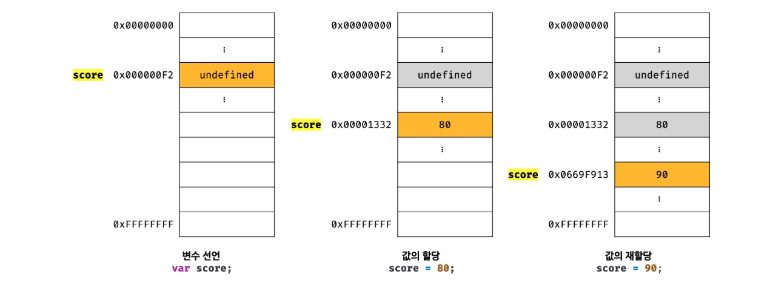
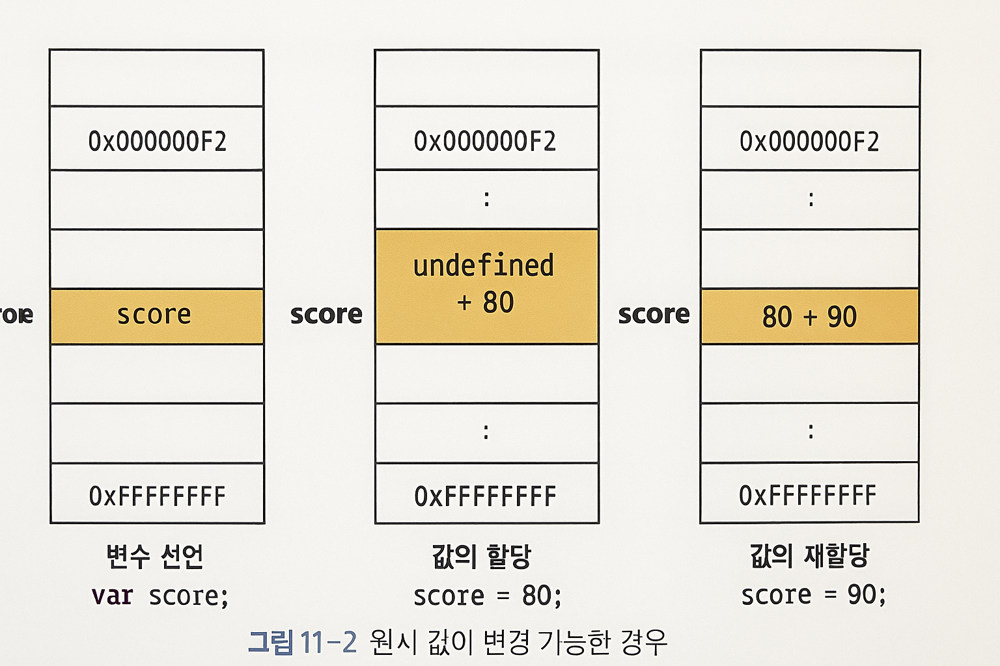
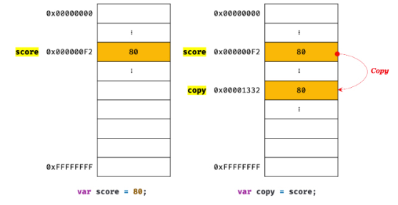
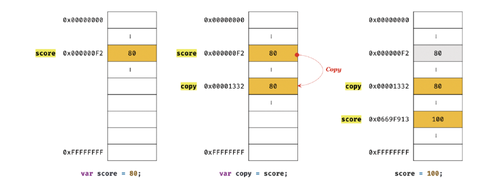
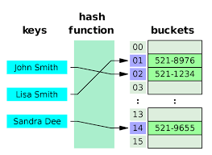
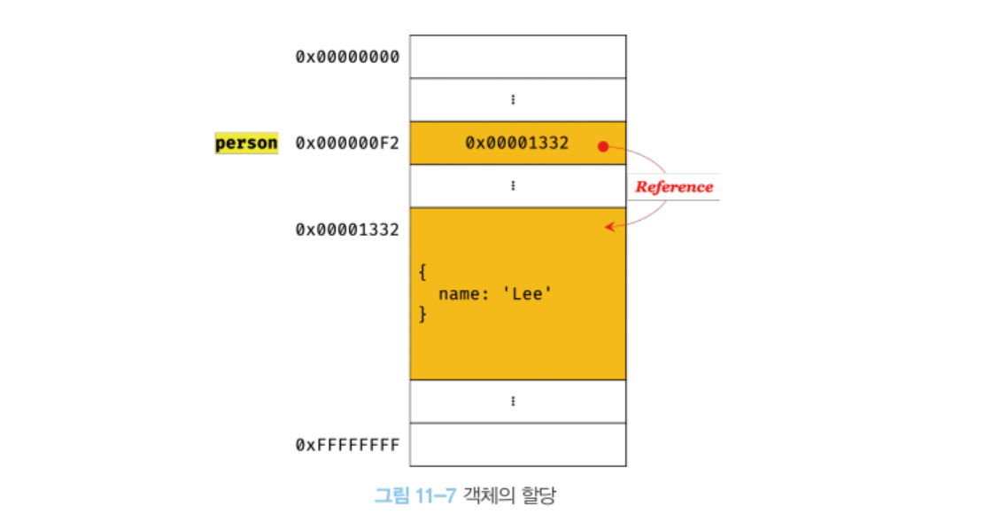
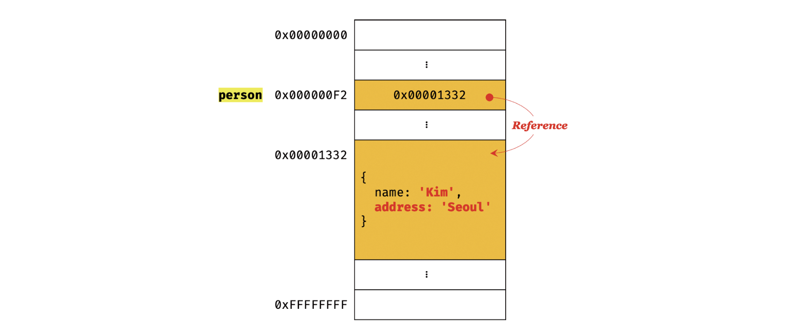
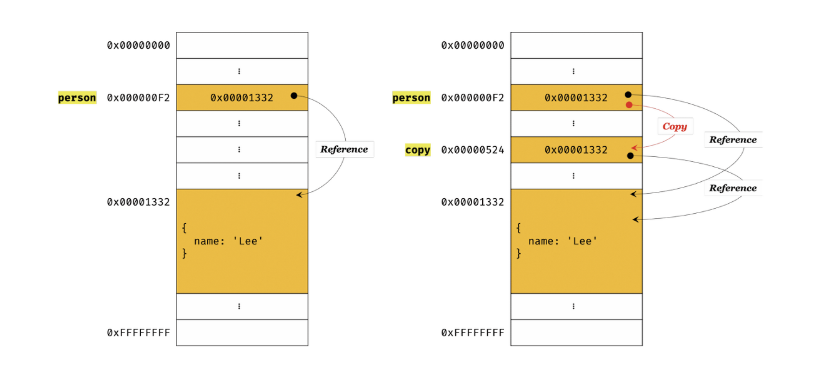

## 🚧 자바스크립트가 제공하는 7가지 데이터 타입

- **원시 타입**
  - 변경 불가능한 값
  - 변수에 할당하면 변수에는 실제 값이 저장된다.
  - 원시 값이 복사되어 전달된다. → 값에 의한 전달
- **객체 타입**
  - 변경 가능한 값
  - 객체를 변수에 할당하면 변수에는 참조 값이 저장된다.
  - 원본의 참조 값이 복사되어 전달된다 → 참조에 의한 전달.

---

## ⭐️원시 값

### 📌 변경 불가능한 값

> 변경 불가능한 값 → 원시 타입의 값, 원시 값은 변경 불가능한 값이다. (읽기 전용)
>
> 변경 불가능하다는 것은 변수가 아니라 값에 대한 진술이다.
>
> → 원시 값 자체를 변경할 수 없다는 것이지 변수 값을 변경할 수 없는 것은 아니다.
>
> → 언제든지 재할당을 통해 변수 값을 변경(교체) 가능하다.
>
> - 상수와 변수의 차이
>   - 상수 → 재할당이 금지된 변수, 할당이 한 번만 허용되므로 변수 값을 변경 할 수 없다.

```js
const o = {};

o.a = 1;
console.log(o); // {a : 1}
```

- 원시 값은 어떤 일이 있어도 불변한다. -> 데이터의 신뢰성을 보장한다.

### ✂️ 원시 값 재할당과 메모리 공간

> 원시 값은 변경 불가능한 값이다.



> - 변수가 참조하던 메모리 공간의 주소가 변경된 이유는 변수에 할당된 원시 값이 변경 불가능한 값이기 때문이다.



> - 만약 원시 값이 변경 가능한 값이라면 변수에 새로운 원시 값을 재할당 했을 때 변수가 가리키던 메모리 공간의 주소를 바꿀 필요없이 원시 값 자체를 변경한다.
> - 그렇다면 변수가 참조하던 메모리 공간의 주소는 바뀌지 않는다.
> - 하지만 원시 값은 변경 불가능한 값이기 때문에 값을 직접 변경할 순 없다.
> - 변수 값을 변경하기 위해 원시 값을 재할당하면 새로운 메모리 공간을 확보하고 재할당한 값을 저장한 후, 변수가 참조하던 메모리 공간의 주소를 변경한다.
> - 값의 이러한 특성을 불변성 이라 한다.
> - 불변성을 갖는 원시 값을 할당한 변수는 재할당 이외에 변수 값을 변경할 수 있는 방법이 없다.

### 📌 문자열과 불변성

> 값을 저장하려면 확보해야 하는 메모리 공간의 크기를 결정해야 한다.
>
> 원시 값인 문자열은 다른 원시 값과 비교할 때 독특한 특징이 있다.
>
> 1. 문자열은 0개 이상의 문자로 이루어진 집합을 말하며, 1개의 문자는 2바이트의 메모리 공간에 저장된다.
> 2. 문자열은 몇 개의 문자로 이뤄졌느냐에 따라 필요한 메모리 공간의 크기가 결정된다.

```js
var str1 = "";
var str2 = "Hello";
```

```js
var str = "Hello";
str = "world";
```

> - 문자열 'Hello'가 저장된 메모리 공간을 가르키는 식별자 str 생성
> - 문자열 'Hello'를 수정하는 것이 아닌 새로운 메모리 공간에 문자열 'world' 생성
> - 식별자 str이 'world' 공간을 가르킴 즉 'Hello' 와 'world'는 모두 메모리에 존재

```js
var str = "string";

console.log(str[0]);
console.log(str.length);
console.log(str.toUpperCase());

str[0] = "S";
console.log(str); // string
```

> - 문자열은 원시 값이므로 변경할 수 없다. 변경 시 에러 발생
> - 문자열을 재할당 하는 것은 가능! 변경하는게 아니라 새로운 문자열을 할당하는 것.

---

## 📌 값에 의한 전달

```js
var score = 80;
var copy = score;
console.log(score); // 80
console.log(copy); // 80
console.log(score === copy); // true

score = 100;
console.log(score); // 100
console.log(copy); // ?
```

> - 변수에 변수를 할당했을 때 무엇이 어떻게 전달되는가?
> - 첫번째 할당에서는 copy에도 80이라는 값이 잘 전달된다.
> - 변수에 원시 값을 갖는 변수를 할당하면 할당받는 변수(copy)에는 할당되는 변수(score)의 원시 값이 복사되어 전달된다.
> - 하지만 score 변수와 copy 변수의 값 80은 다른 메모리 공간에 저장된 별개의 값이다.




> - 변수와 같은 식별자는 값이 아니라 메모리 주소를 기억하고 있다.
> - 단 전달된 메모리 주소를 통해 메모리 공간에 접근하면 값을 참조할 수 있다.
> - 두 변수의 원시 값은 서로 다른 메모리 공간에 저장된 별개의 값이 되어 어느 한쪽에서 재할당을 통해 값을 변경하더라도 서로 간섭할 수 없다.

---

## ⭐️ 객체

### 📢 객체

> - 객체는 프로퍼티의 개수가 정해져 있지 않으며, 동적으로 추가되고 삭제할 수 있다.
> - 프로퍼티에도 제약이 없어, 메모리 공간의 크기를 사전에 정할 수 없다.
> - 객체는 복잡한 자료구조, 브라우저 마다 구현 방식도 다르다.
> - 원시 값은 상대적으로 적은 메모리를 소비하지만, 객체는 경우에 따라 크기가 매우 커질 수도 있다.



> - 자바스크립트 객체는 프로퍼티 키를 인덱스로 사용하는 해시 테이블이라 생각할 수 있다.
> - 자바스크립트는 클래스 없이 객체를 생성할 수 있으며 객체가 생성된 이후라도 동적으로 프로퍼티와 메서드를 추가할 수 있다.
> - V8 자바스크립트 엔진에서는 히든클래스 라는 방식을 사용해 성능을 보장한다!

### 📌 변경 가능한 값

```js
var person = {
  name: "Lee",
};
```

> 객체를 할당한 변수에는 생성된 객체가 실제로 저장된 메모리 공간의 주소가 저장되어 있다. 이 값을 참조 값이라고 한다.



```js
person.name = "Kim";
person.address = "Seoul";
console.log(person); // { name: 'Kim', address: 'Seoul' }
```



> - 객체는 메모리를 효율적으로 사용하기 위해, 변경 가능한 값으로 설계되어 있다.
> - 여러 개의 식별자가 하나의 객체를 공유할 수 있다는 점이다.

### © 얕은 복사 vs 깊은 복사

```js
const o = { x: { y: 1 } };
const c1 = { ...o };
const _ = require("lodash");
const c2 = _.cloneDeep(o);
```

> - 얕은 복사는 참조 값만 복사, 깊은 복사는 객체까지 모두 복사
> - 원본과 복사본은 참조 값이 다른 별개의 객체다.

---

## 📌 참조에 의한 전달

```js
var person = {
  name: "Lee",
};
var copy = person;
```



```js
copy.name = "Kim";
person.address = "Seoul";

console.log(person); // { name: 'Kim', address: 'Seoul' }
console.log(copy); // { name: 'Kim', address: 'Seoul' }
```

> - 참조에 의한 전달은 식별자가 기억하는 메모리 공간에 저장되어 있는 값을 복사해서 전달하는 방식이다.
> - 자바스크립트는 “값에 의한 전달”만 존재하고, 참조 값이 복사된 것일 뿐이다.
