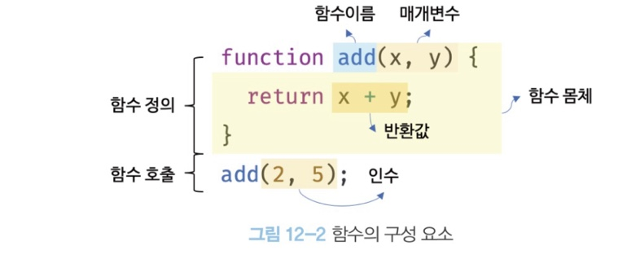
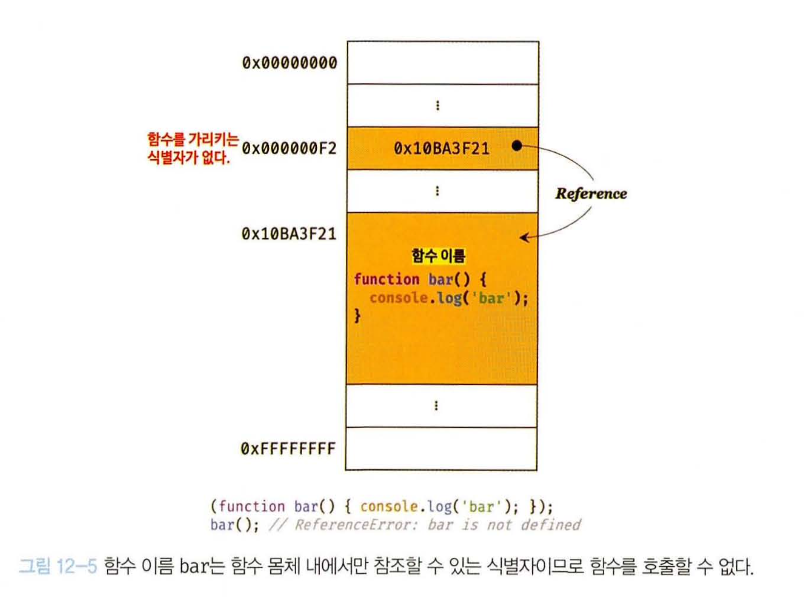
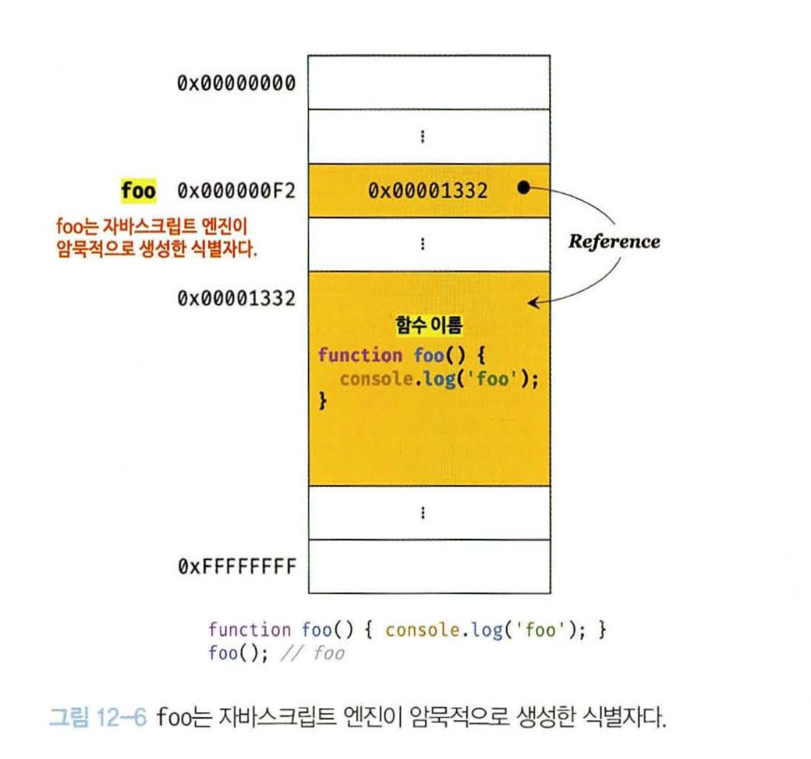
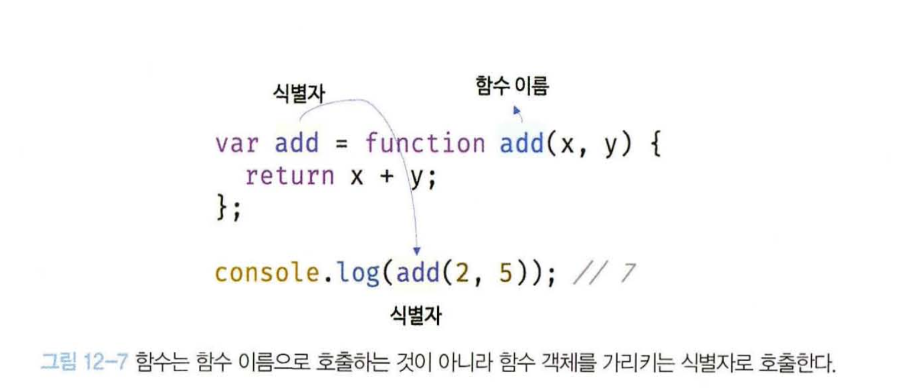
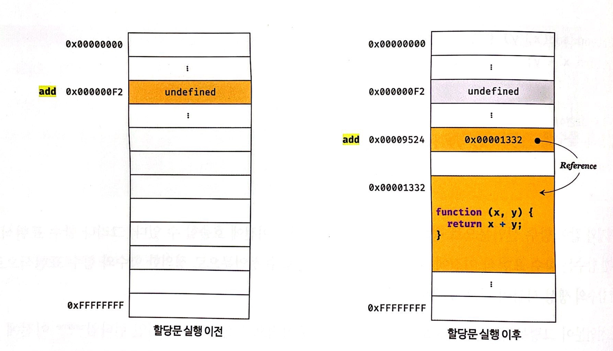
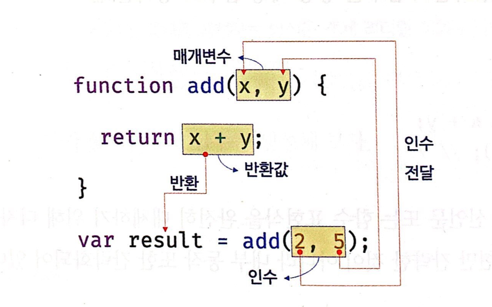
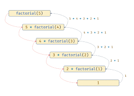

### ⭐️**함수란?**

<aside>
⚙

→ 수학의 함수는 “입력input” 을 받아 “출력(output)”을 내보내는 일련의 과정을 정의한 것이다.

- 예를 들어 f(x + y) = x + y 라는 함수를 정의하고 이 함수에 두 개의 입력 2, 5를 전달하면 x + y = 7을 출력한다.
- 이때 필요한 입력인 2, 5 는 입력을 받아들이는 변수 x, y를 통해 함수 외부에서 내부로 전달된다.
- 함수의 실행 결과인 출력은 함수 외부로 반환된다.

```jsx
// f(x + y) = x + y
function add(x, y) {
  return x + y;
}
// f(2, 5) = 7
add(2, 5); // 7
```

- 프로그래밍 언어의 함수는 일련의 과정을 문으로 구현하고 코드 블록으로 감싸서 하나의 실행 단위로 정의한 것이다.
- 함수 내부로 입력을 전달받는 변수를 매개변수, 입력을 인수, 출력을 반환값이라 한다.

→ 함수는 함수 정의를 통해 생성한다.



```jsx
// 함수 정의 -> 함수 선언문
function add(x, y) {
  return x + y;
}

// 함수 호출
var result = add(2, 5);

// 함수 add에 인수 2, 5를 전달하면서 호출하면 반환값 7을 변환한다.
console.log(result);
```

</aside>

### ⭐️**함수를 사용하는 이유**

<aside>
🔒

→ 함수를 왜 ? 사용 해 ?

- 함수는 필요할 때 여러 번 호출 할 수 있다. → 몇 번이든 재사용이 가능하다. (코드의 재사용)

```jsx
// 함수 정의 -> 함수 선언문
function add(x, y) {
  return x + y;
}

var result = 0;

// 함수 재사용
result = add(2, 5); // 7
result = add(3, 4); // 7
```

- 코드의 재사용은 코드 중복을 억제하고, 유지보수의 편의성을 높이고 실수를 줄여 코드의 신뢰성을 높이는 효과가 있다.
- 함수는 객체 타입의 값이다. → 이름(식별자)를 붙일 수 있다. 이는 가독성을 높인다.
</aside>

### ⭐️**함수 리터럴**

<aside>
✂️

→ 함수는 객체 타입의 값이다.

- 함수 리터럴로 생성이 가능하다.
- 함수 리터럴은 function 키워드, 함수 이름, 매개 변수 목록, 함수 몸체로 구성된다.

```jsx
// 변수에 함수 리터럴을 할당
var f = function add(x, y) {
  return x + y;
};

// 함수 리터럴을 변수에 할당하고 있다.
// 함수 리터럴도 평가되어 값을 생성하며, 이 값은 객체다.
// 함수 = 객체
```

| 구성 요소      | 설명                                                                                                                                                                                                   |
| -------------- | ------------------------------------------------------------------------------------------------------------------------------------------------------------------------------------------------------ |
| 함수 이름      | - 함수 이름은 식별자다 - 함수 이름은 함수 몸체 내에서만 참조할 수 있는 식별자다. - 함수 이름은 생략할 수 있다. (익명 함수)                                                                             |
| 매개 변수 목록 | - 0개 이상의 매개변수를 소괄호로 감싸고 쉼표로 구분 - 각 매개변수에는 함수를 호출할 때 지정한 인수가 순서대로 할당된다. - 매개변수는 함수 몸체 내에서 변수와 동일, 식별자 네이밍 규칙을 준수해야 한다. |
| 함수 몸체      | - 함수가 호출되었을 때 실행될 문들을 하나의 실행 단위로 정의한 코드 블록 - 함수 호출에 의해 실행된다.                                                                                                  |

- 함수는 객체다.
- 그러나 함수는 객체지만 일반 객체와는 다르다. → 일반 객체는 호출할 수 없지만 함수는 호출할 수 있다.
- 함수 객체만의 고유한 프로퍼티를 갖는다.
</aside>

### ⭐️**함수 정의**

<aside>
🧛‍♂️

→ 함수 정의란 함수를 호출하기 이전에 인수를 전달받을 매개변수와 실행할 문들, 반환한 값을 지정하는 것을 말한다.

| 함수 정의 방식       | 예시                                                |
| -------------------- | --------------------------------------------------- |
| 함수 선언문          | `function add(x, y) {  return x + y;}`              |
| 함수 표현식          | `var add = function(x, y) {return x + y;<br>};`     |
| Function 생성자 함수 | `var add = new Function('x', 'y', 'return x + y');` |
| 화살표 함수 (ES6)    | `var add = (x, y) => x + y;`                        |

→ 변수 선언과 함수 정의

- 변수는 선언한다고 했지만 함수는 정의 한다고 표현했다.
</aside>

### **📌 함수 선언문**

<aside>
♻️

→ 함수 선언문으로 함수를 정의하기

```jsx
// 함수 선언문
function add(x, y) {
	return x + y;
}

// 함수 참조
// console.dir은 로그와는 달리 객체의 프로퍼티까지 출력
// Node.js 환경에서는 로그와 같은 결과 출력
console.dir(add); // add(x, y)

// 함수 호출
console.log(add(2,5)); // 7

// 함수 이름 생략 에러
function (x, y) {
	return x + y;
}
// SyntaxError
```

- 함수 선언문은 함수 리터럴과 형태가 동일하다.
- 함수 리터럴은 함수 이름을 생략할 수 있으나 함수 선언문은 함수 이름을 생략할 수 없다.
- 함수 선언문은 표현식이 아닌 문이다. why? → 콘솔 선언문 실행 시 undefined 출력
- 만약 표현식 문이라면 생성된 함수가 출력되어야 한다.

→ 표현식이 아닌 문은 변수에 할당할 수 없다. 근데?

```jsx
// 함수 선언문은 표현식이 아닌 문이므로 변수에 할당할 수 없다.
// 하지만 함수 선언문이 변수에 할당되는 것처럼 보인다.
var add = function add(x, y) {
  return x + y;
};

//함수 호출
console.log(add(2, 5)); // 7

// 자바스크립트 엔진이 코드의 문맥에 따라 함수 리터럴을 표현식이 아닌 함수 선언
// 문으로 해석하는 경우와 표현식인 문인 함수 리터럴 표현식으로 해석하는 경우가 있다.
// 이름을 생략할 수 없다는 점을 제외하면 선언문은 리터럴과 형태가 동일하다.
// 함수 이름이 있는 기명 함수 리터럴은 함수 선언문 또는 함수 리터럴 표현식으로 해석
// 가능성이 있다.
```

- 자바스크립트 엔진은 함수 이름이 있는 함수 리터럴을 단독으로 사용하면 함수 선언문으로 해석하고, 함수 리터럴이 값으로 평가되어야 하는 문맥을 리터럴 표현식으로 해석한다.

```jsx
// 기명 함수 리터럴을 단독으로 사용하면 선언문으로 해석된다.
// 함수 선언문에서는 함수 이름을 생략할 수 없다.
function foo() {
  console.log("foo");
}
foo(); // foo

// 함수 리터럴을 피연산자로 사용하면 함수 선언문이 아니라 함수 리터럴 표현식으로 해석
// 함수 리터럴에서는 함수 이름을 생략 가능.
(function bar() {
  console.log("bar");
});
bar(); // 참조 에러
```

- 단독으로 사용 된 foo 함수는 선언문으로 해석
- 그룹 연산자 () 내에 사용 된 bar 함수는 리터럴 표현식으로 해석된다.
- 따라서 표현식이 아닌 문인 함수 선언문은 피연산자로 사용할 수 없다.

→ 이름이 있는 기명 함수 리터럴은 코드의 문맥에 따라 선언문 또는 리터럴 표현식으로 해석된다.

- 선언문과 표현식은 함수 객체를 생성하는 것은 동일하지만 호출에는 차이점이 있다.
- 함수 몸체 외부에서는 함수 이름으로 함수를 참조할 수 없으므로 함수 이름으로 함수를 호출할 수 없다. → 가리키는 식별자가 없다.



→ 그런데 foo() 함수는 어떻게 호출이 되는거지 ?

- foo 라는 이름으로 함수를 호출하려면 foo는 함수 이름이 아니라 함수 객체를 가리키는 식별자이여야 한다.
- 그러나 아무것도 선언이 안되어 있지만 왜 되는걸까? → 자바스크립트 엔진이 암묵적으로 생성한 식별자다.



- 자바스크립트 엔진은 함수 선언문을 해석해 함수 객체를 생성한다.
- 자바스크립트 엔진은 생성된 함수를 호출하기 위해 함수 이름과 동일한 이름의 식별자를 암묵적으로 생성하고, 거기에 함수 객체를 할당한다.

→ 함수는 함수 이름으로 호출하는 것이 아니라 함수 객체를 가리키는 식별자로 호출한다.

- 함수 이름과 변수 이름이 일치하므로 함수 이름이 호출되는 듯 하지만 사실은 식별자로 호출된 것이다.



</aside>

### **📌 함수 표현식**

<aside>
❤️‍🔥

→ 값의 설징을 갖는 객체를 일급 객체라 한다.

- 자바스크립트의 함수는 일급 객체다.
- 함수는 일급 객체로, 리터럴로 생성한 함수 객체를 변수에 할당할 수 있다.
- 함수 정의 방식을 함수 표현식이라고 한다.

```jsx
// 함수 표현식
var add = function (x, y) {
  return x + y;
};
console.log(add(2, 5)); // 7

// 함수 리터럴의 이름은 생략할 수 있다. -> 익명 함수라 한다.
// 함수 표현식의 함수 리터럴은 함수 이름을 생략하는 것이 일반적이다.

// 기명 함수 표현식
var add = function foo(x, y) {
  return x + y;
};

// 함수 객체를 가리키는 식별자로 호출
console.log(add(2, 5)); // 7

// 함수 이름으로 호출하면 참조에러 발생
// 함수 이름은 함수 몸체 내부에서만 유요한 식별자다.
console.log(foo(2, 5)); // 참조 에러
```

- 자바스크립트 엔진은 함수 선언문의 함수 이름으로 식별자를 암묵적으로 생성하고 생성된 함수 객체를 할당하므로 함수 표현식과 유사하게 동작하는 것처럼 보인다.
- 하지만 함수 선언문과 함수 표현식이 정확히 동일하게 동작하지 않는다.
- 함수 선언ㅁ눙느 “표현식이 아닌 문”이고 함수 표현식은 “표현식인 문” 이다.
</aside>

### **📌 함수 생성 시점과 함수 호이스팅**

<aside>
🙆‍♂️

```jsx
// 함수 참조
console.dir(add); // f add(x, y)
console.dir(sub); // undefined

// 함수 호출
console.log(add(2, 5)); // 7
console.log(sub(2, 5)); // TypeError: sub is not a function

// 함수 선언문
function add(x, y) {
  return x + y;
}

// 함수 표현식
var sub = function (x, y) {
  return x - y;
};
```

- 함수 선언문으로 정의한 함수는 함수 선언문 이전에 호출할 수 있다.
- 함수 표현식으로 정의한 함수는 함수 표현식 이전에 호출할 수 없다.
- 이는 함수 선언문으로 정의한 함수와 함수 표현식으로 정의한 함수의 생성 시점이 다르기 때문이다.

→ 자바 스크립트의 암묵적 생성 ( 런타임 시점 )

- 함수 선언문이 코드의 선두로 끌어 올려진 것처럼 동작하는 자바스크립트 고유의 특징을 함수 호이스팅이라 한다.
- 함수 호이스팅과 변수 호이스팅은 차이가 있다.
- 공통점 → 둘다 런타임 이전에 엔진에 의해 먼저 실행되어 식별자를 생성한다.
- 차이점 → var로 선언된 변수는 undefined이지만 함수 선언문은 식별자를 함수 객체로 초기화한다.

→ 함수 표현식은 변수에 할당되는 값이 함수 리터럴인 문이다.

- 변수 할당문의 값은 할당문이 실행되는 시점, 런타임에 평가 되므로 함수 표현식의 함수 리터럴도 할당문이 실행되는 시점에 평가되어 함수 객체가 된다.
- 함수 표현식으로 함수를 정의하면 함수 호이스팅이 발생하는 것이 아니라 변수 호이스팅이 발생하게 된다.
  
- 따라서 함수 표현식으로 정의한 함수는 반드시 함수 표현식 이후에 참조 또는 호출해야 한다.
- 함수 호이스팅은 함수를 호출하기 전에 함수를 선언해야 한다는 당연한 규칙을 무시한다.
- 따라서 함수 선언문 대신 함수 표현식을 사용할 것을 권장한다.
</aside>

### **📌 Function 생성자 함수**

<aside>
😈

→ 자바스크립트가 기본 제공하는 빌트인 함수 Function

- 생성자 함수에 매개 변수 목록과 함수 몸체를 문자열로 전달하면서 new 연산자와 함께 호출하면 함수 객체를 생성해서 반환한다.

→ 생성자 함수란?

- 생성자 함수는 객체를 생성하는 함수를 말한다.

→ Function add 예제

```jsx
var add = new Function("x", "y", "return x + y");
console.log(add(2, 5)); // 7
```

- Function 생성자 함수로 생성한 함수는 클로저를 생성하지 않는다.
- 함수 선언문이나 함수 표현식으로 생성한 함수와 다르게 동작한다.

```jsx
var add1 = (function () {
  var a = 10;
  return function (x, y) {
    return x + y + a;
  };
})();

console.log(add1(1, 2)); // 13

var add2 = (function () {
  var a = 10;
  return new Function("x", "y", "return x + y + a;");
})();

console.log(add2(1, 2)); // ReferenceError: a is not defined

// 클로저로 인한 선언문과 표현식으로 생성한 함수와 function
// 생성자 함수로 생성한 함수가 동일하게 동작하지 않는다.
```

</aside>

### **📌 화살표 함수**

<aside>
🙏

→ ES6에서 도입된 화살표 함수

- function 키워드 대신 화살표를 사용해 좀 더 간략한 방법으로 함수를 선언한다.
- 화살표 함수는 항상 익명 함수로 정의한다.

```jsx
// 화살표 함수
const add = (x, y) => x + y;
console.log(add(2, 5)); // 7
```

- 화살표 함수는 기존의 함수 선언문 또는 함수 표현식을 완전히 대체하기 위해 디자인 된 것은 아니다.
- 화살표 함수는 생성자 함수로 사용할 수 없으며, 기존 함수와 this 바인딩 방식이 다르다.
- 프로토타입 프로퍼티가 없으며 arguments 객체를 생성하지 않는다.
</aside>

### ⭐️함수 호출

→ 함수는 함수를 가리키는 식별자와 한 쌍의 소괄호인 함수 호출 연산자로 호출한다.

- 함수 호출 연산자 내에는 0개 이상의 인수를 쉼표로 구분해서 나열한다.
- 함수를 호출하면 현재의 실행 흐름을 중단하고, 호출된 함수로 실행 흐름을 옮긴다.
- 매개변수에 인수가 순서대로 할당되고 함수 몸체의 문들이 실행되기 시작한다.

### **📌 매개변수와 인수**

<aside>
✅

→ 함수를 실행하기 위해 필요한 값을 전달할 필요가 있는 경우 → 매개 변수를 통해 인수 전달

- 인수는 값으로 평가될 수 있는 표현식이어야 한다.
- 인수는 함수를 호출할 때 지정하며, 개수와 타입에 제한이 없다.

```jsx
// 함수 선언문
function add(x, y) {
  return x + y;
}

// 함수 호출
// 인수 1과 2가 매개변수 x와 y에 순서대로 할당되고 함수 몸체의 문들이 실행된다.
var result = add(1, 2);
```

- 매개변수는 함수를 정의할 때 선언하며, 함수 몸체 내부에서 변수와 동일하게 취급된다.
- 함수 호출 → 함수 몸체 내에서 암묵적으로 매개변수 생성 → undefined로 초기화 → 인수 할당.



- 매개변수는 함추 몸체 내부에서만 참조할 수 있고, 외부에서는 참조가 불가능.
- 매개변수의 스코프 범위는 함수 내부다.

```jsx
function add(x, y) {
  console.log(x, y);
  return x + y;
}

add(2, 5);

// add 함수의 매개변수 x, y는 함수 몸체 내부에서만 참조할 수 있다.
console.log(x, y); // 참조에러 발생
```

- 매개변수의 개수만큼 인수를 전달하는 것이 일반적이지만 그렇지 않은 경우에도 에러는 발생하지 않는다.

```jsx
function add(x, y) {
  console.log(arguments); // Arguments(3) [2, 5, 10, callee: f, ]

  return x + y;
}

console.log(add(2)); // NaN <- num + undefined

console.log(add(2, 5, 10)); // 7 <- 10은 무시된다.
// arguments 객체의 프로퍼티로 보관
```

- 초과된 인수가 버려지는 것은 아니다. 암묵적으로 arguments 객체의 프로퍼티로 보관된다.

</aside>

### **📌 인수 확인**

<aside>
👩‍🎓

```jsx
function add(x, y) {
  return x + y;
}

console.log(add(2)); // NaN
console.log(add("a", "b")); // 'ab'
```

- 위 코드는 사용자가 원하는 동작은 아니지만, 자바스크립트 엔젠은 아무런 이의 제기 없이 코드를 실행한다.
- 이유 1. 자바스크립트 함수는 매개변수와 인수의 개수가 일치하는지 확인하지 않는다.
- 이유 2. 자바스크립트는 동적 타입 언어다. 따라서 자바스크립트 함수는 매개변수 타입을 사전에 지정할 수 없다.
- 따라서 자바스크립트의 경우 함수를 정의할 때 적절한 인수가 전달되었는지 확인할 필요가 있다.

```jsx
function add(x, y) {
  if (typeof x !== "number" || typeof y !== "number") {
    // 매개변수를 통해 전달된 인수의 타입이 맞는지 확인
    throw new TypeError("인수는 모두 숫자 값이여야 합니다");
  }
  return x + y;
}
console.log(add(2)); // TypeError
console.log(add("a", "b")); // TypeError
```

→ 이처럼 인수 전달을 확인 하더라도 사전에 방지는 불가능하고, 에러는 런타임에 발생하게 된다.

- 따라서 타입스크립트와 같은 정적 타입을 선언할 수 있는 자바스크립트 상위 확장을 도입하여 컴파일 시점에서 호출을 방지할 수 있게 하는 것도 하나의 방법이다.
- arguments 객체를 통해 인수 개수를 확인할 수 있다.
- 인수가 전달되지 않은 경우 단축 평가를 사용해 매개변수에 기본값을 할당하는 방법도 있다.

```jsx
// 단축 평가
function add(a, b, c) {
  a = a || 0;
  b = b || 0;
  c = c || 0;
  return a + b + c;
}

console.log(add(1, 2, 3)); // 6
console.log(add(1, 2)); // 3
console.log(add(1)); // 1
console.log(add()); // 0

// ES6 문법으로 간소화하기
// 매개변수 기본 값은 매개변수에 인수를 전달하지 않았을 경우와 undefined인 경우
function add(a = 0, b = 0, c = 0) {
  return a + b + c;
}

console.log(add(1, 2, 3)); // 6
console.log(add(1, 2)); // 3
console.log(add(1)); // 1
console.log(add()); // 0
```

</aside>

### **📌 매개 변수의 최대 개수**

<aside>
🪴

→ ECMAScript 사양에서는 매개변수의 최대 개수에 대해 명시적으로 제한하고 있지 않다.

- 그렇다면 매개변수는 최대 몇 개 까지 사용하는 것이 좋을까?
- 매개변수에는 순서에 의미가 있다. → 많으면 유지보수 힘듬, 실수도 늘어남.
- 따라서 이상적인 함수는 한 가지 일만 해야 하며 가급적 작게 만들어야 한다.
- 매개변수는 최대 3개 이상을 넘지 않는 것을 권장한다.
- 3개 이상이 될 경우에는 하나의 매개변수를 선언 후 객체를 인수로 전달하는 것이 좋다.

```jsx
$.ajax({
  method: "POST",
  url: "/user",
  data: { id: 1, name: "Lee" },
  cache: false,
});
```

→ 객체를 인수로 사용하는 경우 프로퍼티 키만 정확히 지정하면 매개변수의 순서는 신경 X

- 또한 인수의 의미를 설명하는 프로퍼티 키로 가독성이 높아지고 실수는 줄어든다.
- 주의할 점은 함수 외부에서 함수 내부에 전달한 객체를 함수 내부에서 변경하면 함수 외부의 객체가 변경되는 부수 효과가 발생한다!
</aside>

### **📌 반환문**

<aside>
🐋

→ 함수는 return 키워드와 표현식으로 이뤄진 반환문을 사용해 실행 결과를 함수 외부로 return할 수 있다.

```jsx
function multiply(x, y) {
  return x * y; // 반환문
}

// 함수 호출은 반환값으로 평가한다.
var result = multiply(3, 5);
console.log(result); // 15

// multiply 함수는 두 개의 인수를 전달받아 곱한 값을 return 한다.
// 반환문의 역할은 두가지가 있다.
// 1. 반환문은 함수의 실행을 중단하고 함수 몸체를 빠져나간다.
function multiply(x, y) {
  return x * y; // 반환문
  console.log("실행되지 않는다."); // 반환문 이후의 문은 실행되지 않고 무시.
}

// 둘째 반환문은 return 키워드 뒤에 오는 표현식을 평가해 반환한다.
// return 키워드 뒤에 반환값으로 사용할 표현식을 명시적으로 지정하지 않으면 undefined
function foo() {
  return;
}
console.log(foo()); // undefined

// 반환문은 생략이 가능하다.
// 암묵적으로 undefined를 반환한다.
function foo() {
  // 반환문 생략
}
console.log(foo()); // undefined

// return 키워드와 반환값으로 사용할 표현식 사이에 줄바꿈이 있을 시 결과가 달라진다.
function multiply(x, y) {
  return;
  x * y; // 무시된다.
}
console.log(multiply(3, 5)); // undefined

// 반환문은 함수 몸체 내부에서만 사용할 수  있다.
// 전역에서 반환문을 사용하면 문법에러가 발생한다.
```

</aside>

### ⭐️참조에 의한 전달과 외부 상태의 변경

<aside>
🦈

→ 원시 값은 값에 의한 전달, 객체는 참조에 의한 전달 그렇다면 매개변수는 ?

- 매개변수도 함수 내부에서 변수와 동일하게 취급하므로 매개변수 또한 타입에 따라 값에 의한 전달, 참조에 의한 전달 방식을 그대로 따른다.
- 함수를 호출하면서 매개변수에 값을 전달하는 방식 → 값에 의한 호출, 참조에 의한 호출로 구별해 부르는 경우도 있으나 동작 방식은 동일하다.

```jsx
// 매개변수 primitive는 우너시 값을 전달받고, 매개변수 obj는 객체를 전달받는다.
function changVal(primitive, obj) {
  primitive += 100;
  obj.name = "kim";
}

// 외부 상태
var num = 100;
var person = { name: "Lee" };

console.log(num); // 100
console.log(person); // { name: 'Lee'}

// 원시 값은 값 자체가 복사되어 전달되고 객체는 참조 값이 복사되어 전달된다.
changeVal(num, person);

// 원시 값은 원본이 훼손되지 않는다.
console.log(num); // 100

// 객체는 원본이 훼손된다.
console.log(pesron); // {name: 'kim'}
```

- changeVal 함수는 매개변수를 통해 전달받은 원시 타입 인수와 객체 타입 인수를 함수 몸체에서 변경한다.
- 원시 타입 인수를 전달 받은 매개변수 primitive는 변경 불가능한 값으로 변경이 불가하다.
- 객체 타입 인수를 전달받은 매개변수 obj의 경우, 객체는 변경 가능한 값이므로 직접 변경할 수 있기 때문에 재할당 없이 직접 할당된 객체를 변경했다.
- 원시 값은 인수 값 자체가 복사되어 매개변수에 전달 → 값을 변경해도 원본 그대로 어떠한 부수효과도 발생하지 않는다.
- 객체 값은 참조 값이 복사되어 매개변수에 전달 → 참조 값을 통해 객체를 변경할 경우 원본 훼손, 부수효과가 발생한다.


→ 이러한 현상은 객체가 변경할 수 있는 값이며, 참조에 의한 전달 방식으로 동작하기 때문에 발생하는 부작용이다.

- 여러 변수가 참조에 의한 전달 방식을 통해 참조 값을 공유하고 있다면, 언제든지 참조 하고 있는 객체를 직접 변경할 수 있다.
- 복잡한 코드에서 추적은 어려움으로, 객체의 변경을 추적하려면 옵저버 패턴 등을 통해 모든 이들에게 변경 사실을 통지하고 이에 대처하는 대응을 필요로한다.

→ 해결 방법 중 하나

- 객체를 불변 객체로 만들어 사용하는 것이다.
- 객체의 복사본을 새롭게 생성하는 비용은 들지만 객체를 원시 값처럼 변경 불가능한 값으로 동작하게 만든다.
- 이 방법으로 객체의 방어적 복사를 통해 원본 객체를 완전히 복제하는 깊은 복사를 통해 새로운 객체를 생성하고 재할당을 통해 교체한다. → 부수효과를 없앤다.
</aside>

### ⭐️다양한 함수의 형태

### **📌 즉시 실행 함수**

<aside>
📩

→ 함수 정의와 동시에 즉시 호출되는 함수를 즉시 실행 함수라고 한다.

- 즉시 실행 함수는 단 한번만 호출되며 다시 호출할 수 없다.

```jsx
// 익명 즉시 실행 함수
(function () {
  var a = 3;
  var b = 5;
  return a * b;
})();
```

- 즉시 실행 함수는 함수 이름이 없는 익명 함수를 사용하는 것이 일반적이다.
- 함수 이름이 있는 기맹 즉시 실행 함수도 사용할 수 있다.
- 하지만 그룹 연산자 ( … ) 내의 기명 함수는 함수 선언문이 아니라 함수 리터럴로 평가 되며 함수 이름은 함수 몸체에서만 참조할 수 있는 식별자 이므로 즉시 실행 함수를 다시 호출할 수 없다.

```jsx
// 기명 즉시 실행 함수
(function () {
	var a = 3;
	var b = 5;
	return a * b;
}());

foo(); // 참조에러

// 즉시 실행 함수는 반드시 그룹 연산자 ( ... )로 감싸야 한다. 아니면 에러발생
function (){}(); // SyntaxError

// 위 에러가 발생하는 이유는 함수 정의가 함수 선언문 형식에 맞지 않는다.
// 함수 선언문은 함수 이름을 생략할 수 없다.
// 기명 함수 사용하기
function foo() {
// ...
}(); // SyntaxError: Unexpected token ')'

// 위 예제에서도 에러가 발생하는데, 자바스크립트 엔진이 암묵적으로
// 수행하는 세미콜론 자동 삽입 기능에 의해 함수 선언문이 끝나는 위치에 ;
// 자동으로 붙는다.
function foo() {}(); // function foo() {}; ();

// 그룹 연산자로 해석되고, 피연산자가 없기 때문에 에러가 발생한다.
// 그룹 연산자의 피연산자는 값으로 평가되어 김여 또는 무명 함수를
// 그룹 연산자로 감싸면 함수 리터럴로 평가되어 함수 객체가 된다.
console.log(typeof ( function f(){})); // function
console.log(typeof ( function (){})); // function

// 즉 처음 () 감싼 이유 -> 먼저 함수 리터럴을 평가해서 함수 객체를 생성하기 위해서다.

// 다양한 즉시 실행 함수 생성 방법
(function() {} ()); // 기본

(function() {} )();

!function() {} ();

+function() {} ();

// 즉시 실행 함수도 일반 함수처럼 값을 반환할 수 있다.
var res = (function () {
	var a = 3;
	var b = 5;
	return a * b;
}());

console.log(res); // 15

// 즉시 실행 함수에도 일반 함수처럼 인수를 전달할 수 있다.
res = (function(a, b) {
	return a * b;
}(3, 5));

console.log(res); // 15
```

- 즉시 실행 함수 내에 코드를 모아 두면 중복 변수나 함수 이름을 충돌을 방지할 수 있다.
</aside>

### **📌 재귀 함수**

<aside>
🗼

→ 함수는 자기 자신을 호출하는 것을 재귀 호출이라 한다.

```jsx
function countdown(n) {
  for (var i = n; i >= 0; i--) console.log(i);
}
countdown(10);

// 반복문 없이 재귀함수로 호출하기
function countdown(n) {
  if (n > 0) return;
  console.log(n);
  countdown(n - 1); // 재귀 호출
}

countdown(10);

// 재귀 함수를 사용하면 반복 되는 처리를 반복문 없이 구현이 가능하다.
```



- 함수 표현식으로 정의한 함수 내부에서는 함수 이름은 물론 함수를 가리키는 식별자로도 자기 자신을 재귀 호출할 수 있다.
- 함수 외부에서 함수를 호출할 때는 반드시 함수를 가리키는 식별자로 해야한다.

```jsx
// 함수 표현식
var factorial = function foo(n) {
  // 탈출 조건: n이 1 이하일 때 재귀 호출을 말한다.
  if (n <= 1) return 1;
  // 함수를 가리키는 식별자로 자기 자신을 재귀 호출
  return n * factorial(n - 1);

  // 함수 이름으로 자기 자신을 재귀 호출할 수도 있다.
  // console.log(factorial === foo); // true
  // return n * foo(n - 1);
};

console.log(factorial(5)); // 5! = 5 * 4 * 3 * 2 * 1 = 120
```

→ 재귀 함수는 자신을 무한 재귀 호출한다.

- 재귀 함수 내에는 재귀 호출을 멈출 수 있는 탈출 조건을 반드시 만들어야 한다.
- 탈출 조건이 없으면 함수가 무한 호출되어 스택 오버플로 에러가 발생한다.
- 재귀 함수는 반복되는 처리를 반복문 없이 구현할 수 있다는 장점이 있지만 무한 반복에 위험이 있다.
</aside>

### **📌 중첩 함수**

<aside>
💎

→ 함수 내부에 정의된 함수를 중첩 함수 또는 내부 함수라 한다.

- 중첩 함수를 포함하는 함수는 외부 함수라 부른다.
- 중첩 함수는 외부 함수 내부에서만 호출할 수 있다.
- 일반적으로 중첩 함수는 자신을 포함하는 외부 함수를 돕는 헬퍼 함수의 역할을 한다.

```jsx
function outer() {
  var x = 1;

  //중첩 함수
  function inner() {
    var y = 2;
    // 외부 함수의 변수를 참조할 수 있다.
    console.log(x + y); // 3
  }

  inner();
}
outer();
```

→ ES6부터 함수 정의는 문이 위치할 수 있는 문맥이면 어디든지 가능하다.

- 함수 선언문의 경우 ES6 이전에는 코드의 최상위 또는 다른 함수 내부에서만 정의가 가능했다.
- ES6부터는 if 문이나 for 문 등의 코드 블록 내에서도 정의할 수 있다.
- 단, 호이스팅으로 호란이 발생할 수 있다.
</aside>

### **📌 콜백 함수**

<aside>
🎾

```jsx
function repeat(n) {
  // i를 출력한다.
  for (var i = 0; i < n; i++) console.log(1);
}
repeat(5); // 0 1 2 3 4
```

→ repeat 함수는 매개변수를 통해 전달받은 숫자만큼 반복하여 console.log(i)를 호출한다.

- repeat 함수는 console.log(i)에 강하게 의존하고 있어 다른 일을 할 수 없다.
- 만약 repeat 함수의 반복문 내부에서 다른 일을 하고 싶다면 함수를 새롭게 정의해야 한다.

```jsx
// n 만큼 어떤 일을 반복한다.
function repeat1(n) {
  // i를 출력한다.
  for (var i = 0; i < n; i++) console.log(i);
}

repeat(5); // 0 1 2 3 4

// n 만큼 어떤 일을 반복한다.
function repeat2(n) {
  for (var i = 0; i < n; i++) {
    // i가 홀수일 때만 출력한다.
    if (i % 2) console.log(i);
  }
}
repeat(5); // 1 3
```

→ 위 예제 함수들은 반복하는 일은 변하지 않고 공통적으로 수행하지만 반복하는 일의 내용은 다르다.

- 함수의 일부분만이 다르기 때문에 매번 함수를 새롭게 정의해야 한다.
- 함수의 변하지 않는 공통 로직은 미리 정의 → 경우에 따라 변경 되는 로직을 추상화해 함수 내부로 전달한다.

```jsx
// 외부에서 전달받은 f를 n만큼 반복 호출한다.
function repeat(n, f) {
  for (var i = 0; i < n; i++) {
    f(i); // i를 전달하면서 f를 호출
  }
}

var logAll = function (i) {
  console.log(i);
};

// 반복 호출할 함수를 인수로 전달한다.
repeat(5, logAll); // 0 1 2 3 4

var logOdds = function (i) {
  if (i % 2) console.log(i);
};

// 반복 호출할 함수를 인수로 전달한다.
repeat(5, logOdds); // 1 3
```

→ repeat 함수는 경우에 따라 변경되는 일을 함수 f로 추상화했고 이를 외부에서 전달받는다.

- 자바스크립트의 함수는 일급 객체이므로 함수의 매개변수를 통해 함수를 전달할 수 있다.
- repeat 함수 내부에 의존하지 않고 외부에서 함수를 전달받아 수행하므로 유연한 구조를 갖느다.
- 이처럼 함수의 매개변수를 통해 다른 함수의 내부로 전달되는 함수를 콜백 함수라고 하며, 매개변수를 통해 함수의 외부에서 콜백 함수를 전달받은 함수를 고차 함수라고 한다.

→ 중첩 함수가 외부 함수를 돕는 헬퍼 함수의 역할을 하는 것처럼 콜백 함수도 고차 함수에 전달되어 헬퍼 함수의 역할을 한다.

- 중첩 함수는 고정되어 있어서 교체하기 곤란하지만 콜백 함수는 함수 외부에서 고차 함수 내부로 주입하기에 자유롭게 교체가 가능하다. → 고차 함수는 콜백 함수를 자신의 일부분으로 합성한다.

→ 고차 함수는 매개변수를 통해 전달받은 콜백 함수의 호출 시점을 결정해서 호출한다.

- 콜백함수는 고차 함수에 의해 호출되며, 이때 고차 함수는 필요에 따라 콜백 함수에 인수를 전달한다.
- 따라서 고차 함수에 콜백 함수를 전달할 때 콜백 함수를 호출하지 않고 함수 자체를 전달해야 한다.

```jsx
// 익명 함수 리터럴을 콜백 함수로 고차 함수에 전달한다.
// 익명 함수 리터럴은 repeat 함수를 호출할 때마다 평가되어 함수 객체를 생성한다.
repeat(5, function (i) {
  if (i % 2) console.log(i);
}); // 1 3 <- 콜백 함수로 고차 함수에 전달.
```

→ 이때 콜백 함수로서 전달된 함수 리터럴은 고차 함수가 호출될 때마다 평가되어 함수 객체를 생성한다.

- 콜백 함수를 다른 고셍서도 호출할 필요가 있다?
- 콜백 함수를 전달 받는 함수가 자추 호출된다?
- 함수 외부에서 콜백 함수를 정의한 후 함수 참조를 고차 함수에 전다랗는 편이 효율적이다.

```jsx
// logOdds 함수는 단 한 번만 생성된다.
var logOdds = function (i) {
  if (i % 2) console.log(i);
};

// 고차 함수에 함수 참조를 전달한다.
repeat(5, logOdds); // 1 3
```

→ logOdds는 단 한번만 생성 , 콜백 함수를 익명 함수 리터럴로 정의하면서 고차함수가 호출될 때마다 콜백 함수 생성.

- 콜백 함수는 비동기 처리에 활용되는 중요한 패턴이다.

```jsx
// 콜백 함수를 사용한 이벤트 처리
// myButton 버튼을 클릭하면 콜백함수를 실행.
document.getElementById("myButton").addEventListener("click", function () {
  console.log("button clicked!");
});

// 콜백 함수를 사용한 비동기 처리
// 1초 후에 메세지 출력
setTimeout(function () {
  console.log("1초 경과");
}, 1000);
```

→ 배열 고차 함수 알아보기

```jsx
// 콜백 함수를 사용하는 고차 함수 map
var res = [1, 2, 3].map(function(item) {
	return item * 2;
});

console.log(res); // [2 ,4, 6]

// 콜백 함수를 사용하는 고차 함수 filter
res = [1, 2, 3].filter(function (item) {
	return item % 2;
});

console.log(res); // [1, 3]

// 콜백 함수를 사용하는 고차 함수 reduce
res = [1, 2, 3].reduce(function (acc, cur) {
	return acc + cur 2;
});

console.log(res); // 6
```

</aside>

### **📌 순수 함수와 비순수 함수**

<aside>
🧪

→ 함수형 프로그래밍, 외부 상태에 의존하지도 않고 변경하지도 않는, 즉 부수 효과가 없는 함수를

순수 함수라고 한다.

→ 외부 상태에 의존하거나 외부 상태를 변경하는, 부수 효과가 있는 함수를 비순수 함수라고 한다.

→ 순수함수

- 동일한 인수가 전달되면 언제나 동일한 값을 반환하는 함수이다.
- 어떤 외부 상태에도 의존하지 않고 오직 매개변수를 통해 함수 내부로 전달된 인수에게만 의존해 반환값을 만든다.
- 외부 상태에 의존하는 함수는 외부 상태에 따라 반환값이 달라진다.

→ 순수 함수 . 함수의 외부 상태를 변경하지 않는다.

```jsx
var count = 0; // 현재 카운트를 나타내는 상태

// 순수 함수 increase는 동일한 인수가 전달되면 언제나 동일한 값을 반환한다.
function increase(n) {
  return ++n;
}

// 순수 함수가 반환한 결과값을 변수에 재할당해서 상태를 변경
count = increase(count);
console.log(count); // 1

count = increase(count);
console.log(count); // 2
```

→ 비순수 함수. 외부 상태에 의존하거나 외부 상태를 변경하는 함수.

```jsx
var count = 0; // 현재 카운트를 나타내는 상태: increase 함수에 의해 변화한다.

// 비순수 함수
function increase() {
  return ++count; // 외부 상태에 의존하며 외부 상태를 변경한다.
}

// 비순수 함수는 외부 상태(count)를 변경하므로 상태 변화를 추적하기가 어려워진다.
increase();
console.log(count); // 1

increase();
console.log(count); // 2
```

</aside>
