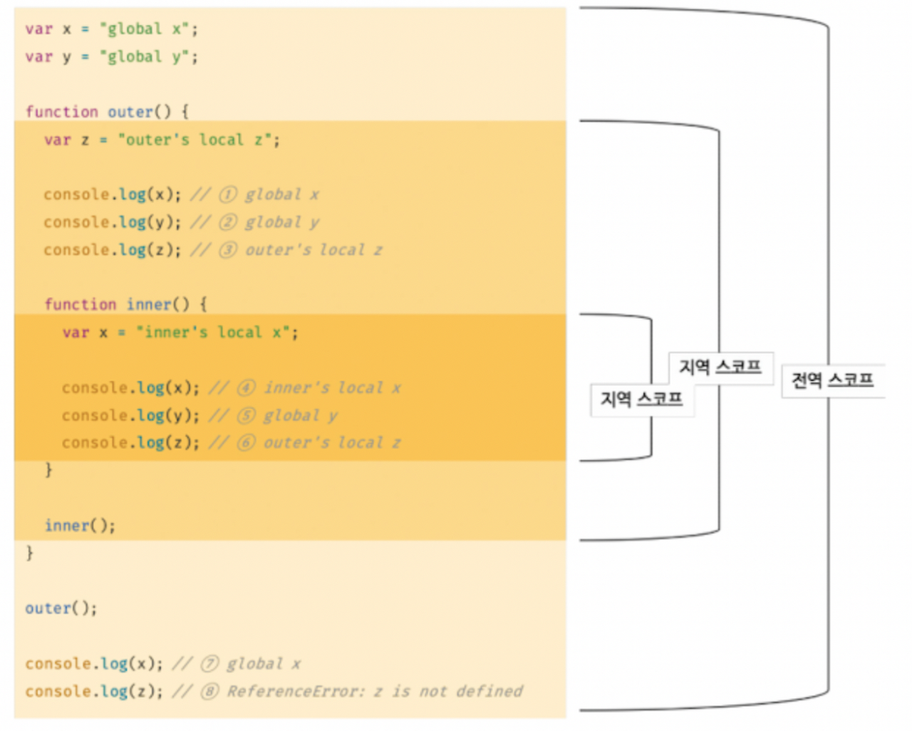
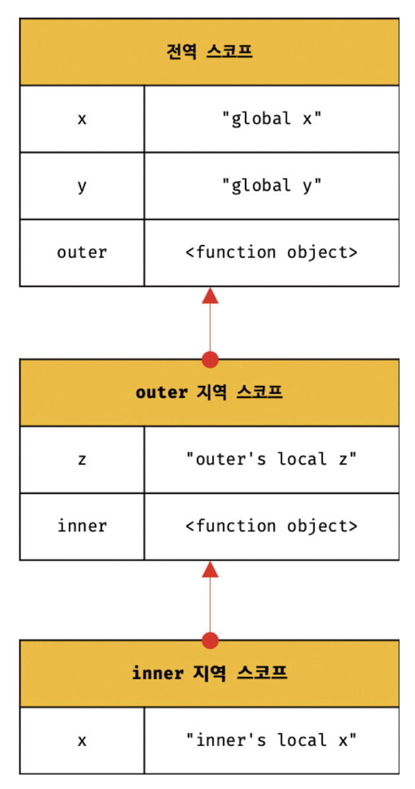

### ⭐️스코프란?

<aside>
🧪

→ 스코프(유효범위)는 자바스크립트를 포함한 모든 프로그래밍 언어의 기본적이며 중요한 개념이다.

- var 키워드로 선언한 변수와 let 또는 const 키워드로 선언한 변수의 스코프도 다르게 동작한다.
- 스코프는 변수 그리고 함수와 깊은 관련이 있다.

→ 우리는 스코프를 이미 경험했다.

- 함수의 매개변수는 함수 몸체 내부에서만 참조할 수 있고 함수 몸체 외부에서는 참조할 수 없다고 했다.
- 이것은 매개변수를 참조할 수 있는 유효범위, 매개변수의 스코프가 함수 몸체 내부에 한정이다.

```jsx
function add(x, y) {
	// 매개변수는 함수 몸체 내부에서만 참조할 수 있다.
	// 즉, 매개변수의 스코프(유효범위)는 함수 몸체 내부다.
	console.log(x, y); // 2 5
	return x + y;
}
add(2, 5);

// 매개변수는 함수 몸체 내부에서만 참조할 수 있다.
console.log(x, y) // 참조 에러 발생

// 변수는 코드의 가장 바깥 영역뿐 아니라 코드 블록이나 함수 몸체 내에서도
// 선언이 가능하다 이때 코드 블럭이나 함수는 중첩이 될 수 있다.
var var1 = 1; // 코드의 가장 바깥 영역에서 선언한 변수

if(true) {
	var var2 = 2; // 코드 블럭 내에서 선언한 변수
	if(true) {
		var var3 = 3; // 중첩된 코드 블록 내에서 선언한 변수
	}
}

function foo() {
	var var4 = 4; // 함수 내에서 선언한 변수

	function bar() {
		var var5 = 5; // 중첩된 함수 내에서 선언한 변수
	}
]

console.log(var1); // 1
console.log(var2); // 2
console.log(var3); // 3
console.log(var4); // 참조에러
console.log(var5); // 참조에러
```

→ 변수는 잔신이 선언된 위치에 의해 자신이 유효한 범위, 즉 다른 코드가 변수 자신을 참조할 수 있는 범위가 결정된다.

- 변수뿐만 아니라 모든 식별자가 그렇다
- 모든 식별자(변수이름, 함수이름, 클래스이름)는 자신이 선언된 위치에 의해 다른 코드가 식별자 자신을 참조할 수 있는 유효 범위가 결정된다.
- 이를 스코프라고 한다. → 스코프는 식별자가 유효한 범위를 말한다.

```jsx
var x = "global";

function foo() {
  var x = "local";
  console.log(x); // 1
}

foo();

console.log(x); // 2

// 코드의 가장 바깥 영역과 foo 함수 내부에 같은 이름을 갖는 x 변수를 선언
// 1과 2에서 x 변수를 참조한다.
// 이때 자바스크립트 엔진은 이름이 같은 두 개의 변수 중에서 어떤 변수를
// 참조해야 할 것인지를 결정해야 한다. 이를 바로 식별자 결정이라고 한다.
// 스코프란 자바스크립트 엔진이 식별자를 검색할 때 사용하는 규칙이다.
```

→ 자바스크립트 엔진은 코드를 실행할 때 코드의 문맥을 고려한다.

- 위 예제에서 코드의 가장 바깥 영역에 선언된 x 변수는 어디서든 참조가 가능하다.
- foo 함수 내부에서 선언된 x 변수는 foo 함수 내부에서만 참조가 가능하다.
- 두 개의 x 변수는 식별자 이름이 동일하지만 자신이 유효한 범위, 스코프는 다른 별개의 변수이다.
- 만약 스코프가 없었다면? → 위 예제 같은 이름 x 변수는 충돌을 이르킨다.

→ 식별자에 대해 다시 한번 생각해보자

- 식별자는 어떤 값을 구별할 수 있어야 하므로 유일 해야한다.
- 식별자인 변수 이름은 중복될 수 없다.
- 하나의 값은 유일한 식별자에 연결 되어야 한다.
- 프로그래밍 언어에서는 스코프를 통해 식별자인 변수 이름의 충돌을 방지하여 같은 이름의 변수를 사용할 수 있게 한다.
- 스코프 내에서 식별자는 유일해야 하지만 다른 스코프에는 같은 이름의 식별자를 사용할 수 있다.

즉, 스코프는 네임스페이스다.

! var 키워드로 선언된 변수는 같은 스코프 내에서 중복 선언이 허용된다.

</aside>

### ⭐️스코프의 종류

<aside>
🏫

→ 코드는 전역과 지역으로 구분할 수 있다.

| 구분 | 설명                  | 스코프      | 변수      |
| ---- | --------------------- | ----------- | --------- |
| 전역 | 코드의 가장 바깥 영역 | 전역 스코프 | 전역 변수 |
| 지역 | 함수 몸체 내부        | 지역 스코프 | 지역 변수 |

- 변수는 자신이 선언된 위치에 의해 자신이 유효한 범위인 스코프가 결정된다.
- 전역에서 선언된 변수 → 전역 스코프, 지역에서 선언된 변수 → 지역 스코프
</aside>

### **📌 전역과 전역 스코프**

<aside>
🤹‍♀️



→ 전역이란 코드의 가장 바깥 영역을 말한다.

- 전역은 전역 스코프를 만든다. 전역에 변수를 선언하면 전역 스코프를 갖는 전역 변수가 된다.
- 전역 변수는 어디서든지 참조할 수 있다.
- 위 예제에서 가장 바깥 영역의 x, y 변수는 전역 변수다.
</aside>

### **📌 지역과 지역 스코프**

<aside>
🍻

→ 지역이란 함수 몸체 내부를 말한다.

- 지역은 지역 스코프를 만든다. 지역에 변수를 선언하면 지역 스코프를 갖는 지역 변수가 된다.
- 지역 변수는 자신의 지역 스코프와 하위 지역 스코프에서 유효하다.

→ 위 예제 outer 함수 내부에서 선언된 z 변수는 지역 변수다.

- 지역 변수 z는 자신의 지역 스코프인 outer 함수 내부와 지역 스코프인 inner 함수 내부에서 참조 할 수 있다.
- 하지만 전역에서 z 를 참조하면 참조 에러가 발생한다.

→ inner 함수 내부에서 선언된 x 변수도 지역 변수다.

- 지역 변수 x는 자신의 지역 스코프인 함수 inner 내부에서만 참조할 수 있다.
- 하지만 지역 변수를 x를 전역 또는 inner 함수 내부 이외에 지역에서 참조하면 에러가 발생한다.

→ inner 함수 내부에서 선언된 x 변수 이외에 이름이 같은 전역 변수 x가 존재한다.

- inner 함수 내부에서 x 변수를 참조하면 전역 변수 x를 참조하는 것이 아니라 inner 함수 내부에서 선언 된, x 변수를 참조한다.
- 이는 자바스크립트 엔진이 스코프 체인을 통해 참조할 변수를 검색 했기 때문이다.
</aside>

### ⭐️스코프 체인

<aside>
🕵️‍♀️

→ 함수는 전역에서 정의할 수도 있고 함수 몸체 내부에서도 정의할 수도 있다.

- 함수 몸체 내부에서 함수를 정의하는 것을 ‘함수의 중첩’이라 한다.
- 함수 몸체 내부에서 정의한 함수를 ‘중첩 함수’, 중첩 함수를 포함하는 함수를 ‘외부 함수’

→ 함수는 중첩될 수 있으므로 함수의 지역 스코프도 중첩이 가능하다.

- 스코프가 함수의 중첩에 의해 계층적 구조를 갖는다는 것을 의미한다.
- 중첩 함수의 지역 스코프는 중첩 함수를 포함하는 외부 지역 스코프와 계층적 구조를 갖는다.
- 외부 함수의 지역 스코프를 중첩 함수의 상위 스코프라 한다.



→ 모든 스코프는 하나의 계층적 구조로 연결되며, 모든 지역 스코프의 최상위 스코프는 전역 스코프다.

- 스코프가 계층적으로 연결된 것을 스코프 체인이라 한다.

→ 변수를 참조할 때 자바스크립트 엔진은 스코프 체인을 통해 변수를 참조하는 코드의 스코프에서 시작하여 상위 스코프 방향으로 이동하며 선언된 변수를 검색한다.

- 이를 통해 상위 스코프에서 선연한 변수를 하위 스코프에서도 참조할 수 있다.

→ 스코프 체인은 물리적인 실체로 존재한다.

- 자바스크립트 엔진은 코드를 실행하기에 앞서 렉시컬 환경을 실제로 생성한다.
- 변수 선언이 실행되면 변수 식별자가 렉시컬환경에 키로 등록되고, 변수 할당이 일어나면 환경에 변수 식별자에 해당하는 값을 변경한다.
</aside>

### **📌스코프 체인에 의한 변수 검색**

<aside>
🌷

→ 자바스크립트 엔진은 스코프 체인을 따라 변수를 참조하는 코드의 스코프에서 시작해서 상위 스코프 방향으로 이동하며 선언된 변수를 검색한다.

- 절대 하위 스코프로 내려가며 식별자를 검색하는 일은 없다.
- 상위 스코프에서 유효한 변수는 하위 스코프에서 자유롭게 참조할 수 있지만 하위 스코프애서 유효한 변수를 상위 스코프에서 참조할 수 없다는 것을 의미한다.
- 스코프 체인으로 연결된 계층적 구조는 부자 관계로 이뤄진 상속과 유사하다.
- 상속으로 부모의 자산을 자식이 자유롭게 사용이 가능하지만 자식의 자산을 부모가 사용할 수는 없다.
</aside>

### **📌스코프 체인에 의한 함수 검색**

<aside>
♻️

→ 다음 예제를 살펴보자. 전역에서 정의된 foo 함수와 bar 함수 내부에서 정의 된 foo 함수다.

```jsx
// 전역 함수
function foo() {
  console.log("global function foo");
}

function bar() {
  // 중첩 함수
  function foo() {
    console.log("local function foo");
  }
  foo();
  1;
}

bar();
```

→ 함수 호이스팅으로 함수 선언문으로 함수를 정의하면 런타임 이전에 함수 객체가 실행된다.

- 자바스크립트 엔진은 함수 이름과 동일한 이름의 식별자를 암묵적으로 선언 후 생성된 함수 객체를 할당한다.
- 위 예제의 모든 함수는 함수 이름과 동일한 이름의 식별자에 할당된다.
- 1에서 foo함수를 호출하면 엔진은 함수를 호출하기 위해 먼저 함수를 가리키는 식별자 foo를 검색한다.

→ 함수도 식별자에 할당되기 때문에 스코프를 갖는다.

- 함수는 식별자에 함수 객체가 할당 된 것 외에는 일반 변수와 다름이 없다.
- 식별자를 검색하는 규칙이라고 표현한다.

</aside>

### ⭐️함수 레벨 스코프

<aside>
🚨

→ 코드 블록이 아닌 함수에 의해서만 지역 스코프가 생성된다.

- 함수 몸체만이 아닌 모든 코드 블럭이 지역 스코프를 만든다.
- 이러한 특성은 블록 레벨 스코프라 한다.
- 하지만 var 키워드로 선언된 변수는 오로지 함수의 코드 블록만을 지역스코프로 인정한다.
- 이러한 특성을 함수 레벨 스코프라 한다.

```jsx
var x = 1;
if (true) {
  // var 키워드로 선언된 변수는 함수의 코드 블록을 지역 스코프로 인정한다.
  // 함수 밖에서 var 키워드로 선언된 변수는 코드 블록 내에서 선언되었다 할지라도 모든 전역 변수다
  // 따라서 x는 전역 변수다. 이미 선언된 전역 변수 x가 있으므로 x 변수는 중복 선언된다.
  // 이는 의도치 않게 변수 값이 변경되는 부작용이 발생한다.
  var x = 10;
}
console.log(x); // 10
```

→ 전역 변수 x가 선언되었고 if 문의 코드 블록 내에도 x 변수가 선언되었다.

- if 문 코드불록에 선언된 x 변수는 전역변수다.
- var 키워드로 선언된 변수는 함수 레벨 스코프만 인정하기 때문에 함수 밖에서 var 키워드로 선언된 변수는 코드 블록내에서 선언되었다 할지라도 모두 전역 변수다.
- 따라서 전역 변수 x 는 중복 선언되고 결과 의도치 않는 전역 변수의 값이 재할당 된다.

```jsx
var i = 10;

// for 문에서 선언한 i는 전역 변수다. 이미 선언된 전역 변수 i가 있으므로 중복 선언된다.
for (var i = 0; i < 5; i++) {
  console.log(i); // 0 1 2 3 4
}

// 의도치 않게 변수의 값이 변경되었다.
console.log(i); // 5
```

- for 문에서 반복을 위해 선언된 i 변수가 for 문의 코드 블록 내에서만 유효한 지역 변수다.
- 하지만 var 키워드로 선언된 변수는 블록 레벨 스코프를 인정하지 않기 때문에 i 변수는 전역 변수가 된다.
- 따라서 전역 변수 i는 중복 선언되고 그 결과 의도치 않은 전역 변수의 값이 재할당된다.
</aside>

### ⭐️렉시컬 스코프

<aside>
🍀

```jsx
var x = 1;

function foo() {
  var x = 10;
  bar();
}

function bar() {
  console.log(x);
}

foo(); // ?
bar(); // ?
```

1. 함수를 어디서 호출했는지에 따라 함수의 상위 스코프를 결정한다.
2. 함수를 어디서 정의했는지에 따라 함수의 상위 스코프를 결정한다.

→ 첫 번째 방식으로 함수의 상위 스코프를 결정하기

- bar 함수의 상위 스코프 foo 함수의 지역 스코프와 전역 스코프일 것이다.
- 동적 스코프라 한다. → 함수가 정의하는 시점에는 함수가 어디서 호출될 지 알 수 없다.
- 따라서 함수가 호출되는 시점에 동적으로 상위 스코프를 결정해야 하기에 동적 스코프다.

→ 두번째 방식으로 함수의 상위 스코프를 결정하기

- bar 함수의 상위 스코프는 전역 스코프일 것이다.
- 렉시컬 스코프 또는 정적 스코프라 한다.
- 동적 스코프 방식처럼 상위 스코프가 동적으로 변하지 않고 함수 정의가 평가되는 시점에 상위 스코프가 정적으로 결정되기 때문에 정적 스코프라고 부른다.
- 자바스크립트 언어는 렉시컬 스코프를 따른다.

→ JS는 렉시컬 스코프를 따르므로 함수를 어디서 호출했는지가 아니라 함수를 어디서 정의했는지에 따라 상위 스코프를 결정한다.

- 함수가 호출된 위치는 상위 스코프 결정에 어떠한 영향도 주지 않는다.
- 함수의 상위 스코프는 언제나 자신이 정의된 스코프다.

→ 함수의 상위 스코프는 함수 정의가 실행될 때 정적으로 결정된다.

- 함수 정의가 실행되어 생성된 함수 객체는 이렇게 결정된 상위 스코프를 기억한다.
- 함수가 호출될 때마다 함수의 상위 스코프를 참조할 필요가 있기 때문이다.

→ 위 예제의 BAR 함수는 전역에서 정의된 함수다.

- 함수 선언문으로 함수 호이스팅 되어 먼저 평가된다.
- 이때 평가된 bar 함수 객체는 자신이 정의된 스코프, 즉 전역 스코프를 기억한다.
- bar 함수가 호출되면 호출된 곳이 어디인지 관계없이 자신이 기억하고 있는 전역 스코프를 상위 스코프로 사용한다
- 따라서 위 예제를 실행하면 전역 변수 x의 값 1을 두번 출력한다.
</aside>
