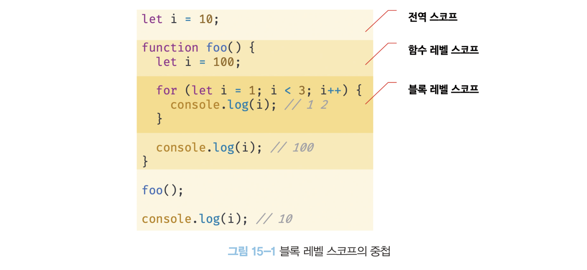
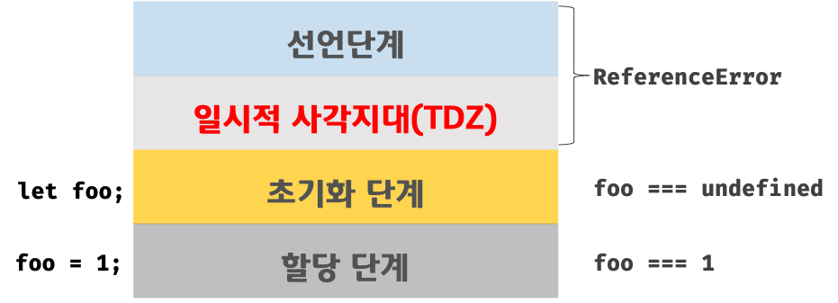

### ⭐️var 키워드로 선언한 변수의 문제점

<aside>
🔷

→ ES6까지 변수를 선언할 수 있는 유일한 방법은 var 키워드를 사용하는 것이였다.

- var 키워드로 선언된 변수는 다음과 같은 특징이 있다.
</aside>

### **📌 변수 중복 선언 허용**

<aside>
🔶

→ var 키워드로 선언한 변수는 중복 선언이 가능하다.

```jsx
var x = 1;
var y = 1;

// var 키워드로 선언된 변수는 같은 스코프 내에서 중복 선언을 허용한다.
// 초기화문이 있는 변수 선언문은 자바스크립트 엔진에 의해
// var 키워드가 없는 것처럼 동작한다.

var x = 100;
// 초기화 문이 없는 변수 선언문은 무시된다.
var y =;

console.log(x); // 100
console.log(y) // 1
```

→ 위 예제의 var 키워드로 선언한 x 변수와 y 변수는 중복 선언되었다.

- var 키워드로 선언한 변수를 중복 선언하면 초기화문 유무에 따라 다르게 동작한다.
- 초기화문이 있는 변수 선언문은 자바스크립트 엔진에 의해 var 키워드가 없는 것처럼 동작하고 초기화문이 없는 변수 선언문은 무시된다. → 에러는 발생하지 X
- 만약 동일한 이름의 변수가 이미 선언되어 있는 것을 모르고 변수를 중복 선언하면서 값을 할당 했다면 의도치 않게 먼저 선언된 변수 값이 변경되는 부작용이 발생한다.
</aside>

### **📌 함수 레벨 스코프**

<aside>
💠

→ var 키워드로 선언한 변수는 오로지 함수의 코드 블록만을 지역 스코프로 인정한다.

- 함수 외부에서 var 키워드로 선언한 변수는 코드 블록 내에서 선언해도 모두 전역 변수가 된다.

```jsx
var x = 1;

if (true) {
  // x는 전역 변수다. 이미 선언된 전역 변수 x가 있으므로 x변수는 중복 선언된다.
  // 이는 의도치 않게 변수값이 변경되는 부작용을 발생시킨다.
  var x = 10;
}

console.log(x); // 10
```

→ for 문의 변수 선언문에서 var 키워드로 선언한 변수도 전역 변수가 된다.

```jsx
var i = 10;
// for 문에서 선언한 i는 전역 변수다. 이미 선언된 i가 있으므로 중복 선언이다.
for (var i = 0; i < 5; i++) {
  console.log(i); // 0 1 2 3 4
}
// 의도치 않게 i 변수의 값이 변경되었다.
console.log(i); // 5
```

→ 함수 레벨 스코프는 전역 변수를 남발할 가능성을 높인다.

</aside>

### **📌 변수 호이스팅**

<aside>
🚐

→ var 키워드로 변수를 선언하면 변수 호이스팅에 의해 변수 선언문이 스코프의 선두로 끌어 올려진 것처럼 동작한다.

- 변수 호이스팅에 의해 var 키워드로 선언한 변수는 변수 선언문 이전에 참조할 수 있다.
- 할당문 이전에 변수를 참조하면 언제나 undefined를 반환한다.

```jsx
// 이 시점에는 변수 호이스팅에 의해 이미 foo 변수가 선언 (1. 선언 단계)
// 변수 foo는 undefined로 선언된다. (2. 초기화 단계)
console.log(foo); // undefined

// 변수에 값을 할당(3. 할당 단계)
foo = 123;

// 변수 선언은 런타임 이전에 자바스크립트 엔진으로 암묵적 실행
var foo;
```

- 변수 선언문 이전에 변수를 참조하는 것은 변수 호이스팅에 의해 에러를 발생하지는 않지만 프로그램의 흐름상 맞지 않고, 가독성을 떨어트린다.
</aside>

### **⭐️let 키워드**

→ ES6에서는 새로운 변수 선언 키워드인 let 과 const를 도입했다.

### **📌 변수 중복 선언 금지**

<aside>
🥜

→var 키워드로 이름이 동일한 변수를 중복 선언하면 아무런 에러가 발생하지 않는다.

- 이때 변수를 중복 선언하면서 값까지 할당 했다면 의도치 않게 먼저 선언된 변수 값이 재할당 되어 변경되는 부작용이 발생한다.
- 하지만 let 키워드로 이름이 같은 변수를 중복 선언하면 문법 에러가 발생한다.

```jsx
var foo = 123;
// var 키워드로 선언된 변수는 같은 스코프 내에서 중복 선언을 허용한다.
// 아래 변수 선언문은 자바스크립트 엔진에 의해 var 키워드가 없는 것처럼 동작한다.

var foo = 456;

let bar = 123;
// let이나 const 키워드로 선언된 변수는 같은 스코프 내에서 중복 선언을 허용하지 않는다.
let bar = 456; // 문법에러
```

</aside>

### **📌 블록 레벨 스코프**

<aside>
👨‍👩‍👧

→ var 키워드로 선언한 변수는 오로지 함수의 코드 블록만을 지역 스코프로 인정하는 함수 레벨 스코프를 따른다.

- 하지만 let 키워드로 선언한 변수는 모든 코드 블럭을 지역 스코프로 인정하는 블록 레벨 스코프를 따른다.

```jsx
let foo = 1; // 전역 변수

{
  let foo = 2; // 지역 변수
  let bar = 3; // 지역 변수
}

console.log(foo); // 1
console.log(bar); // 참조에러
```

→ let 키워드로 선언된 변수는 블록 레벨 스코프를 따른다.

- 위 예제의 코드 블록 내에서 선언된 foo 변수와 bar 변수는 지역 변수다.
- 전역에서 선언된 foo 변수와 코드 블록 내에서 선언된 foo 변수는 다른 별개의 변수다.
- bar 변수도 블록 레벨 스코프며, 전역에서는 bar 변수를 참조할 수 없다.

→ 함수도 코드 블록이므로 스코프를 만든다. → 함수 내의 코드 블록은 함수 레벨 스코프에 중첩된다.



</aside>

### **📌 변수 호이스팅**

<aside>
🎴

→ var 키워드로 선언한 변수와 달리 let 키워드로 선언한 변수는 변수 호이스팅이 발생하지 않는 것처럼 동작한다.

```jsx
console.log(foo); // 참조에러
let foo;
```

→ let 키워드로 선언한 변수를 변수 선언문 이전에 참조하면 참조 에러가 발생한다.

- var 키워드로 선언한 변수는 런타임 이전에 엔진에 의해 암묵적으로 선언 - 초기화가 진행.

```jsx
// var 키워드로 선언한 변수는 런타임 이전에 선언 단계와 초기화 단계가 실행된다.
// 따라서 변수 선언문 이전에 변수를 참조할 수 있다.
console.log(foo); // undefined

var foo;
console.log(foo); // undefined

foo = 1; // 할당문에서 할당 단계가 실행된다.
console.log(foo); // 1
```



→ let 키워드로 선언한 변수는 변수 호이스팅이 발생하지 않는 것처럼 보인다.

```jsx
let foo = 1; // 전역 변수
{
  console.log(foo); // 참조에러
  let foo = 2; // 지역 변수
}
```

→ let 키워드로 선언한 변수의 경우 변수 호이스팅이 발생하지 않는다면 위 예제는 전역 변수 foo의 값을 출력 해야 한다.

- 하지만 let 키워드로 선언한 변수도 여전히 호이스팅이 발생하기 때문에 참조 에러가 발생한다.
- 자바스크립트는 ES6에서 도입된 모든 선언을 호이스팅 한다.
- 단 let, const, class를 사용한 선언문은 호이스팅이 발생하지 않는 것처럼 동작한다.
</aside>

### **📌 전역 객체와 let**

<aside>
🐆

→ var 키워드로 선언한 전역 변수와 전역 함수, 그리고 선언하지 않은 변수에 값을 할당한 암묵적 전역은 전역 객체 window의 프로퍼티가 된다.

- 전역 객체의 프로퍼티를 참조할 때 window를 생략할 수 있다.

```jsx
// 이 예제는 브라우저 환경에서 실행해야 한다.

// 전역 변수
var x = 1;
// 암묵적 전역
y = 2;
// 전역 함수
function foo() {}

// var 키워드로 선언한 전역 변수는 전역 객체 window의 프로퍼티다.
console.log(window.x); // 1
// 전역 객체 window의 프로퍼티는 전역 변수처럼 사용할 수 있다.
console.log(x); // 1

// 암묵적 전역은 전역 객체 window의 프로퍼티다.
console.log(window.y); // 2
console.log(y); // 2

// 함수 선언문으로 정의한 전역 함수는 전역 객체 window의 프로퍼티다.
console.log(window.foo); // f foo() {}
console.log(foo); // f foo() {}
```

→ let 키워드로 선언한 전역 변수는 전역 객체의 프로퍼티가 아니다.

- window.foo와 같이 접근할 수 없다.
- let 전역 변수는 보이지 않는 개념적인 블록 내에 존재하게 된다.

```jsx
// 이 예제는 브라우저 환경에서 실행해야 하낟.
let x = 1;

// let, const 키워드로 선언한 전역 변수는 전역 객체 window의 프로퍼티가 아니다.
console.log(window.x); // undefined
console.log(x); // 1
```

</aside>

### **⭐️const 키워드**

<aside>
💆‍♂️

→ const 키워드는 상수를 선언하기 위해 사용한다.

- 하지만 반드시 상수만을 위해 사용하지는 않는다.
- const 키워드의 특징은 let 키워드와 대부분 동일하므로 let 키워드와 다른 점을 살펴보자
</aside>

### **📌 선언과 초기화**

<aside>
🏩

→ const 키워드로 선언한 변수는 반드시 선언과 동시에 초기화해야 한다.

`const foo = 1;`

- 그렇지 않으면 다음과 같이 문법 에러가 발생한다.

`const foo; // SyntaxError`

- const 키워드로 선언한 변수는 let 키워드로 선언한 변수와 마찬가지로 블록 레벨 스코프를 가지며, 변수 호이스팅이 발생하지 않는 것처럼 동작한다.

```jsx
{
  // 변수 호이스팅이 발생하지 않는 것처럼 동작한다
  console.log(foo); // 참조에러
  const foo = 1;
  console.log(foo); // 1
}

// 블록 레벨 스코프를 갖는다.
console.log(foo); // 참조에러
```

</aside>

### **📌 재할당 금지**

<aside>
💐

→ var 또는 let 키워드로 선언한 변수는 재할당이 자유로우나 const 키워드로 선언한 변수는 재할당이 금지된다.

```jsx
const foo = 1;
foo = 2; // TypeError
```

</aside>

### **📌 상수**

<aside>
📊

→ const 키워드로 선언한 변수에 원시 값이 할당한 경우 변수 값을 변경할 수 없다.

- 원시 값은 변경 불가능한 값이므로 재할당 없이 값을 변경할 수 있는 방법이 없기 때문이다.
- 이러한 특징을 이용해 const 키워드를 상수로 표현하는 데 사용하기도 한다.

→ 변수의 상대 개념인 상수는 재할당이 금지된 변수를 말한다.

- 상수도 값을 저장하기 위한 메모리 공간이 필요하므로 변수라고 할 수 있다.
- 단 변수는 언제든지 재할당이 가능하지만 상수는 재할당이 금지된다.
- 상수는 상태 유지와 가독성, 유지보수의 편의를 위해 적극적으로 사용해야 한다.

```jsx
// 세전 가격
let preTaxPrice = 100;

// 세후 가격
// 0.1의 의미를 명확히 알기 어렵기 때문에 가독성이 좋지 않다.
let afterTaxPrice = preTaxPrice + preTaxPrice * 0.1;

console.log(afterTaxPrice); // 110
```

→ 코드 내에서 사용한 0.1은 어떤 의미로 사용 했는지 알기 어렵다.

- 세율을 의미하는 0.1은 쉽게 바뀌지 않는 값이며, 전체에서 고정된 값을 사용해야 한다.
- 이때 상수로 정의하면 값의 의미를 쉽게 파악하고 변경될 수 없는 고정값으로 사용이된다.

→ const 키워드로 선언된 변수는 재할당이 금지된다.

- const 키워드로 선언된 변수에 원시 값을 할당한 경우 원시 값은 변경할 수 없는 값
- const 키워드에 의해 재할당이 금지되므로 할당된 값을 변경할 수 있는 방법은 없다.
- 프로그램 전체에서 사용하여 상수만 변경하여 유지보수성이 높아진다.

→ 일반적으로 상수의 이름은 대문자로 선언해 상수임을 명확히 나타낸다.

- 여러 단어로 이뤄진 경우에는 언더스코어로 구분해서 스네이크 케이스로 표현한다.

```jsx
// 세전을 의미하는 0.1을 상수로 사용하자
// 변수 이름을 대문자로 선언해 상수임을 명확히 나타낸다.
const TAX_RATE = 0.1;

// 세전 가격
let preTaxPrice = 100;

// 세후 가격
let afterTaxPrice = preTaxPrice + preTaxPrice * TAX_RATE;

console.log(afterTaxPrice); // 110
```

</aside>

### **📌 const 키워드와 객체**

<aside>
🛕

→ const 키워드로 선언된 변수에 원시 값을 할당한 경우 값을 변경할 수 없다.

- 하지만 const 키워드로 선언된 변수에 객체를 할당한 경우 값을 변경할 수 있다.

```jsx
const person = {
  name: "Lee",
};

// 객체는 변경 가능한 값이다. 따라서 재할당 없이 변경이 가능하다.
person.name = "Kim";

console.log(person); // {name: 'Kim'}
```

→ const 키워드는 재할당을 금지할 뿐 ‘불변’을 의미하지는 않는다.

- 프로퍼티 동적 생성, 삭제, 값의 변경을 통해 객체를 변경하는 것은 가능하다.
- 객체가 변경되더라도 변수에 할당된 참조 값은 변경되지 않는다.
</aside>

### **⭐️var vs let vs const**

<aside>
❓

→ 변수 선언에는 기본적으로 const를 사용하고 let은 재할당이 필요한 경우에 한정해 사용하는 것이 좋다.

- const 키워드를 사용하면 의도치 않는 재할당을 방지하기 때문에 좀 더 안전하다.
- ES6를 사용한다면 var 키워드는 사용하지 않는다.
- 재할당이 필요한 경우에만 let 을 사용한다.
- 변경이 발생하지 않고 읽기 전용으로 사용하는 원시 값과 객체는 const를 사용한다.
</aside>
