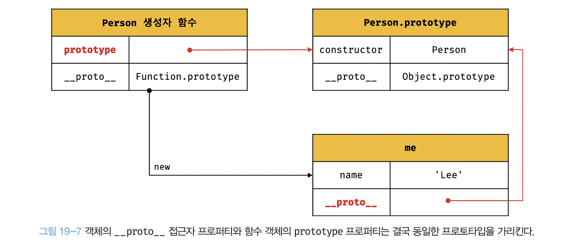

### ⭐️19 프로토타입

<aside>
🚄

→ 자바스크립트는 클래스 기반 객체지향 프로그래밍 언어보다 효율적이며 더 강력한 객체지향 프로그래밍 능력을 지니고 있는 프로토타입 기반의 객체지향 프로그래밍 언어이다.

- 자바스크립트는 객체 기반의 프로그래밍 언어이며 자바스크립트를 이루고 있는 거의 “모든 것”이 객체다.
- 원시 타입의 값을 제외한 나머지 값들은 모두 객체다.
</aside>

### ⭐️19.1 객체지향 프로그래밍

<aside>
🚶

→ 객체지향 프로그래밍이란?

- 프로그램을 명령어 또는 함수의 목록으로 보는 전통적인 명령형 프로그래밍의 절차지향적 관점에서 벗어나 여러 개의 독립적 단위
- 객체의 집합으로 프로그램을 표현하려는 프로그래밍 패러다임을 말한다.
- 실세계의 실체를 인식하는 철학적 사고를 프로그래밍에 접목하려는 시도이다.
- 실체는 특징이나 성질을 나타내는 속성을 가지고 있고, 이를 통해 실체를 인식하거나 구별한다.
- 다양한 속성 중에서 프로그래메 필요한 속성만 간추려 내어 표현하는 것을 추상화라 한다.

```jsx
// 이름과 주소 속성을 갖는 객체
const person = {
	name : 'Lee',
	address : 'Seoul'
};

console.log(person); 

// 속성을 통해 여러개의 값을 하나의 단위로 구성한 복합적인 자료구조 -> 객체
// 객체지향 프로그래밍 -> 객체의 집합으로 프로그램을 표현

// 원 개념을 객체로 만들기
const circle = {
	radius: 5, // 반지름
	getDiameter () {
		return 2 * this.radius;
	},
}

// 반지름은 원의 상태를 나타내는 데이터
// 원의 지름을 구하는 getDiameter는 동작이다.
// 객체지향은 객체의 상태(데이터)와 상태 데이터를 조작하는 동작을 하나의
// 논리적인 단위로 묶는다. 
// 따라서 객체는 상태 데이터와 동작을 하나의 논리적인 단위로 묶은 자료구조이다.
```

</aside>

### ⭐️19.2 상속과 프로토타입

<aside>
🥕

→ 상속은 객체지향 프로그래밍의 핵심 개념이다.

- 객체의 프로퍼티 또는 메서드를 다른 객체가 상속 받아 그래도 사용할 수  있는것을 말한다.
- 자바스크립트는 프로토타입을 기반으로 상속을 구현하여 불필요한 중복을 제거한다.
- 기존의 코드를 적극적으로 재사용하여 중복을 제거하는 방법을 사용한다.

→ 코드 재사용 예제

```jsx
// 생성자 함수
function Circle(radius) {
	this.radius = radius
	this.getArea = function () {
		return Math.PI * this.radius ** 2;
	};
}

// 반지름이 1인 인스턴스 생성
const Circle1 = new Circle(1);
// 반지름이 2인 인스턴스 생성
const Circle2 = new Circle(2);

// Circle 생성자 함수로 동일한 동작을 하는
// getArea 메서드를 중복 생성하고 모든 인스턴스가 중복 소유한다.
console.log(circle1.getArea());
console.log(circle2.getArea());
```

→ 생성자 함수는 동일한 프로퍼티 구조를 갖는 객체를 여러 개 생성할 때 유용하다.

→ 그러나 위 예제 생성자 함수는 문제가 있다.

- Circle 생성자 함수가 생성하는 모든 객체는 radius 프로퍼티와 getArea 메서드를 갖는다.
- radius 프로퍼티 값은 일반적으로 인스턴스마다 다르다.
- getArea 메서드는 모든 인스턴스가 동일한 내용의 메서드를 사용하므로 단 하나만 생성하여 모든 인스턴스가 공유해서 사용하는 것이 바람직하다.
- Circle 생성자 함수는 인스턴스를 생성할 때마다 getArea 메서드를 중복 생성하고 모든 인스턴스가 중복 소유한다.


→ 이경우 메모리를 불필요하게 낭비한다.

- 상속을 통해 불필요한 중복을 제거한다. → 프로토타입을 기반으로 상속을 구현한다.

```jsx
// 생성자 함수
function Circle(radius) {
	this.radius = radius;
}

// Circle 생성자 함수가 생성한 모든 인스턴스가 getArea 메서드를
// 공유해서 사용할 수 있도록 프로토타입에 추가한다.
// 프로토타입은 Circle 생성자 함수의 prototype 프로퍼티에 바인딩되어 있다.
Circle.prototype.getArea = function () {
	return Math.PI * this.radius ** 2;
};

// 반지름이 1인 인스턴스 생성
const Circle1 = new Circle(1);
// 반지름이 2인 인스턴스 생성
const Circle2 = new Circle(2);

// Circle 생성자 함수가 생성한 모든 인스턴스는 부모 객체의 역할을 하는
// 프로토타입 Circle.prototype으로부터 getArea 메서드를 상속받는다.
// 즉, Circle 생성자 함수가 생성하는 모든 인스턴스는 하나의 getArea 함수를 공유
console.log(circle1.getArea === circle2.getArea); // true

console.log(circle1.getArea());
console.log(circle2.getArea());
```


→  Circle 생성자 함수가 생성한 모든 인스턴스는 자신의 프로토타입, 상위 객체 역할을 하는 Circle, prototype의 모든 프로퍼티와 메서드를 상속받는다.

- Circle 생성자 함수가 생성하는 모든 인스턴스는 getArea메서드를 상속받아 사용한다.
- radius 프로퍼티만 개별적으로 소유하고, 동일한 메서드는 상속을 통해 공유하여 사용
</aside>

### ⭐️19.3 프로토타입 객체

<aside>
🔒

→ 프로토타입 객체란?

- 객체지향 프로그래밍의 근간을 이루는 객체 간 상속을 구현하기 위해 사용된다.
- 프로토타입은 어떤 객체의 상위 객체의 역할을 하는 객체로서 다른 객체 공유 프로퍼티를 제공한다.
- 프로토타입을 상속받은 하위 객체는 상위 객체의 프로퍼티를 자신의 프로퍼티처럼 자유롭게 사용이 가능하다.

→ [[Prototype]]

- 모든 객체는 [[Prototype]]이라는 내부슬롯을 가지며, 내부 슬롯의 값은 프로토타입의 참조다.
- [[Prototype]]에 저장되는 프로토타입은 객체 생성 방식에 의해 결정된다.
- 객체가 생성될 때 객체 생성 방식에 따라 프로토타입이 결정되고 [[Prototype]]에 저장된다.

→ 모든 객체는 하나의 프로토타입을 갖는다.

- 모든 프로토타입은 생성자 함수와 연결되어 있다.
- 객체와 프로토타입과 생성자 함수는 서로 연결되어 있다.
    
    
    
- [[Prototype]]에 직접 접근은 불가능, __proto__ 접근자 프로퍼티를 통해 [[Prototype]] 내부 슬롯이 가리키는 프로토타입에 간접적으로 접근이 가능하다.
</aside>

### **📌 19.3.1 __proto__ 접근자 프로퍼티**

<aside>
🧭

→ 모든 객체는  **__proto__** 접근자 프로퍼티를 통해 자신의 프로토타입, 내부 슬롯에 간접적으로 접근이 가능하다.

`const person = { name: ‘Lee’ };`


→ 빨간색 영역이  **__proto__** 접근자 프로퍼티를 통해 person 객체의 내부 슬롯이 가리키는 객체인 Object .prototype 접근한 결과이다.

→  ****1. **__proto__**는 접근자 프로퍼티다.

- 내부 슬롯은 프로퍼티가 아니다, 직접적으로 접근하거나 호출하는 방법은 제공하지 않는다.
- **__proto__** 접근자 프로퍼티를 통해 간접적으로 프로토 타입에 접근한다.
- **__proto__** 는 getter/setter 함수라고 부르는 접근자 함수를 통해 내부 슬롯의 값, 프로토타입을 취득하거나 할당한다.

```jsx
const obj = {};
const parent = { x: 1 };

// getter 함수인 get __proto__가 호출되어 obj 객체의 프로토타입을 취득
obj.__proto__;

// setter 함수인 set  **__proto__**가 호출되어 obj 객체의 프로토타입을 교체
obj.__proto__ = parent;

console.log(obj.x); // 1
```

→  2.  **__proto__** 접근자 프로퍼티는 상속을 통해 사용된다.

- **__proto__** 접근자 프로퍼티는  객체가 직접 소유하는 프로퍼티가 아니라 Object.prototype의 프로퍼티다.
- 모든 객체는 상속을 통해 Object.prototype.__proto__ 접근자 프로퍼티를 사용할 수 있다.

```jsx
const person = { name: 'Lee' };

// person 객체는 __proto__ 프로퍼티를 소유하지 않는다.
console.log(person.hasOwnProperty('__proto__')); // false

// __proto__ 프로퍼티는 모든 객체의 프로토타입 객체인 Object.prototype 접근자 
console.log(Object.getOwnPropertyDescriptor(Object.prototype,'__proto__'));

// 모든 객체는 Object.prototype의 접근자 프로퍼티 __proto__를 상속받아 사용가능
console.log({}.__proto__ === Object.prototype); // true
```

→  3.  __proto__ 접근자 프로퍼티를 통해 프로토타입에 접근하는 이유

- 내부 슬롯의 값, 프로토타입에 접근하기 위해 접근자 프로퍼티를 사용하는 이유는 상호 참조에 의해 프로토타입 체인이 생성되는 것을 방지하기 위해서다.

```jsx
const parent = {};
const child = {};

// child의 프로토타입을 parent로 설정
child.__proto__ = parent;
// parent의 프로토타입을 child로 설정
parent.__proto__ = child; // TypeError: Cyclic __proto__ value
```

→ 위코드에서는 에러가 발생한다.

- 위 코드가 에러 없이 정상적으로 처리 된다면 서로가 자신의 프로토타입이 되는 비정상적인 프로토타입 체인이 만들어지기 때문에 __proto__ 접근자 프로퍼티는 에러를 발생시킨다.
- 프로토타입 체인은 단방향 링크드 리스트로 구현되어야 한다.
- 순환 참조하는 프로토타입이 만들어지면, 체인 종점이 존재하지 않기 때문에 프로토타입 체인에서 프로퍼티를 검색할 때 무한 루프에 빠진다.
- 따라서 아무런 체크 없이 무조건적으로 프로토타입을 교체할 수 없도록 __proto__ 접근자 프로퍼티를 통해 접근하고 교체하도록 구현되어 있다.

→  4. __proto__ 접근자 프로퍼티를 코드 내에서 직접 사용하는 것은 권장하지 않는다.

- 모든 객체가 __proto__ 접근자 프로퍼티를 사용할 수 있는 것은 아니다.
- 직접 상속을 통해 Object.prototype을 상속받지 않는 객체를 생성할 수도 있기 때문에 __proto__ 접근자 프로퍼티를 사용할 수 없는 경우가 있다.

```jsx
// obj는 프로토타입 체인의 종점이다. 따라서 __proto__ 를 상속받을 수 없다.
const obj = Object.create(null);

// obj는 Object.__proto__를 상속받을 수 없다.
console.log(obj.__proto__); // undefined

// 따라서 __proto__ 보다 Object.getPropertypeOf 메서드를 사용하는 편이 좋다.
console.log(Object.getPrototypeOf(obj)); // null
```

→ __proto__  접근자 대신 프로토타입의 참조를 취득하고 싶은 경우에는 `Object.getPrototypeOf` 메서드 사용하기.

```jsx
// 객체의 프로토타입을 취득
Object.getPrototypeOf();
// 객체의 프로토타입을 교체
Object.setPrototypeOf();
```

</aside>

### **📌 19.3.2 함수 객체의 prototype 프로퍼티**

<aside>
🦸‍♀️

→ 함수 객체만이 소유하는 prototype 프로퍼티는 생성자 함수가 생성할 인스턴스의 프로토타입을 가리킨다.

```jsx
// 함수 객체는 prototype 프로퍼티를 소유한다.
(function () {}).hasOwnProperty('prototype'); // true

// 일반 객체는 prototype 프로퍼티를 소유하지 않는다.
({}).hasOwnProperty('prototype'); // false
```

→ 생성자 함수로서 호출할 수 없는 함수

- non-constructor 인 화살표 함수와 ES6 메서드 축약 표현으로 정의한 메서드는 prototype 프로퍼티를 소유하지 않으면 프로토타입도 생성하지 않는다.

```jsx
// 화살표 함수는 non-construct이다.
const Person = name => {
	this.name = name;
};

// non-constructor는 prototype 프로퍼티를 소유하지 않는다.
console.log(Person.hasOwnProperty('protortype')); // false

// non-constructor는 프로토타입을 생성하지 않는다.
console.log(Person.prototype); // undefined

// ES6의 메서드 축약 표현으로 정의한 메서드는 non-constructor다.
const obj = {
	foo() {}
};

// non-constructor는 prototype 프로퍼티를 소유하지 않는다.
console.log(obj.foo.hasOwnProperty('prototype')); // false

// non-constructor는 프로토타입을 생성하지 않는다.
console.log(obj.foo.prototype); // undefined
```

→ 객체를 생성하지 않는 일반 함수의 prototype 프로퍼티는 아무런 의미가 없다.

→ 모든 객체가 가지고 있는 __proto__ 접근자 프로퍼티와 함수 객체만이 가지고 있는 prototype 프로퍼티는 결국 동일한 프로토타입을 가리킨다.

| 구분 | 소유 | 값 | 사용 주체 | 사용 목적 |
| --- | --- | --- | --- | --- |
| __proto__ 접근자 프로퍼티 | 모든 객체 | 프로토타입의 참조 | 모든 객체 | 객체가 자신의 프로토타입에 접근 또는 교체하기 위해 사용 |
| prototype 프로퍼티 | constructor | 프로토타입의 참조 | 생성자함수 | 생성자 함수가 자신이 생성할 객체의 프로토타입을 할당하기 위해 사용 |

```jsx
// 생성자 함수로 객체를 생성 후 __proto__ 와 prototype 으로 객체에 접근하기
function Pesron(name) {
	this.name = name;
}

const me = new Person('Lee');

// 결국 Person.prototype과 me.__proto__는 동일한 프로토타입을 가리킨다.
console.log(Person.prototype === me.__proto__); // true
```



</aside>

### **📌 19.3.3 프로토타입의 constructor 프로퍼티와 생성자 함수**

<aside>
💥

→ 모든 프로토타입은 constuctor 프로퍼티를 갖는다.

- constructor 프로퍼티는 prototype 프로퍼티로 자신을 참조하는 생성자 함수를 가리킨다.
- 연결은 생성자 함수가 생성될 때, 이뤄진다.

```jsx
// 생성자 함수
function Person(name){
	this.name = name;
}

const me = new Person('Lee');

// me 객체의 생성자 함수는 Person이다.
console.log(me.constructor === Person); // true
```


</aside>

### ⭐️19.4 리터럴 표기법에 의해 생성된 객체의 생성자 함수와 프로토타입

<aside>
👩‍🦰

→ constructor 프로퍼티가 가리키는 생성자 함수는 인스턴스를 생성한 생성자 함수다.

```jsx
// obj 객체를 생성한 생성자 함수는 object다.
const obj = new Object();
console.log(obj.constructor === Object); // true

// add 함수 객체를 생성한 생성자 함수는 Function이다.
const add = new Function('a', 'b', 'return a+b');
console.log(add.constructor === Function); // true

// 생성자 함수
function Person(name){
	this.name = name;
}

// me 객체를 생성한 생성자 함수는 Person이다.
const me = new Person('Lee');
console.log(me.constructor === Person); // true
```

→ 위와 다르게 리터럴 표기법에 의한 객체 생성 방식과 같이 명시적으로 new 연산자와 함께 생성자 함수를 호출하여 인스턴스를 생성하지 않는 객체 생성 방식도 있다.

```jsx
// 객체 리터럴
const obj = {};

// 함수 리터럴
const add = function (a, b) { return a + b; };

// 배열 리터럴
const arr = [1, 2, 3];

// 정규 표현식 리터럴
const regexp = /is/ig
```

→ 리터럴 표기법에 의해 생성된 객체도 프로토타입이 존재한다.

- 리터럴 표기법에 의해 생성된 객체의 경우 프로토타입의 constructor 프로퍼티가 가리키는 생성자 함수가 반드시 객체를 생성한 생성자 함수라고 단정할 수 없다.

```jsx
// obj 객체는 Object 생성자 함수로 생성한 객체가 아니라 객체 리터럴로 생성했다.
const obj = {};

// 하지만 obj 객체의 생성자 함수는 Object 생성자 함수다.
console.log(obj.constructor === Object); // true

// Object 생성자 함수에 인수를 전달하지 않거나 undefined 또는 null을 인수로 
// 전달하면서 호출하면 내부적으로 추상 연산을 호출하여
// Object.prototype을 프로토타입으로 갖는 빈 객체를 생성한다.
let obj = new Object();
console.log(obj) // {}

// new.target이 undefined나 Object가 아닌 경우
// 인스턴스 -> Foo.prototype -> Object.prototype 순으로 프로토타입 체인이 생성
class Foo extends Object {}
new Foo(); // Foo {}

// 인수가 전달된 경우에는 인수를 객체로 변환한다.
// Number 객체 생성
obj = new Object(123);
console.log(obj) // Number {123}

// String 객체 생성
obj = new Object('123');
console.log(obj) // String {"123"}
```

→ 객체 리터럴이 평가될 때는 추상 연산 OrdinaryObjectCreate를 호출하여 빈 객체를 생성하고 프로퍼티를 추가하도록 정의되어 있다.

- Object 생성자 함수 호출과 객체 리터럴의 평가는 추상 연산를 호출하여 빈 객체를 생성하는 점에서 동일하나, new.target의 확인이나 프로퍼티를 추가하는 처리 등 세부 내용은 다르다.
- 따라서 객체 리터럴에 의해 생성된 객체는 Object 생성자 함수가 생성한 객체가 아니다.

→ 함수 객체의 경우 차이가 더 명확하다

- Function 생성자 함수를 호출하여 생성한 함수는 렉시컬 스코프를 만들지 않고 전역 함수인 것처럼 스코프를 생성하며 클로저도 만들지 않는다.
- 함수 선언문과 함수 표현식을 평가하여 함수 객체를 생성한 것은 Function 생성자 함수가 아니다.

```jsx
// foo 함수는 Function 생성자 함수로 생성한 함수 객체가 아니라 함수 선언문으로 생성
function foo() {}

// 하지만 constructor 프로퍼티를 통해 확인하면 함수 foo 생성자 함수는 Function 생성자다
console.log(foo.constructor === Function); // true
```

→ 리터럴 표기법에 의해 생성된 객체도 상속을 위해 프로토타입이 필요하다.

- 프로토 타입은 생성자 함수와 더불어 생성되며 prototype, constructor 프로퍼터에 의해 연결되어 있기 때문이다.
- 프로토타입과 생성자 함수는 단독으로 존재할 수 없고 언제나 쌍으로 존재한다.

→ 리터럴 표기법에 의해 생성된 객체는 생성자 함수에 의해 생성된 객체는 아니다.

- 객체 리터럴과 object 생성자 함수 객체는 생성 과정에 미묘한 차이는 있지만 결국 객체로서 동일한 특성을 갖는다.
- 프로토타입의 constructor 프로퍼티를 통해 연결되어 있는 생성자 함수를 리터럴 표기법으로 생성한 객체를 생성자 함수로 생각해도 크게 무리는 없다.

| 리터럴 표기법 | 생성자 함수 | 프로토타입 |
| --- | --- | --- |
| 객체 리터럴 | Object | Object.prototype |
| 함수 리터럴 | Function | Function.prototype |
| 배열 리터럴 | Array | Array.prototype |
| 정규 표현식 리터럴 | RegExp | RegExp.prototype |
</aside>

### ⭐️19.5 프로토타입의 생성 시점

<aside>
🗣

→ 프로토타입은 생성자 함수가 생성되는 시점에 더불어 생성된다.

- 프로토타입과 생성자 함수는 단독으로 존재할 수 없고 언제나 쌍으로 존재한다.
- 생성자 함수는 사용자가 직접 사용한 사용자 정의 생성자 함수와 자바스크립트가 기본 제공하는 빌트인 생성자 함수로 구분할 수 있다.
</aside>

### **📌 19.5.1 사용자 정의 생성자 함수와 프로토타입 생성 시점**

<aside>
🚴

→ 생성자 함수로서 호출할 수 있는 함수, 즉 constructor는 함수 정의가 평가되어 함수 객체를 생성하는 시점에 프로토타입도 더불어 생성된다.

```jsx
// 함수 정의(constructor)가 평가되어 함수 객체를 생성하는 시점에 프로토타입도 생성
console.log(Person.prototype); // {constructor: f}

// 생성자 함수
function Person(name) {
	this.name = name;
};

// 화살표 함수는 non-constructor이다
const Person = name => {
	this.name = name;
};

// non-constructor는 프로토타입이 생성되지 않는다.
console.log(Person.prototype); // undefined
```

→ 빌트인 생성자 함수가 아닌 사용자정의 생성자 함수는 자신의 평가되어 함수 객체로 생성되는 시점에 프로토타입도 더불어 생성되며, 생성된 프로토타입의 프로토타입은 언제나 Object.prototype이다.


</aside>

### **📌 19.5.2 빌트인 생성자 함수와 프로토타입 생성 시점**

<aside>
🐀

→ 빌트인 생성자 함수도 일반 함수와 마찬가지로 빌트인 생성자 함수가 생성되는 시점에 프로토 타입 생성

- 모든 빌트인 생성자 함수는 전역 객체가 생성되는 시점에 생성된다.
- 생성된 프로토타입은 빌트인 생성자 함수의 prototype 프로퍼티에 바인딩된다.


→ 생성자 함수 또는 리터럴 표기법으로 객체를 생성하면 프로토타입은 생성된 객체의 [[Prototype]] 내부 슬롯에 할당된다. → 생성된 객체는 프로토타입을 상속받는다.

</aside>

### ⭐️19.6 객체 생성 방식과 프로토타입의 결정

<aside>
🪺

→ 객체 생성 방식의 차이는 있으나 추상 연산 OrdinaryObjectCreate 에 의해 생성된다는 공통점이 있다.

- OrdinaryObjectCreate 는 필수적으로 자신이 생성할 객체의 프로토타입을 인수로 전달받는다.
- 자신이 생성할 객체에 추가할 프로퍼티 목록을 옵션으로 전달할 수 있다.
- OrdinaryObjectCreate은 빈 객체를 생성한 후, 객체에 추가할 프로퍼티 목록이 인수로 전달된 경우 프로퍼티를 객체에 추가한다.
- 그리고 인수로 전달받은 프로토타입을 자신이 생성한 객체의 내부 슬롯에 할당 한후 생성한 객체를 반환한다.

즉, 프로토타입은 추상 연산 OrdinaryObjectCreate에 전달되는 인수에 의해 결정된다.

이 인수는 객체가 생성되는 시점에 객체 생성 방식에 의해 결정된다.

</aside>

### **📌 19.6.1 객체 리터럴에 의해 생성된 객체의 프로토타입**

<aside>
🐧

→ `const obj = { x: 1 };`

- 객체 리터럴 평가 시, 추상 연산 OrdinaryObjectCreate에 의해 다음과 같이 Object 생성자 함수와 Object.prototype 과 생성된 객체 사이에 연결이 만들어진다.
- 객체 리터럴로 생성된 obj 객체는 Object.prototype을 프로토타입을 갖게되며, Object.prototype을 상속받는다.

```jsx
const obj = { x: 1 };

// 객체 리터럴에 의해 생성된 obj 객체는 Object.prototype 을 상속
console.log(obj.constructor === Object); // true
console.log(obj.hasOwnProperty('x')); // true
```


</aside>

### **📌 19.6.2 Object 생성자 함수에 의해 생성된 객체의 프로토타입**

<aside>
🧑‍🦰

```jsx
const obj = new Object();
obj.x = 1;
```

→ 추상 연산에 의해 Object 생성자 함수와 Object.prototype 객체 사이에 연결이 만들어진다.

- Object 생성자 함수에 의해 생성된 obj 객체는 Object.prototype을 프로토타입으로 갖게 되며, 이로써 Object.prototype을 상속받는다.

```jsx
const obj = new Object();
obj.x = 1;

// Object 생성자 함수에 의해 생성된 obj 객체는 Object.prototype을 상속
console.log(obj.constructor === Object); // true
console.log(obj.hasOwnProperty('x')); // true
```

객체 리터럴 생성 방식 ↔ Object 생성자 함수에 의한 객체 생성

- 두 방식의 차이는 프로퍼티를 추가하는 방식에 있다.
- 객체 리터럴 방식은 내부에 프로퍼티를 추가
- Object 생성자 함수 방식은 빈 객체를 생성 한 이후 프로퍼티를 추가
</aside>

### **📌 19.6.3 생성자 함수에 의해 생성된 객체의 프로토타입**

<aside>
💂

→ 생성자 함수에 의해 생성되는 객체의 프로토타입은 생성자 함수의 prototype 프로퍼티에 바인딩 되어 있는 객체다.

```jsx
function Person(name) {
	this.name = name;
}

const me = new Person('Lee');
```

1. 추상 연산에 의해 생성자 함수와 생성자 함수의 prototype 프로퍼티에 바인딩 되어 있는 객체와 생성된 객체 사이에 연결이 만들어진다.
2. 프로토타입 Person.prototype에 프로퍼티를 추가하여 하귀 객체가 상속받을 수 있도록 구현
3. 일반 객체와 같이 프로토타입에도 프로퍼티를 추가/삭제할 수 있다. → 즉각 프로토타입 체인에 반영된다.

```jsx
function Person(name) {
	this.name = name;
}

// 프로토타입 메서드
Person.prototype.sayHello = function () {
	console.log('Hi! My name is ${this.name} );
};

const me = new Person('Lee');
const you = new Person('Kim');

me.sayHello(); // Hi! My name is Lee
you.sayHello(); // Hi! My name is Kim
```

→ Person 생성자 함수를 통해 생성된 모든 객체는 프로토타입에 추가된 sayHello 메서드를 상속받아 자신의 메서드처럼 사용이 가능하다

</aside>

### ⭐️19.7 프로토타입 체인

<aside>
💂

```jsx
function Perons(name) {
	this.name = name;
}

// 프로토타입 메서드
Person.prototype.sayHello = function () {
	console.log('Hi! My name is ${this.name} );
};

const me = new Person('Lee');

// hasOwnProperty는 Object.prototype 의 메서드다.
console.log(me.hasOwnProperty('bame')); // true
```

→ Person 생성자로 생성된 me 객체는 Object.prototype 메서드를 호출할 수 있다.

- Person 생성자와 Object.prototype를 상속받았단 걸 알 수 있다.
- me 객체의 프로토타입은 Person.prototype 이다.
- Person.prototype의 프로토 타입은 Object.prototype 이다.

따라서 JS는 객체의 프로퍼티에 접근하려고 할 때 객체에 접근하는 프로퍼티가 없다면 내부 슬롯의 참조에 따라 자신의 부모 프로토타입의 프로퍼티를 순차적으로 검색한다.

→ 이를 프로토타입 체인이라고 한다.

```jsx
// hasOwnProperty는 Object.prototype 의 메서드다.
// me 객체는 프로토타입 체인을 따라 hasOwnProperty 메서드를 검색하여 사용한다.
me.hasOwnProperty('name'); // true

// 1. me 객체에서 hasOwnProperty 검색 -> 없음 -> 프로토타입 체인 따라감
// 2. Person.prototype에 hasOwnProperty 검색 -> 없음 -> 프로토타입 체인 따라감
// 3. Object.prototype에 hasOwnProperty 검색 -> 있음 -> 가져옴
```

→ 프로토타입 체인의 최상위에 위치하는 객체는 언제나 Object.prototype 이다.

따라서 모든 객체는 Object.prototype을 상속받는다.

→ Object.prototype을 프로토타입 체인의 종점이라 한다.

- Object.prototype의 프로토타입은 내부 슬롯의 값은 null이다. → 체인의 종점에도 없는 프로퍼티를 호출한다면 undefined를 반환한다.

→ 프로토타입 체인은 상속과 프로퍼티 검색을 위한 메커니즘이라고 할 수 있다.

→ 스코프 체인은 식별자 검색을 위한 메커니즘

</aside>

### ⭐️19.8 오버라이딩과 프로퍼티 섀도잉

<aside>
🦭

→ 생성자 함수로 객체를 생성한 다음, 인스턴스에 메서드를 추가했다.

```jsx
const Person = (function () {
	// 생성자 함수
	function Person(name) {
		this.name = namel
	}
	
	// 프로토 타입 메서드
	Person.prototype.sayHello = function () {
		console.log(`Hi My name is ${this.name}`);
	};
	
	// 생성자 함수를 반환
	return Person;
}());

const me = new Person('Lee');

// 인스턴스 메서드
me.sayHello = function () 
	console.log(`Hey My name is ${this.name}`);
};

// 인스턴스 메서드가 호출된다. 프로토타입 메서드는 인스턴스 메서드에 의해 가려진다.
me.sayHello(); // Hey My name is Lee
```

→ 프로토 타입이 소유한 프로퍼티를 프로토타입 프로퍼티, 인스턴스 소유한 프로퍼티를 인스턴스 프로퍼티라고 부른다.

- 프로퍼티와 같은 이름의 프로퍼티를 인스턴스에 추가하면 ?
- 프로토타입 체인을 타고 해당 프로토타입 프로퍼티를 덮어쓰는 것이 아닌,
- 인스턴스 프로퍼티로 추가, 따라서 sayHello 함수는 오버라이딩 하고, 프로토타입 메서드 sayHello는 가려진다.
- 이렇게 프로퍼티가 가려지는 현상을 프로퍼티 섀도잉이라 한다.

→ 프로퍼티를 삭제하는 경우도 마찬가지이다.

```jsx
// 인스턴스 메서드를 삭제한다.
delete me.sayHello;
// 인스턴스에는 sayHello 메서드가 없으므로 프로토타입 메서드가 호출된다.
me.sayHello(); // Hi! My name is Lee
```

→ 프로토 타입 메서드 sayHello가 삭제되는 것이 아닌 인스턴스 메서드 sayHello 가 삭제된다!

- 하위 객체를 통해 프로토타입의 프로퍼티를 변경 또는 삭제하는 것은 불가능하다.
- 하위 객체를 통해 프로토타입에 get 액세스는 허용되나 set 액세스는 허용되지 않는다.

-

→ 그렇다면 프로토타입 메서드는 어떻게 삭제할까 ?

- 직접 접근해야 한다.

```jsx
// 프로토타입 메서드 변경
Person.prototype.sayHello = function () {
	console.log(`Hey My name is ${this.name}`);
};
me.sayHello(); // Hey My name is Lee

// 프로토타입 메서드 삭제
delete Person.prototype.sayHello;
me.sayHello(); // TypeError
```

</aside>

### ⭐️19.9 프로토타입의 교체

<aside>
🤢

→ 프로토타입은 임의의 다른 객체로 변경할 수 있다.

- 부모 객체인 프로토타입을 동적으로 변경할 수 있다.
- 객체 간의 상속 관계를 동적으로 변경할 수 있다.
- 프로토타입은 생성자 함수 또는 인스턴스에 의해 교체할 수 있다.
</aside>

### **📌 19.9.1 생성자 함수에 의한 프로토타입의 교체**

<aside>
🙇‍♀️

→ 생성자 함수에 의한 프로토타입의 교체

```jsx
const Person = (function () {
	function Person(name) {
		this.name = name;
	}

	// 생성자 함수의 prototype 프로퍼티를 통해 프로토타입을 교체
	Person.prototype = {
		sayHello() {
			console.log(`Hi! My name is ${this.name}`);
		}
	};
	
	return Person;
}());

const me = new Person('Lee');
```

1. 프로토타입으로 교체한 객체 리터럴에는 constructor 프로퍼티가 없다.
2. 프로토타입을 교체하여 constructor 프로퍼티와 생성자 함수 간의 연결이 파괴된다.
3. 살리는 방법으로 교체한 객체 리터럴에 constructor  프로퍼티를 추가하여 되살린다.

```jsx
	// 생성자 함수의 prototype 프로퍼티를 통해 프로토타입을 교체
	Person.prototype = {
	// constructor 프로퍼티와 생성자 함수 간의 연결을 설정
		constructor: Person,
		sayHello() {
			console.log(`Hi! My name is ${this.name}`);
		}
	};
```

</aside>

### **📌 19.9.2 인스턴스에 의한 프로토타입의 교체**

<aside>
💛

→ 인스턴스로 프로토타입 교체하기

- __proto__ 접근자 프로퍼티를 통해 프로토타입에 접근하고, 교체가 가능하다.
- __proto__ 접근자 프로퍼티를 통해 프로토타입을 교체하는 것은 이미 생성된 객체의 프로토타입을 교체하는 것이다.

```jsx
function Person(name) {
	this.name = name;
}

const me = new Person('Lee');

// 프로토타입으로 교체할 객체
const parent = {
	sayHello(){
		console.log(`Hi! My name is ${this.name}`);
	}
};

// 1. me 객체의 프로토타입을 parent 객체로 교체한다.
Object.setPrototypeOf(me, parent);
// me.__proto_- = parent 와 동일하다.

me.sayHello(); 
```

→ 프로토타입을 교체한 객체에는 consturctor 프로퍼티가 없으므로 constructor 프로퍼티와 생성자 함수 간의 연결이 파괴된다.

생성자 함수에의한 프로토타입 교체 ↔ 인스턴스에 의한 프로토타입 교체 차이


→ 프로토타입 교체로 객체 간의 상속 관계를 동적으로 변경하는 것은 꽤나 까다롭다. 따라서 프로토타입은 직접 교체하지 않는 것이 좋다.

</aside>

### ⭐️19.10 instanceof 연산자

<aside>
💖

→ instanceof 연산자는 이항 연산자로서 좌변에 객체를 가리키는 식별자, 우변에 생성자 함수를 가리키는 피연산자로 받는다. 

- 만약 우변의 피연산자가 함수가 아닌 경우 타입에러가 발생한다.
- 우변의 생성자 함수의 prototype에 바인딩 된 객체가 좌변의 객체의 프로토타입 체인 상에 존재하면 true로 평가되고, 그렇지 않은 경우에는 false로 평가된다.

```jsx
// 생성자 함수
function Person(name) {
	this.name = name;
}

const me = new Person('Lee');

// Person.prototype이 me 객체의 프로토타입 체인 상에 존재하므로 true 평가
console.log(me instanceof Person); // true

// Object.prototype이 me 객체의 프로토타입 체인 상에 존재하므로 true 평가
console.log(me instanceof Object); // true

// 프로토 타입을 교체해 보자
const parent  = {};
Object.setPrototypeOf(me, parent);

//Person 생성자 함수와 parent 객체는 연결되어 있지 않다.
console.log(Person.prototype === parent); // false
console.log(parent.constructor === Person); // false

// Person.prototype이 me 객체의 프로토타입 체인 상에 존재하지 않기 때문에 false
console.log(me instanceof Person); // false

// Object.prototype 이 me 객체의 프로토타입 체인 상에 존재하므로 true
console.log(me instanceof Object); // true
```

→ me 객체는 프로토타입이 교체되어 프로토타입과 생성자 함수 간의 연결이 파괴되었지만 Person 생성자 함수에 의해 생성된 인스턴스이다.

그러나 me instanceof Person은 false로 평가된다.

- 프로토타입으로 교체한 parent 객체를 Person 생성자 함수의 prototype 프로퍼티에 바인딩하면 me instanceof Person 은 true로 평가된다.

```jsx
// 생성자 함수
function Person(name) {
	this.name = name;
}

const me = new Person('Lee');

// Person.prototype이 me 객체의 프로토타입 체인 상에 존재하므로 true 평가
console.log(me instanceof Person); // true

// Object.prototype이 me 객체의 프로토타입 체인 상에 존재하므로 true 평가
console.log(me instanceof Object); // true

// 프로토 타입을 교체해 보자
const parent  = {};
Object.setPrototypeOf(me, parent);

//Person 생성자 함수와 parent 객체는 연결되어 있지 않다.
console.log(Person.prototype === parent); // false
console.log(parent.constructor === Person); // false

// parent 객체를 Person 생성자 함수의 prototype 프로퍼티에 바인딩한다.
Person.prototype = parent;

// Person.prototype이 me 객체의 프로토타입 체인 상에 존재하므로  true
console.log(me instanceof Person); // true

// Object.prototype 이 me 객체의 프로토타입 체인 상에 존재하므로 true
console.log(me instanceof Object); // true
```

→ instanceof 연산자는 생성자 함수의 prototype에 바인딩된 객체가 프로토타입 체인 상에 존재하는지 확인한다. (constructor 연결이 파괴되어도 상관 없다.)

</aside>

### ⭐️19.11 직접 상속

### **📌 19.11.1 Object.create에 의한 직접 상속**

<aside>
🧑

→ Object.create

- 명시적으로 프로토타입을 지정하여 새로운 객체를 생성한다.

```jsx
/**
* 지정된 프로토타입 및 프로퍼티를 갖는 새로운 객체를 생성하여 반환한다.
* prototype - 생성할 객체의 프로토타입으로 지정할 객체
* propertiesObject - 생성할 객체의 프로퍼티를 갖는 객체
* return - 지정된 프로토타입 및 프로퍼티를 갖는 새로운 객체
*/
Object.create(prototype[, propertiesObject]);
```

→Object.create 메서드는 첫 번째 매개변수에 전달한 객체의 프로토타입 체인에 속하는 객체를 생성한다. 즉, 객체를 생성하면서 직접적으로 상속을 구현한다.

**장점.**

1. new 연산자가 없어도 객체를 생성할 수 있다.
2. 프로토타입을 지정하면서 객체를 생성할 수 있다.
3. 객체 리터럴에 의해 생성된 객체도 상속받을 수 있다.

**주의.**

→ ESLint에서는 Object.prototype의 빌트인 메서드를 객체가 직접 호출하는 것을 권장하지 않는다.

- 이유는 Object.create 메서드를 통해 프로토타입 체인의 종점에 위치하는 객체를 생성할 수 있기 때문이다.
- 프로토타입 체인의 종점에 위치하는 객체는 Object.prototype의 빌트인 메서드를 사용할 수 없다. → null 이기 때문에.

**그렇담 어떻게 호출? 해결 방법?**

- call 함수를 통해서 간접적으로 호출한다.
</aside>

### **📌 19.11.2 객체 리터럴 내부에서 __proto__에 의한 직접 상속**

<aside>
🐽

→ ES6에서는 객체 리터럴 내부에서 __proto__ 접근자 프로퍼티를 사용하여 직접 상속을 구현할 수 있다.

```jsx
const myProto = { x: 10 };

// 객체 리터럴에 의해 객체를 생성하면서 프로토타입을 지정하여 직접 상속 가능.
const obj = {
	y: 20,
	// 객체를 직접 상속받는다.
	// obj -> myProto -> Object.prototype -> null
	__proto__: myProto
};

console.log(obj.x, obj.y); // 10 20
console.log(Object.getPrototypeOf(obj) === myProto); // true
```

</aside>

### ⭐️19.12 직접 프로퍼티/메서드

<aside>
💌

→ 정적 프로퍼티/메서드는 생성자 함수로 인스턴스를 생성하지 않아도 참조/호출할 수 있는 프로퍼티/메서드를 말한다.

```jsx
// 생성자 함수
function Person(name) {
	this.name = name;
}

// 프로토타입 메서드
Person.prototype.sayHello = function () {
	console.log(`Hi My name is ${this.name}`);
};

// 정적 프로퍼티
Person.staticProp = 'static prop';

// 정적 메서드
Person.staticMethod = function () {
	console.log('staticMethod');
};

const me = new Person('Lee');

// 생성자 함수에 추가한 정적 프로퍼티/메서드는 생성자 함수로 참조/호출한다.
Person.staticMethod(); // staticMethod

// 정적 프로퍼티/메서드는 생성자 함수가 생성한 인스턴스로 참조/호출할 수 없다.
// 인스턴스로 참조/호출할 수 있는 프로퍼티/메서드는 프로토타입 체인 상 존재해야함.
me.staticMethod(); // TypeError
```

→ Person 생성자 함수는 객체이므로 자신의 프로퍼티/메서드를 소유할 수 있다.

- Person 생성자 함수 객체가 소유한 프로퍼티/메서드를 정적 프로퍼티/메서드라고 한다.
- 정적 프로퍼티/메서드는 생성자 함수가 생성한 인스턴스로 참조/호출할 수 없다.

→ 생성자 함수가 생성한 인스턴스는 자신의 프로토타입 체인에 속한 객체의 프로퍼티/메서드에 접근이 가능하다.

- But. 정적 프로퍼티/메서드는 인스턴스의 프로토타입 체인에 속한 객체의 프로퍼티/메서드가 아니므로 인스턴스에 접근할 수 없다.

```jsx
// Object.create는 정적 메서드다.
const obj = Object.create({ name: 'Lee' });

// Object.prototype.hasOwnProperty는 프로토타입 메서드다.
obj.hasOwnProperty('name'); // false
```

→ 인스턴스가 호출한 인스턴스/프로토타입 메서드 내에서 this는 인스턴스를 가리킨다.

- 메서드 내에서 인스턴스를 참조할 필요가 없다면 정적 메서드로 변경하여도 동작한다.
- 프로토타입 메서드는 인스턴스를 생성해야 하지만 정적 메서드는 인스턴스를 생성하지 않아도 호출할 수 있다.

```jsx
function Foo() {}

// 프로토타입 메서드
// this를 참조하지 않는 프로토타입 메서드는 정적 메서드로 변경하여도
// 동일한 효과를 얻을 수 있다.
Foo.prototype.x = function () {
	console.log('x');
};

const foo = new Foo();
// 프로토타입 메서드를 호출하려면 인스턴스를 생성해야 한다.
foo.x(); // x

// 정적 메서드
Foo.x = function () {
	console.log('x');
};

// 정적 메서드는 인스턴스를 생성하지 않아도 호출할 수 있다.
Foo.x(); // x
```

</aside>

### ⭐️19.13 프로퍼티 존재 확인

### **📌 19.13.1 in 연산자**

<aside>
🥕

→ in 연산자는 객체 내에 특정 프로퍼티가 존재하는지 여부를 확인한다.

```jsx
/**
* key: 프로퍼티 키를 나타내는 문자열
* object: 객체로 평가되는 표현식
*/
key in object
```

```jsx
const person = {
	name: 'Lee',
	address: 'Seoul'
};

// person 객체에 name 프로퍼티가 존재한다.
console.log('name' in person); // true
// person 객체에 address 프로퍼티가 존재한다.
console.log('address ' in person); // true
// person 객체에 age 프로퍼티는 존재하지 않는다.
console.log('age' in person); // false
```

→ 주의. 

대상 객체 내에 프로퍼티 뿐만이 아닌 상속받는 모든 프로토타입의 프로퍼티를 확인하므로 주의를 해야한다.

- ES6 에서는 Reflect.has 메서드를 사용할 수도 있다. 동작은 같다.
</aside>

### **📌 19.13.2 Object.prototype.hasOwnProperty 메서드**

<aside>
🕵️‍♀️

→ **Object.prototype.hasOwnProperty를 사용해도 객체에 특정 프로퍼티가 존재하는지 확인 할 수 있다.**

```jsx
console.log(person.hasOwnProperty('name')); // true
console.log(person.hasOwnProperty('age')); // false
```

→ in 연산자와는 다르게 객체 고유의 프로퍼티 키인 경우에만 true를 반환한다.

- 상속받은 프로토타입의 프로퍼티 키인 경우 false를 반환한다.
</aside>

### ⭐️19.14 프로퍼티 열거

### **📌 19.14.1 for…in 문**

<aside>
🐀

→ 객체의 모든 프로퍼티를 순회하며 열거하려면 for…in 문을 사용한다.

```jsx
const person = {
	name: 'Lee',
	address: 'Seoul'
};

// for...in 문의 변수 prop에 person 객체의 프로퍼티 키가 할당된다.
for(const key in person) {
	console.log(key +': ' + perons[key]);
}
// name: Lee
// address: Seoul
```

→ fon…in 문은 in 연산자처럼 순회 대상 객체의 프로퍼티뿐만 아니라 상속받은 프로토타입의 프로퍼티까지 열거한다. 

- But. 프로퍼티 어트리뷰트 [[Enumerable]]의 값이 false 인 경우는 불러오지 않는다.
- for…in 문은 프로퍼티 키가 심벌인 프로퍼티는 열거하지 않는다.
- 상속받은 프로퍼티는 제외하고 열거하려면 **hasOwnProperty 메서드를 사용한다.**

→ 배열에는 for…in문 보다는 일반적인 for문이나 for…of문 또는 Array.prototype.forEach메서드를 사용하자

```jsx
const arr = [1, 2, 3];
arr.x = 10; // 배열도 객체이므로 프로퍼티를 가질 수 있다.

for(const i in arr) {
	// 프로퍼티 x도 출력된다.
	console.log(arr[i]); // 1 2 3 10
};

// arr.length는 3이다.
for(let i = 0; i < arr.length; i++) {
	console.log(arr[i]); // 1 2 3
}

// forEach 메서드는 요소가 아닌 프로퍼티는 제외한다.
arr.forEach(v => console.log(v)); // 1 2 3

// for...of는 변수 선언문에서 선언한 변수에 키가 아닌 값을 할당한다.
for (const value of arr) {
	console.log(value); // 1 2 3
};
```

</aside>

### **📌 19.14.2 Object.keys/values/entries 메서드**

<aside>
🧑‍💻

→ 객체 자신의 고유 프로퍼티만을 열거하기 위해서는 for…in 문을 사용하는 것보다 Object.keys/values/entries 메서드를 사용하는 것을 권장한다.

- Object.keys 메서드는 객체 자신의 열거 가능한 프로퍼티 키를 배열로 반환한다.

```jsx
const person = {
	name: 'Lee',
	address: 'Seoul',
	__proto__: { age: 20 }
};

console.log(Object.keys(person)); // ["name", "address"]
```

```jsx
// ES8 에서 도입된 Object.values 메서드는 객체 자신의 열거 가능한 프로퍼티 값을 
// 배열로 반환한다.
console.log(Object.values(person)); // ["Lee", "Seoul"]

// ES8 Object.entries 메서드는 객체 자신의 열거 가능한
// 프로퍼티 키와 값 쌍의 배열을 배열에 담아 반환한다.
console.log(Object.entries(person)); // [["name", "Lee"], ["address", "Seoul"]]
Object.entries(person).forEach(([key, value]) => console.log(key, value));
/*
name Lee
address Seoul
*/
```

</aside>