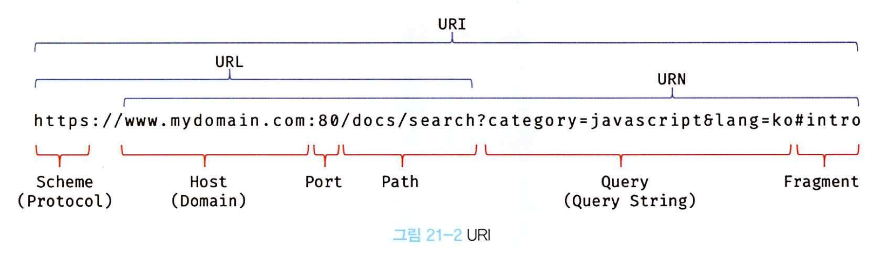

### ⭐️21.1 자바스크립트 객체의 분류

<aside>
📩

→ 자바스크립트 객체는 다음과 같이 크게 3개의 객체로 분류할 수 있다.

1. 표준 빌트인 객체
    1. ECMAScript 사양에 정의된 객체로 애플리케이션 전역의 공통 기능을 제공한다.
    2. 표준 빌트인 객체는 자바스크립트 실행 환경과 관계없이 언제나 사용할 수 있다.
    3. 표준 빌트인 객체는 전역 객체의 프로퍼티로서 제공된다.
2. 호스트객체
    1. ECMAScript 사양에 정의되어 있지 않지만, 자바스크립트 실행 환경에서 추가로 제공한다.
    2. 브라우저 환경에서는, DOM, BOM Canvas 와 같은 클라이언트 사이드 Web API를 호스트 객체로 제공한다.
    3. Node.js 환경에서는 Node.js 고유의 API를 호스트 객체로 제공한다.
3. 사용자 정의 객체
    1. 사용자 정의 객체는 표준 빌트인 객체와 호스트 객체처럼 기본 제공되는 객체가 아닌 사용자와 직접 정의한 객체를 말한다.
</aside>

### ⭐️21.2 표준 빌트인 객체

<aside>
🦉

→ 자바스크립트는 총 40여 개의 표준 빌트인 객체를 제공한다.

- Math, Reflect, JSON을 제외한 표준 빌트인 객체는 모두 인스턴스를 생성할 수 있는 생성자 함수이다.
- 생성자 함수 객체인 표준 빌트인 객체는 프로토타입 메서드와 정적 메서드를 제공하고, 생성자 함수 객체가 아닌 표준 빌트인 객체는 정적 메서드만 제공한다.

```jsx
// String 생성자 함수에 의한 Stirng 객체 생성
const strObj = new String('Lee'); // String { "Lee" }
console.log(typeof strObj); // object

// Number 생성자 함수에 의한 Number 객체 생성
const numObj = new Number(123); // Number { 123 }
console.log(typeof numObj ); // object

// Boolean 생성자 함수에 의한 Boolean 객체 생성
const boolObj = new Boolean(true); // Boolean(true)
console.log(typeof boolObj); // object

// Function 생성자 함수에 의한 Function 객체 생성
const func = new Function('x', 'return x * x'); // f anonymous
console.log(typeof func);

// Array 생성자 함수에 의한 Array 객체 생성
const arr = new Array(1, 2, 3); // (3) [1, 2, 3]
console.log(typeof arr); // object

// RegExp 생성자 함수에 의한 RegExp 객체(정규 표현식) 생성
const regExp = new RegExp(/ab+c/i); // /ab+c/i 
console.log(typeof arr); // object

// Date 생성자 함수에 의한 Date객체 생성
const date = new Date(); // Fri May 08 2020 
console.log(typeof date); // object
```

→ 생성자 함수인 표준 빌트인 객체가 생성한 인스턴스의 프로토타입은 표준 빌트인 객체의 prototype 프로퍼티에 바인딩 된 객체다.

```jsx
// String 생성자 함수에 의한 String 객체 생성
const strObj = new String('Lee'); // String { "Lee" }

// String 생성자 함수를 통해 생성된 strObj 객체의 프로토 타입은 String.prototype 이다.
console.log(Object.getPrototype(strObj) === String.prototype); // true
```

→ 표준 빌트인 객체의 prototype 프로퍼티에 바인딩된 객체는 다양한 기능의 빌트인 프로토타입 메서드를 제공한다.

```jsx
// Number 생성자 함수에 의한 Number 객체 생성
const numObj = new Number(1,5); // Number {1,5}

// toFixed는 Number.prototype의 프로토타입 메서드다.
// Number.prototype.toFixed는 소수점 자리를 반올림하여 문자열로 반환한다.
console.log(numObj.toFixed()); // 2

// isInteger는 Number의 정적 메서드다.
// Number.isInteger는 인수가 정수인지 검사하여 그 결과를 Boolean으로 반환한다.
console.log(Number.isInteger(0.5)); // false
```

</aside>

### ⭐️21.3 원시값과 래퍼 객체

<aside>
🥥

→ 표준 빌트인 생성자 함수가 존재하는 이유는 무엇일까?

- 원시 값은 객체가 아니므로 프로퍼티나 메서드를 가질 수 없는데도 원시값인 문자열이 마치 객체처럼 동작한다.

```jsx
const str = 'hello';

// 원시 타입인 문자열이 프로퍼티와 메서드를 갖고 있는 객체처럼 동작한다.
console.log(str.length); // 5
console.log(str.toUpperCae()); // HELLO
```

→ 이는 원시값에 대해 마치 객체러럼 마침표 표기법으로 접근하면 자바스크립트 엔진이 일시적으로 원시값을 연관된 객체로 변환해 주기 때문이다.

- 원시값을 객체처럼 사용하면 자바스크립트 엔진은 암묵적으로 연관된 객체를 생성하여 생성된 객체로 프로퍼티에 접근하거나 메서드를 호출하고 다시 원시값으로 되돌린다.
- 문자열, 숫자, 불리언 값에 대해 객체처럼 접근하면 생성되는 임시 객체를 래퍼 객체라고 한다.
- 문자열에 대해 마침표 표기법으로 접근하면 그 순간 래퍼 객체인 String 생성자 함수의 인스턴스가 생성되고 문자열은 래퍼 객체의 내부 슬롯에 할당된다.

```jsx
const str = 'hi';

// 원시 타입인 문자열이 래퍼 객체인 String 인스턴스로 변환된다.
console.log(str.length); // 2
console.log(str.toUpperCase()); // HI

// 래퍼 객체로 프로퍼티에 접근하거나 메서드를 호출한 후 다시 원시값으로 되돌린다.
console.log(typeof str); // string
```

→ 이때 문자열 래퍼 객체인 String 생성자 함수의 인스턴스는 String.prototype의 메서드를 상속받아 사용할 수 있다.

- 그 후 래퍼 객체의 저리가 종료되면 래퍼 객체 내부 슬롯에 할당된 원시값으로 원래의 상태, 식별자가 원시값을 갖도록 되돌리고 래퍼 객체는 가비지 컬렉션의 대상이 된다.

```jsx
// 1. 식별자 str은 문자열을 값으로 가지고 있다.
const str = 'hello';

// 2. 식별자 str은 암묵적으로 생성된 래퍼 객체를 가리킨다.
// 식별자 str의 값 'hello'는 래퍼 객체의 [[StringData]] 내부 슬롯에 할당된다.
// 래퍼 객체에 name 프로퍼티가 동적 추가된다.
str.name = 'Lee';

// 3. 식별자 str은 다시 원래 문자열, 즉 래퍼 객체의 [[StringData]] 내부 슬롯에 원시값
// 이때 2에서 생성된 래퍼 객체는 아무도 참조하지 않는 상태이므로 가비지 컬렉션 대상이다.

// 4. 식별자 str은 새롭게 암묵적으로 생성된 래퍼 객체를 가리킨다.
// 새롭게 생성된 래퍼 객체는 name 프로퍼티가 존재하지 않는다.
console.log(str.name); // undefined

// 5. 식별자 str은 다시 원래의 문자열, 즉 래퍼 객체의 [[StringData]] 내부 슬롯에 원시값
// 이때 4에서 생성된 래퍼 객체는 아무도 참조하지 않아 가비지 컬렉션 대상이다.
console.log(typeof str, str); // string hello
```

→ 나머지 빌트인 생성자 들도 마찬가지이다.

- Number 생성자로 확인해보자.

```jsx
const num = 1.5;

// 원시 타입인 숫자가 래퍼 객체인 String 객체로 변환된다.
console.log(num.toFixed()); // 2

// 래퍼 객체로 프로퍼티에 접근하거나 메서드를 호출한 후, 다시 원시값으로 되돌린다.
console.log(typeof num, num); // Number 1.5
```

→ 불리언 값도 문자열이나 숫자와 마찬가지지만, 불리언 값으로 메서드를 호출하는 경우는 없으므로 유용하지 않다.

→ 이처럼 암묵적으로 생성되는 래퍼 객체에 의해 마치 객체처럼 사용할 수 있으며, 표준 빌트인 객체의 프로토타입 메서드 또는 프로퍼티를 참조할 수 있다.

- 문자열 숫자 불리언 심벌 이외의 원시값, null과 undefined는 래퍼 객체를 생성하지 않는다.
- 따라서 null 과 undefined를 값을 객체처럼 사용하면 에러가 발생한다.
</aside>

### ⭐️21.4 전역 객체

<aside>
🎾

→ 전역 객체는 코드가 실행되기 이전 단계에 자바스크립트 엔진에 의해 어떤 객체보다도 먼저 생성되는 특수한 객체이며, 어떤 객체에도 속하지 않은 최상위 객체이다.

- 전역 객체는 자바스크립트 환경에 따라 지칭하는 이름이 제각각이다.
- 브라우저 환경에서는 window, Node.js 환경에서는 global이 전역 객체를 가리킨다.
- 전역 객체는 표준 빌트인 객체와 var 키워드로 선언한 전역 변수와 전역 함수를 프로퍼티로 갖는다.

→ 전역 객체는 계층적 구조상 어떤 객체에도 속하지 않은 모든 빌트인 객체의 최상위 객체다.

- 전역 객체의 특징은 다음과 같다.
    - 전역 객체는 개발자가 의도적으로 생성할 수 없다. 즉, 전역 객체를 생성할 수 있는 생성자 함수가 제공되지 않는다.
    - 전역 객체의 프로퍼티를 참조할 때 window를 생략할 수 있다.

```jsx
// 문자열 F를 16진수로 해석하여 10진수로 변환하여 반환한다.
window.parseInt('F', 16); // 15
// window.parseInt는 parseInt로 호출할 수 있다.
parseInt('F', 16); // 15

window.parseInt === parseInt; // true
```

→ var 키워드로 선언한 전역 변수와 선언하지 않은 변수에 값을 할당한 암묵적 전역, 그리고 전역 함수는 전역 객체의 프로퍼티가 된다.

```jsx
// var 키워드로 선언한 전역 변수
var foo = 1;
console.log(window.foo); // 1

// 선언하지 않은 변수에 값을 암묵적 전역. 
// bar는 전역 변수가 아니라 전역 객체의 프로퍼티다.
bar = 2; // window.bar = 2
console.log(window.bar); // 2

// 전역 함수
function baz() { return 3; }
console.log(window.baz()); // 3
```

→ let 이나 const 키워드로 선언한 전역 변수는 전역 객체의 프로퍼티가 아니다.

- 따라서 [window.foo](http://window.foo) 와 같이 접근할 수 없다.
- let 이나 const 로 선언한 전역 변수는 보이지 않는 개념적인 블록 내에 존재하게 된다.

```jsx
let foo = 123;
console.log(window.foo); // undefined
```

</aside>

### **📌 21.4.1 빌트인 전역 프로퍼티**

<aside>
👩‍🦽

→ 빌트인 전역 프로퍼티는 전역 객체의 프로퍼티를 의미한다. 주로 어플리케이션 전역에서 사용하는 값을 제공한다.

`Infinity` 

→ Infinity 프로퍼티는 무한대를 나타내는 숫자값 Infinity를 갖는다.

```jsx
// 전역 프로퍼티는 window를 생략하고 참조할 수 있다.
console.log(window.Infinity === Infinity); // true

// 양의 무한대
console.log(3/0); // Infinity
// 음의 무한대
console.log(-3/0) // Infinity
// Infinity는 숫자값이다.
console.log(typeof Infinity); // number
```

`NaN`

→ NaN 프로퍼티는 숫자가 아님을 나타내는 숫자값 NaN을 갖는다. NaN 프로퍼티는 Number, NaN 프로퍼티와 같다.

```jsx
console.log(window.NaN); // NaN

console.log(Number('xyz')); // NaN
console.log(1 * 'string'); // NaN
console.log(typeof NaN); // number
```

`Undefined`

→ undefined 프로퍼티는 원시 타입 undefined를 값으로 갖는다.

```jsx
console.log(window.undefined); // undefined 

var foo;
console.log(foo); // undefined 
console.log(typeof undefined); // undefined 
```

</aside>

### **📌 21.4.2 빌트인 전역 함수**

<aside>
🧀

→ 빌트인 전역 함수는 애플리케이션 전역에서 호출할 수 있는 빌트인 함수로서 전역 객체의 메서드다.

`eval`

→ eval 함수는 자바스크립트 코드를 나타내는 문자열을 인수로 전달받는다.

- 전달 받은 문자열 코드가 표현식이라면 eval 함수는 문자열 코드를 런타임에 평가하여 값을 생성한다.
- 전달 받은 인수가 표현식이 아닌 문이라면 eval 함수는 문자열 코드를 런타임에 실행한다.
- 문자열 코드가 여러 개의 문으로 이루어져 있다면 모든 문을 실행한다.

```jsx
// 표현식인 문
eval('1 + 2;'); // 3
// 표현식이 아닌 문
eval('var x = 5;'); // undefined

// eval 함수에 의해 런타임에 변수 선언문이 실행되어 x 변수가 선언되었다.
console.log(x); // 5

// 객체 리터럴은 반드시 괄호로 둘러싼다.
const o = eval('({a: 1})');
console.log(o); // {a: 1}

// 함수 리터럴은 반드시 괄호로 둘러싼다.
const f = eval('(function() { return 1: })');
console.log(f()); // 1
```

→ 인수로 전달받은 문자열 코드가 여러 개의 문으로 이루어져 있다면 모든 문을 실행한 다음, 마지막 결과값을 반환한다.

- `eval(’1 + 2; 3 + 4;‘); // → 7`

→ eval 함수는 자신이 호출된 위치에 해당하는 기존의 스코프를 런타임에 동적으로 수정한다.

```jsx
const x = 1;
function foo() {
	// eval 함수는 런타임에 foo 함수의 스코프를 동적으로 수정한다.
	eval('var x = 2;');
	console.log(x); // 2
}

foo();
console.log(x); // 1
```

→ eval 함수는 기존의 스코프를 런타임에 동적으로 수정한다.

- eval 함수에 전달된 코드는 이미 그 위치에 존재하던 코드 처럼 동작한다.
- eval 함수가 호출된 foo 함수의 스코프에서 실행된다.
- 단, strict mode에서 eval 함수는 기존의 스코프를 수정하지 않고 eval 함수 자신의 자체적인 스코프를 생성한다.

```jsx
const x = 1;
function foo() {
	'use strict';
	
	// strict mode에서 eval 함수는 기존의 스코프를 수정하지 않고 eval 함수
	// 자신의 자체적인 스코프를 생성한다.
	eval('var x = 2; console.log(x);'); // 2
	console.log(x); // 1
}

foo();
console.log(x); // 1
```

→ 인수로 전달받은 문자열 코드가 let, const 키워드로 사용한 변수 선언문이라면 암묵적으로 strict mode가 적용된다.

```jsx
const x = 1;
function foo() {
	
	eval('var x = 2; console.log(x);'); // 2
	// let const 키워드를 사용한 변수 선언문은 strict mode가 적용된다.
	eval('const x = 3; console.log(x);'); // 3
	console.log(x); // 2
}

foo();
console.log(x); // 1
```

→ eval 함수를 통해 사용자로부터 입력받은 콘텐츠를 실행하는 것은 보안에 매우 취약하다.

- 또한 eval 함수를 통해 실행되는 코드는 자바스크립트 엔진에 의해 최적화가 수행되지 않는다.
- 따라서 eval 함수의 사용은 금지해야 한다.

`isFinite`

→ 전달받은 인수가 정상적인 유한수인지 검사하여 유한수이면 true를 반환하고, 무한수이면 false를 반환한다.

```jsx
// 인수가 유한수이면 true를 반환한다.
isFinite(0); // true
isFinite(2e64); // true
isFinite('10'); // true: '10' -> 10
isFinite(null); // -> true: null -> 0

// 인수가 무한수 무한수 또는 NaN으로 평가되는 값이라면 false를 반환한다.
isFinite(Infinity); // -> false
isFinite(-Infinity); // -> false

// 인수가 NaN으로 평가되는 값이라면 false를 반환한다.
isFinite(NaN); // -> false
isFinite('Hello'); // -> false
isFinite('2005/12/12'); // -> false
```

→ isFinite(null) 은 true를 반환한다. 이것은 null을 숫자로 변환하여 검사를 수행했기 때문이다.

null을 숫자 타입으로 변환하면 0이 된다.

`console.log(+null); // 0`

I

`isNaN`

→ 전달받은 인수가 NaN인지 검사하여 그 결과를 불리언 타입으로 반환한다.

- 전달받은 인수의 타입이 숫자가 아닌 경우 숫자로 타입을 변환한 후 검사를 수행한다.

```jsx
// 숫자
isNaN(NaN); // -> true
isNaN(10); // -> false

// 문자열
isNaN('blabla'); // -> true: 'blabla' => NaN
isNaN('10'); // -> false: '10' => 10
isNaN('10.12'); // -> false: '10.12' => 10.12
isNaN(''); // -> false: '' => 0
isNaN(' '); // -> false: ' ' => 0

// 불리언
isNaN(true); // -> false: true => 1
isNaN(null); // -> false: null => 0

// undefined
	isNaN(undefined); // -> true: undefined => NaN
	
	// 객체
	isNaN({}); // -> true: {} => NaN
	
	// date
	isNaN(new Date()); // false: new Date() => Number
	isNaN(new Date().toString()); // true: String => NaN
```

`parseFloat`

→ 전달받은 문자열 인수를 부동 소수점 숫자, 즉 실수로 해석하여 반환한다.

```jsx
// 문자열을 실수로 해석하여 반환한다.
parseFloat('3.14'); // -> 3.14
parseFloat('10.00'); // -> 10

// 공백으로 구분된 문자열은 첫 번째 문자열만 변환한다.
parseFloat('34 45 66'); // -> 34
parseFloat('40 years'); // -> 40

// 첫 번째 문자열을 숫자로 변환할 수 없다면 NaN을 반환한다.
parseFloat('He was 40'); // -> NaN

// 앞 뒤 공백은 무시된다.
parseFloat(' 60 '); // -> 60
```

`parseInt`

→ 전달 받은 문자열 인수를 정수로 해석하여 반환한다.

```jsx
// 문자열을 정수로 해석하여 반환한다.
parseInt('10'); // -> 10
parseInt('10.123'); // -> 10

// 두번째 인수로 진법을 나타내는 기수를 전달할 수 있다.
// 기수를 지정하면 첫 번째 인수로 전달된 문자열을 기수의 숫자로 해석한다.
// 반환값은 언제나 10진수다.
// 기수를 생략하면 첫 번째 인수로 전달된 문자열을 10진수로 해석하여 변환한다.

// 10을 10진수로 해석하고 그 결과를 10진수 정수로 반환한다.
parseInt('10'); // -> 10
// 10을 2진수로 해석하고 그 결과를 10진수 정수로 반환한다.
parseInt('10', 2); // -> 2
// 10을 8진수로 해석하고 그 결과를 10진수 정수로 반환한다.
parseInt('10', 8); // -> 8
// 10을 16진수로 해석하고 그 결과를 10진수 정수로 반환한다.
parseInt('10', 16); // -> 16
```

→ 기수를 지정하여 10진수 숫자를 해당 기수의 문자열로 변환하여 반환하고 싶을 때는 Number.prototype.toString 메서드를 사용한다.

```jsx
const x =15;
// 10진수 15를 2진수로 변환하여 그 결과를 문자열로 반환
x.toString(2); // -> '1111'
// 다시 문자열 1111를 2진수로 해석 후 결과를 10진수 정수로 변환
parseInt(x.toString(2),2); // -> 15
```

→ 두번째 인수로 진법을 나타내는 기수를 지정하지 않더라도 첫 번째 인수로 전달된 문자열이 0x 또는 0X로 시작하는 16진수 리터럴이라면 16진수로 해석하여 10진수 정수로 반환한다.

- 하지만 2진수 리터럴과 8진수 리터럴은 제대로 해석하지 못한다.
- ES6부터는 “0”으로 시작하는 숫자를 8진수로 해석하지 않고 10진수로 해석한다.
- 따라서 문자열을 8진수로 해석하려면 지수를 반드시 지정해야 한다.

→ 첫 번째 인수로 전달한 문자열의 첫 번째 문자가 해당 지수의 숫자로 변환될 수 없다면 NaN을 반환한다.

```jsx
// 'A'는 10진수로 해석할 수 없다.
parseInt('A0'); // -> NaN
// '2'는 2진수로 해석할 수 없다.
parseInt('20',2); // -> NaN
```

→ 첫 번째 인수로 전달한 문자열의 두 번째 문자부터 해당 진수를 나타내는 숫자가 아닌 문자와 마주치면 이 문자와 계속되는 문자들은 전부 무시되며 해석된 정수값만 반환한다.

```jsx
// 10진수로 해석할 수 없는 'A' 이후의 문자는 모두 무시된다.
parseInt('1A0'); // -> 1
// 2진수로 해석할 수 없는 '2' 이후의 문자는 모두 무시된다.
parseInt('102', 2); // -> 2
// 8진수로 해석할 수 없는 '8' 이후의 문자는 모두 무시된다.
parseInt('58', 8); // -> 5
// 16진수로 해석할 수 없는 'G'이후의 문자는 모두 무시된다.
parseInt('FG', 16); // -> 15
```

→ 첫 번째 인수로 전달한 문자열에 공백이 있다면 첫 번째 문자열만 해석하여 반환하며 앞뒤 공백은 무시된다. 만일 첫 번째 문자열을 숫자로 해석할 수 없는 경우 NaN을 반환한다.

```jsx
// 공백으로 구분된 문자열은 첫 번째 문자열만 변환한다.
parseInt('34 45 66'); // -> 34
parseInt('40 years'); // -> 40
// 첫 번째 문자열을 숫자로 변환할 수 없다면 NaN을 반환한다.
parseInt('He was 40'); // -> NaN
// 앞 뒤 공백은 무시된다.
parseInt(' 60 '); // -> 60
```

`encodeURI / decodeURI`

→ encodeURI 함수는 완전한 URI를 문자열로 전달받아 이스케이프 처리를 위해 인코딩한다.

- URI는 인터넷에 있는 자원을 나타내는 유일한 주소를 말한다.
- URI의 하위개념으로 URL, URN이 있다.



→ 인코딩이란 URI의 문자들을 이스케이프 처리하는 것을 의미한다.

- 이스케이프 처리는 네트워크를 통해 정보를 공유할 때 어떤 시스템에서도 읽을 수 있는 아스키 문자 셋으로 변환하는 것이다.
- UTF-8 특수 문자 경우 1문자당 1~3바이트 UTF-8 한글 경우 1문자당 3바이트다.
- URL은 아스키 문자 셋으로만 구성되어야 하며 한글을 포함한 대부분의 외국어나 아스키 문자 셋에 정의되지 않은 특수 문자의 경우 URL에 포함될 수 없다.
- URL 내에서 의미를 갖고 있는 문자나 URL에 올 수 없는 문자 또는 시스템에 의해 해석될 수 있는 의미를 갖고 있는 문자를 이스케이프 처리하여 야기될 수 있는 문제를 예방하기 위해 이스케이프 처리가 필요하다.

```jsx
// 완전한 URL
const uri = 'http://example.com?name=황유빈&job=student';

// encodeURI 함수는 완전한 URI를 전달받아 이스케이프 처리를 위해 인코딩한다.
const enc = encodeURI(uri);
console.log(enc); // http://example.com?name=dqwoidmoaism&job=student

```

→ decodeURI 함수는 인코딩된 URI를 인수로 전달받아 이스케이프 처리 이전으로 디코딩한다.

```jsx
const uri = 'http://example.com?name=황유빈&job=student';

// encodeURI 함수는 완전한 URI를 전달받아 이스케이프 처리를 위해 인코딩한다.
const enc = encodeURI(uri);
console.log(enc);
// http://example.com?name=dqwoidmoaism&job=student

// decodeURI 함수는 인코딩된 완전한 URI를 전달받아 이스케이프 처리 이전으로 디코딩
const dec = decodeURI(enc);
console.log(dec);
// http://example.com?name=황유빈&job=student
```

`encodeURIComponent / decodeURIComponent`

→ `encodeURIComponent` 함수는 URI 구성 요소를 인수로 전달받아 인코딩한다.

- 인코딩이란 URI의 문자들을 이스케이프 처리하는 것을 의미한다.
- `decodeURIComponent` 함수는 매개변수로 전달된 URI 구성 요소를 디코딩한다.

```jsx
// URI의 쿼리 스트링
const uriComp = 'name=황유빈&job=student';

// encodeURIComponent 함수는 인수로 전달받은 문자열을 URI의 구성요소인 
// 쿼리 스트링의 일부로 간주한다.
// 쿼리 스트링 구분자로 사용되는 =, ?, &은 인코딩하지 않는다.
let enc = encodeURIComponent(uriComp);
console.log(enc); // name=%3%D323%D2324%DI

let dec = decodeURIComponent(enc);
console.log(dec); // 황유빈&job=student
```

</aside>

### **📌 21.4.3 암묵적 전역**

<aside>
🍘

→ 암묵적 전역이란?

```jsx
var x = 10; // 전역 변수

function foo () {
	// 선언하지 않은 식별자에 값을 할당
	y = 20; // window.y = 20;
}
foo(); 

// 선언하지 않은 식별자 y를 전역에서 참조할 수 있다.
console.log(x + y); // 30
```

→ foo 함수 내에 y는 선언하지 않은 식별자다.

- y = 20이 실행되면 참조 에러가 발생할 것처럼 보인다.
- 하지만 선언하지 않은 식별자 y는 마치 선언된 전역 변수처럼 동작한다.
- 이는 선언하지 않은 식별자에 값을 할당하면 전역 객체의 프로퍼티가 되기 때문이다.

→  이러한 현상을 암묵적 전역 이라 한다.

```jsx
// 전역 변수 x는 호이스팅이 발생한다.
console.log(x); // undefined
// 전역 변수가 아니라 단지 전역 객체의 프로퍼티인 y는 호이스팅이 발생하지 않는다.
console.log(y); // 참조에러

var x = 10; // 전역 변수

function foo () {
	// 선언하지 않은 식별자에 값을 할당
	y = 20; // window.y = 20;
}
foo();

// 선언하지 않은 식별자 y를 전역에서 참조할 수 있다.
console.log(x + y); // 30
```

→ 변수가 아니라 단지 프로퍼티인 y는 delete 연산자로 삭제할 수 있다.

→ 전역 변수는 프로퍼티이지만 delete 연산자로 삭제할 수 없다.

```jsx
var x = 10; // 전역 변수

function foo () {
	// 선언하지 않은 식별자에 값을 할당
	y = 20; // window.y = 20;
	console.log(x + y);
}

foo(); // 30

console.log(window.x); // 10
console.log(window.y); // 20

delete x; // 전역 변수는 삭제되지 않는다.
delete y; // 프로퍼티는 삭제된다.

console.log(window.x); // 10
console.log(window.y); // undefined
```

</aside>