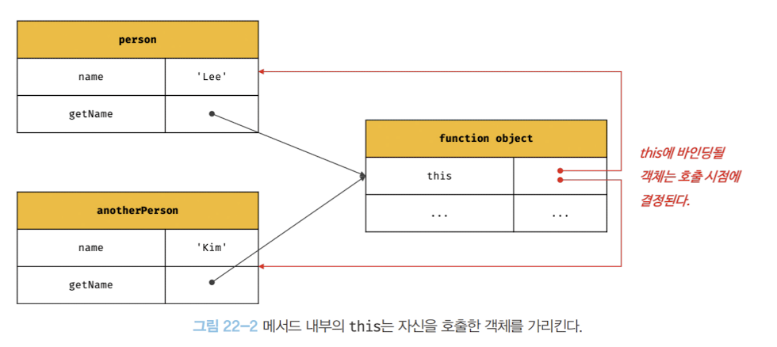
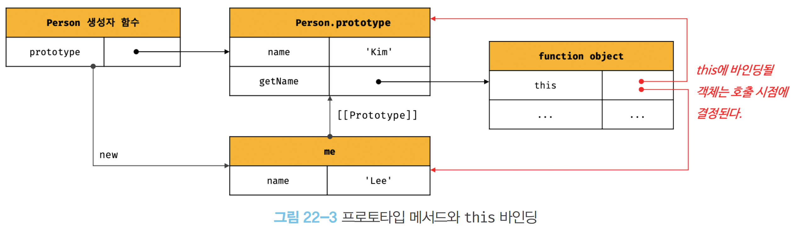

### ⭐️22.1 this 키워드

<aside>
⚡

→ 복습하기!  **객체란?**

1. 상태를 나타내는 프로퍼티
2. 동작을 나타내는 메서드

위에 아이들을 하나의 논리 적인 단위로 묶은 복합적인 자료구조이다.

→ **메서드는 ?**

- 자신이 속한 객체의 상태, 프로퍼티를 참조하고 변경이 가능해야 함

→ **메서드가 자신이 속한 객체의 프로퍼티를 참조하려면 ?** 

- 자신이 속한 객체를 가리키는 식별자를 참조할 수 있어야 한다.

```jsx
const circle = {
	// 프로퍼티: 객체 고유의 상태 데이터
	radius: 5,
	
	// 메서드: 상태 데이터를 잠조하고 조작하는 동작
	getDiameter() {
		// 이 메서드가 자신이 속한 객체의 프로퍼티나 다른 메서드를 참조하려면?
		// 자신이 속한 객체인 circle을 참조할 수 있어야 한다.
		return 2 * circle.radius;
	}
};

console.log(circle.getDiameter()); // 10
```

→ **위와 같이 메서드가 circle.radius 를 참조할 수 있는 이유 ?**

-> `getDiameter()` 함수가 호출되는 시점에는 ?

1. 객체 리터럴 `{ radius : 5, getDiamger() { … }  }` 이 먼저 생성.
2. 생성된 리터럴을 circle 이라는 변수에 할당
3. `getDiameter()` 를 호출한다.
4. circle 변수에 할당된 circle.radius로 참조가 가능하다!

→  하지만 다시 자신이 속한 객체를 재귀적으로 호출하는 방식? 

- 일반적이지도 않고 바람직하지도 않다. 왜?
- 객체 리터럴은 평가 되자마자 **circle 변수에 즉시 할당** 이라 참조가 가능하지만
- 생성자 함수 방식은 다르기에 참조가 불가능하다.

→ 생성자 함수 방식으로 인스턴스를 생성하는 경우를 살펴보자

```jsx
function Circle(radius) {
	// 이 시점에는 생성자 함수 자신이 생성할 인스턴스를 가리키는 식별자를 알 수 없다.
	????.radius = radius;
}

circle.prototype.getDiameter = function () {
	// 이 시점에는 생성자 함수 자신이 생성할 인스턴스를 가리키는 식별자를 알 수 없다.
	return 2 * ????.radius;
};

// 생성자 함수로 인스턴스를 생성하려면 먼저 생성자 함수를 정의해야 한다.
const circle = new Circle(5);
```

→ 무슨말인데? 

1. 생성자 함수 `function Circle(radius){}` 는 단순한 틀이다. (붕어빵 틀)
2. `const circle = new Circle(5)`를 해야지 이제서야 변수 circle를 만든다는걸 알 수 있음!(팥붕)
3. 그 전까지는 생성자 함수는 무슨 붕어빵을 시키려는지 알리가 없다.
4. 따라서 자바스크립트는 자신이 생성할 인스턴스를 가리키는 특별한 식별자 this를 제공한다.

→ this 란?

- 자신이 속한 객체 또는 자신이 생성할 인스턴스를 가리키는 자기 참조 변수다.
- this를 통해 자신이 속한 객체 또는 자신이 생성할 인스턴스의 프로퍼티나 메서드를 참조할 수 있다.
- 자바스크립트 엔진에 의해 암묵적으로 생성되며, 코드 어디서든 참조할 수 있다.
- 단, this가 가리키는 값, this 바인딩은 함수 호출 방식에 의해 동적으로 결정 된다.

→ 다시 그럼 this를 통해 위 예제들을 바꿔보자 ( 객체 리터럴 )

```jsx
// 객체 리터럴
const circle = {
	radius: 5,
	getDiameter() {
		// this는 메서드를 호출한 객체를 가리킨다.
		return 2 * this.radius;
	}
};

console.log(circle.getDiameter()); // 10
```

→ this를 통해 바꿔보는 예제 ( 생성자 함수 )

```jsx
// 생성자 함수
function Circle(radius) {
	// this는 생성자 함수가 생성할 인스턴스를 가리킨다.
	this.radius = radius;
}

Circle.prototype.getDiameter = function () {
	// this는 생성자 함수가 생성할 인스턴스를 가리킨다.
	return 2 * this.radius;
};

// 인스턴스 생성
const circle = new Circle(5);
console.log(circle.getDiameter()); // 10
```

→ this는 상황에 따라 가리키는 대상이 다르다.

- 자바스크립트의 this는 함수가 호출되는 방식에 따라 this에 바인딩될 값, 즉 this 바인딩이 동적으로 결정된다.
- this는 코드 어디에서든 참조 가능하다. 전역에서도 함수 내부에서도 참조할 수 있다.

→ this는 어디에서든 참조가 가능. + 호출 방식에 따른 대상이 다르다. 예제

```jsx
// this는 어디서든지 참조 가능하다.
// 전역에서 this는 전역 객체 window를 가리킨다.
console.log(this); // window

function square(number) {
	// 일반 함수 내부에서 this는 전역 객체 window를 가리킨다.
	console.log(this); // window
	return number * number;
}
number(2);

const person = {
	name: 'Lee',
	getName() {
		// 메서드 내부에서 this는 메서드를 호출한 객체를 가리킨다.
		console.log(this); // { name: 'Lee', getName: f }
		return this.name;
	}
};
console.log(person.getName()); // Lee

function Person(name) {
	this.name = name;
	// 생성자 함수 내부에서 this는 생성자 함수가 생성할 인스턴스를 가리킨다.
	console.log(this); // Person { name: 'Lee' }
}

const me = new Person('Lee');
```

→ this는 자기 참조 변수이므로 일반적으로 객체의 메서드 내부 또는 생성자 함수 내부에서만 의미가 있다.

따라서 strict mode가 적용된 일반 함수 내부의 this는 undefined가 바인딩 된다.

</aside>

### ⭐️22.2 함수 호출 방식과 this 바인딩

<aside>
⚡

→ this 바인딩은 함수 호출 방식, 즉 함수가 어떻게 호출되었는지에 따라 동적으로 결정 된다.

주의할 것은 동일한 함수도 다양한 방식으로 호출할 수 있다는 것이다. 

1. 일반 함수 호출
2. 메서드 호출
3. 생성자 함수 호출
4. Function.prototype/call/bind 메서드에 의한 간접 호출

```jsx
// this 바인딩은 함수 호출 방식에 따라 동적으로 결정된다.
const foo = function () {
	console.dir(this);
};

// 동일한 함수도 다양한 방식으로 호출할 수 있다.

// 1. 일반 함수 호출
// foo 함수를 일반적인 방식으로 호출
// foo 함수 내부의 this는 전역 객체 window를 가리킨다.
foo(); // window

// 2. 메서드 호출
// foo 함수를 프로퍼티 값으로 할당하여 호출
// foo 함수 내부의 this는 메서드를 호출한 객체 obj를 가리킨다.
const obj = { foo };
obj.foo(); // obj

// 3. 생성자 함수 호출
// foo 함수를 new 연산자와 함께 생성자 함수로 호출
// foo 함수 내부의 this는 생성자 함수가 생성한 인스턴스를 가리킨다.
new foo(); // foo {}

// 4. Function.prototype.apply/call/bind 메서드에 의한 간접 호출
// foo 함수 내부의 this는 인수에 의해 결정된다.
const bar = { name: 'bar' };
foo.call(bar); // bar
foo.apply(bar); // bar
foo.bind(bar)(); // bar
```

</aside>

### **📌 22.2.1 일반 함수 호출**

<aside>
⚡

→ 기본적으로 this에는 전역 객체가 바인딩된다.

→ 전역 함수나 중첩 함수나 일반 함수로 호출하면 함수 내부의 this에는 전역 객체가 바인딩된다.

```jsx
function foo() {
	console.log("foo's this: ", this); // window
	function bar() {
		console.olg("bar's this: ", this); // window
	}
	bar();
}
foo();
```

→ strict mode가 적용된 일반 함수 내부의 this에는 undefined가 바인딩된다.

```jsx
function foo() {
	'use strict';
	
	console.log("foo's this: ", this); // undefined
	function bar() {
		console.log("bar's this: ", this); // undefined
	}
	bar();
}
foo();
```

→ 메서드 내에서 중첩 함수를 일반 함수로 호출되면 중첩 함수 내부의 this에는 전역 객체가 바인딩된다.

```jsx
 // var 키워드로 선언한 전역 변수 value는 전역 객체의 프로퍼티다.
 var value = 1;
 // const 키워드로 선언한 전역 변수 value는 전역 객체의 프로퍼티가 아니다.
 // const value = 1;
 
 const obj ={
	 value: 100,
	 foo() {
		 	console.log("foo's this: ", this); // {value: 100, foo: f}
		 	console.log("foo's this.value: ', this.vlaue); // 100
		
			// 메소드 내에서 정의한 중첩 함수
			function bar() {
				console.log("bar's this: ", this); // window
				console.log("bar's this.value: ", this.value); // 1
			}
		
		// 메서드 내에서 정의한 중첩 함수도 일반 함수로 호출되면 중첩 함수도
		// 전역 객체가 바인딩된다.
		bar();
	}
};

obj.foo();
```

→ 콜백 함수가 일반 함수로 호출된다면 콜백 함수 내부의 this에도 전역 객체가 바인딩된다.

```jsx
var value = 1;

const obj = {
	value: 100,
	foo() {
		console.log("foo's this: ", this); // {value:100, foo: f}
		// 콜백 함수 내부의 this에는 전역 객체가 바인딩된다.
		setTimeout(function() {
			conosle.log("callback's this: ", this); // window
			console.log("callback's this.value: ", this.value); // 1
		}, 100);
	}
};

obj.foo();
```

→ 위처럼 일반 함수로 호출된 모든 함수(중첩 함수, 콜백 함수) 내부의 this에는 전역 객체가 바인딩된다.

???: foo 함수의 this는 obj여야 하는데, 내부 콜백 함수(setTimeout)는 일반 함수라서 this가 전역으로 간다고? 저 두개를 일치 시키고 싶은데..?

했을 때! 세가지 방법

1. 변수 that에 this 바인딩을 시켜준다.

```jsx
var value = 1;

const obj = {
	value: 100,
	foo() {
		// this 바인딩(obj)을 변수 that에 할당한다.
		const that = this;
		
		// 콜백 함수 내부에서 this 대신 that을 참조한다.
		setTimeout(function() {
			conosle.log(that.value); // 100 
		}, 100);
	}
};

obj.foo();
```

1. bind() 함수를 사용한다.

```jsx
var value = 1;

const obj = {
	value: 100,
	foo() {
		// 콜백 함수에 명시적으로 this를 바인딩한다.
		// this를 강제로 콜백 함수 내부에 연결 -> this(obj)
		setTimeout(function() {
			conosle.log(this.value); // 100 
		}.bind(this), 100);
	}
};

obj.foo();
```

1. 화살표 함수를 사용한다.

```jsx
var value = 1;

const obj = {
	value: 100,
	foo() {
		// 화살표 함수 내부의 this는 상위 스코프의 this를 가리킨다.
		setTimeout(() => conosle.log(this.value), 100); // 100
	}
};

obj.foo();
```

</aside>

### **📌 22.2.2 메서드 호출**

<aside>
⚡

→ this에는 메서드를 호출할 때 메서드 이름 앞의 마침표(.) 연산자 앞에 기술한 객체가 바인딩 된다. 

`주의` 메서드 내부의 this는 메서드를 소유한 객체가 아닌 메서드를 호출한 객체에 바인딩된다!

```jsx
const person = {
	name: 'Lee',
	getName(){
		// 메서드 내부의 this는 메서드를 호출한 객체에 바인딩된다.
		return this.name;
	}
};

// 메서드 getName을 호출한 객체는 person이다.
console.log(person.getName()); // Lee
```


`getName()`은 **함수 객체를 참조하는 프로퍼티**일 뿐,

그 **함수 자체는 독립적으로 존재**한다.

하지만 `person.getName()`처럼 호출하면,

**this는 `getName`을 호출한 객체인 `person`에 바인딩**된다.

→ `getName`메서드는 다른 객체의 프로퍼티에 할당하는 것으로 다른 객체의 메서드가 될 수도 있고 일반 변수에 할당하여 일반 함수로 호출될 수도 있다.

```jsx
const anotherPerson = {
	name: 'Kim';
};
// getName 메서드를 anotherPerson 객체의 메서드로 할당.
anotherPerson.getName = person.getName;

// getName 메서드를 호출한 객체는 anotherPerson이다.
console.log(anotherPerson.getName()); // Kim

// getName 메서드를 변수에 할당
const getName = person.getName;

// getName 메서드를 일반 함수로 호출
// -> 아까 뭐라고 했죠? 일반함수로 호출하면? 전역 객체로 바인딩 된다!

console.log(getName()); // ''
// 일반 함수로 호출된 getName 함수 내부의 this.name은 브라우저 환경에서 
// window.name과 같다.
// 브라우저 환경에서 window.name은 브라우저 창의 이름을 나타내는 빌트인 객체
// 기본값은 '' 이다.
// Node.js 환경에서 this.name은 undefined다.
```



따라서 메서드 내부의 this는 프로퍼티로 메서드를 가리키고 있는 객체와는 관계가 없고 메서드를 호출하는 객체에 바인딩 된다.

→ 프로토타입 메서드 내부에서 사용된 this도 일반 메서드와 마찬가지로 해당 메서드를 호출한 객체에 바인딩된다.

```jsx
function Person(name) {
	this.name = name;
}

Person.prototype.getName = function () {
	return this.name;
};

const me = new Person('Lee'); 

// getName 메서드를 호출한 객체는 me 다.
console.log(me.getName()); // 1. Lee

Person.prototype.name = 'Kim';

// getName 메서드를 호출한 객체는 Person.prototype 이다.
console.log(Person.prototype.getName()); // 2. Kim
```

→ 각 this가 누구를 가리키는지 확인해보자

1. 1의 경우 getName 메서드를 호출한 객체는 me, 따라서 getName 메서드 내부의 this는 me를 가리키며 this.name은 ‘Lee’다.
2. 2의 경우 getName 메서드를 호출한 객체는 Person.prototype이다. 따라서 getName 메서드 내부의 this는 Person.prototype을 가리키며 this.name은 ‘Kim’이다.



</aside>

### **📌 22.2.3 생성자 함수 호출**

<aside>
⚡

→ 생성자 함수 내부의 this에는 생성자 함수가 생성할 인스턴스가 바인딩된다.

```jsx
// 생성자 함수
function Circle(radius); {
	// 생성자 함수 내부의 this는 생성자 함수가 생성할 인스턴스를 가리킨다.
	this.radius = radius;
	this.getDiameter = function () {
		return 2 * this.radius;
	};
}

// 반지름이 5인 Circle 객체를 생성
const circle1 = new Circle(5);
// 반지름이 10인 Circle 객체를 생성
const circle2 = new Circle(10);

console.log(circle1.getDiameter()); // 10
console.log(circle2.getDiameter()); // 20
```

1. 생성자 함수는 이름 그대로 객체를 생성하는 함수다.
2. 일반 함수와 동일한 방법으로 생성자 함수를 정의하고 new 연산자와 함께 호출한다.
3. new 연산자와 함께 생성자 함수를 호출하지 않으면 생성자 함수가 아니라 일반 함수로 동작한다.

```jsx
// new 연산자와 함께 호출하지 않으면 생성자 함수로 동작하지 않는다.
// 일반적인 함수의 호출이다.
const circle3 = Circle(15); 

// 일반 함수로 호출된 Circle에는 반환문이 없으므로 암묵적으로 undefined를 반환한다.
console.log(circle3); // undefined

// 일반 함수로 호출된 Circle 내부의 this는 전역 객체를 가리킨다.
console.log(radius); // 15
```

</aside>

### **📌 22.2.4 Function.prototype.apply/call/bind**

<aside>
⚡

→ apply, call, bind 메서드는 Function.prototype의 메서드다. 

이들 메서드는 모든 함수가 상속받아 사용할 수 있다.

→ Function.prototype.apply, Function.prototype.call 메서드는 this로 사용할 객체와 인수 리스트를 인수로 전달받아 함수를 호출한다.

```jsx
/**
* 주어진 this 바인딩과 인수 리스트 배열을 사용하여 함수를 호출한다.
* @param thisArg - this로 사용할 객체
* @param argsArray - 함수에게 전달할 인수 리스트의 배열 또는 유사 배열 객체
* @returns 호출된 함수의 반환
*/

Function.prototype.apply(thisArg[, argsArray])

/**
* 주어진 this 바인딩과 ,로 구분된 인수 리스트를 사용하여 함수를 호출한다.
* @param thisArg - this로 사용할 객체
* @param arg1, arg2, ... - 함수에게 전달할 인수 리스트
* @returns 호출된 함수의 반환값
*/

Function.prototype.call(thisArg[, arg1[, arg2[, ...]]])
```

→ apply와 call 메서드의 본질적인 기능은 함수를 호출하는 것이다.

- apply와 call 메서드를 호출하면 첫 번째 인수로 전달한 특정 객체를 호출한 함수의 this에 바인딩 한다.
- apply와 call 메서드는 호출할 함수에 인수를 전달하는 방식만 다를 뿐 동일하게 동작한다.

```jsx
function getThisBinding() {
	return this;
}

// this로 사용할 객체
const thisArg = { a : 1 };

console.log(getThisBinding()); // window

// getThisBinding 함수를 호출하면서 인수를 전달할 객체를
// getThisBinding 함수의 this를 바인딩한다.
console.log(getThisBinding.apply(thisArg)); // { a: 1}
console.log(getThisBinding.call(thisArg)); // { a: 1}
```

→ apply와 call 메서드를 통해 getThisBinding 함수를 호출하면서 인수를 전달해 보자.

1. apply 메서드는 호출할 함수의 인수를 배열로 묶어 전달한다.
2. call 메서드는 호출할 함수의 인수를 쉼표로 구분한 리스트 형식으로 전달한다.

```jsx
function getThisBinding() {
	console.log(arguments);
	return this;
}

// this로 사용할 객체
const thisArg = { a: 1 };

// getThisBinding 함수를 호출하면서 인수로 전달한 객체를 getThisBinding 함수
// this에 바인딩한다.
// apply 메서드는 호출할 인수를 배열로 묶어 전달한다.
console.log(getThisBinding.apply(thisArg, [1, 2, 3]));
// Arguments(3) [1, 2, 3, callee: f, Symbol(Symbol.iterator): f]
// {a: 1}
```

→ arguments의 사용법

1. apply와 call 메서드의 대표적인 용도는 arguments 개겣와 같은 유사 배열 객체에 배열 메서드를 사용하는 겨우다.
2. arguments 객체는 배열이 아니기 때문에 Array.prototype.slice 같은 배열 메서드를 사용할 수 없다.
3. 그러나 apply 와 call 메서드를 이용하면 가능하다.

```jsx
function convertArgsToArray() {
	console.log(arguments);
	
	// arguments 객체를 배열로 변환
	// Array.prototype.slice를 인수 없이 호출하면 배열의 복사본을 생성한다.
	const arr = Array.prototype.slice.call(arguments);
	// const arr = Array.prototype.slice.apply(arguments);
	console.log(arr);
	
	return arr;
}

convertArgsToArray(1, 2, 3); // [1, 2, 3]
```

→ Function.prototype.bind 메서드

- Function.prototype.bind 메서드는 apply와 call 메서드와 달리 함수를 호출하지 않고 this로 사용할 객체만 전달한다.

```jsx
function getThisBinding() {
	return this;
}

// this를 사용할 객체
const thisArg = { a: 1 };

// bind 메서드는 함수에 this로 사용할 객체를 전달한다.
// bind 메서드는 함수를 호출하지는 않는다.
console.log(getThisBinding.bind(thisArg)); // getThisBinding
// bind 메서드는 함수를 호출하지는 않으므로 명시적으로 호출해야 한다.
console.log(getThisBinding.bind(thisArg)()); // { a: 1 }
```

→ 함수 호출 방식에 따른 this 바인딩이 동적으로 결정되는 것

| 함수 호출 방식 | this 바인딩 |
| --- | --- |
| 일반 함수 호출 | 전역 객체 |
| 메서드 호출 | 메서드를 호출한 객체 |
| 생성자 함수 호출 | 생성자 함수가 생성할 인스턴스 |
| Function.prototype.apply/call/bind 메서드에 의한 간접 호출 | Function.prototype.apply/call/bind 메서드에 첫 번째 인수로 전달한 객체 |
</aside>