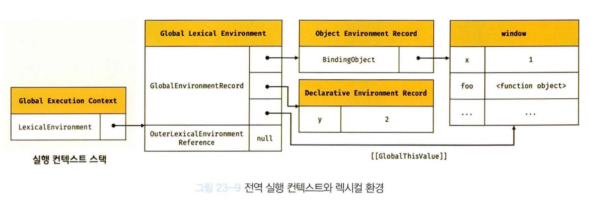
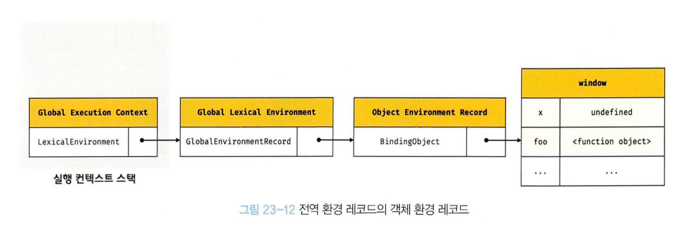
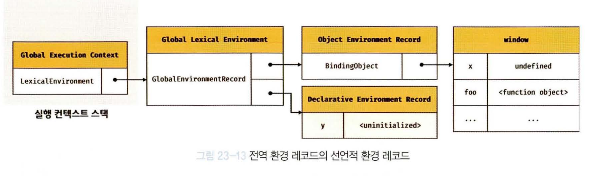

### ⭐️23.1 소스코드의 타입

<aside>
🤖

ECMAScript 사양은 소스코드를 4가지 타입으로 구분한다.

4가지 타입의 소스코드는 실행 컨텍스트를 생성한다.

| 소스코드의 타입 | 설명 |
| --- | --- |
| 전역 코드 | 전역에 존재하는 소스코드.
전역에 정의된 함수.
클래스 등의 내부 코드는 포함되지 않는다. |
| 함수 코드 | 함수 내부에 존재하는 소스코드.
함수 내부에 중첩된 함수.
클래스 등의 내부 코드는 포함되지 않는다. |
| eval 코드 | 빌트인 전역 함수인 eval 함수에 전달되어 실행되는 소스코드. |
| 모듈 코드 | 모듈 내부에 존재하는 소스코드.
모듈 내부의 함수
클래스 등의 내부 코드는 포함되지 않는다. |

→ 소스코드의 타입에 따라 실행 컨텍스트를 생성하는 과정과 관리 내용이 다르다.

1. 전역 코드
    - 전역 변수를 관리하기 위해 최상위 스코프인 전역 스코프를 생성해야 한다.
    - var 키워드로 선언된 전역 변수와 함수 선언문으로 전역 함수를 전역 객체의 프로퍼티와 메서드로 바인딩하고 참조하기 위해 전역 객체와 연결되어야 한다.
    - 전역 코드가 평가되면 전역 실행 컨텍스트가 생성된다.
2. 함수 코드
    - 함수 코드는 지역 스코프를 생성하고 지역 변수, 매개 변수, arguments 객체를 관리한다.
    - 생성한 지역 스코프를 전역 스코프에서 시작하는 스코프 체인의 일원으로 연결한다.
    - 함수코드가 평가되면 함수 실행 컨텍스트가 생성된다.
3. eval 코드
    - eval 코드는 strict mode 에서 자신만의 독자적인 스코프를 생성한다.
    - eval 코드가 평가되면 eval 실행 컨텍스트가 생성된다.
4. 모듈 코드
    - 모듈 코드는 모듈별로 독립적인 모듈 스코프를 생성한다.
    - 모듈 코드가 평가되면 모듈 실행 컨텍스트가 생성된다.
</aside>

### ⭐️23.2 소스코드의 평가와 실행

<aside>
🤖

→ 모든 소스코드는 실행에 앞서 평가 과정을 거치면 코드를 실행하기 위한 준비를 한다.

자바 스크립트 엔진은 소스코드를 2개의 과정으로 나누어 처리한다.

1. 소스코드의 평가
    1. 실행 컨텍스트 생성, 변수, 함수 등의 선언문만 먼저 실행하여 생성된 변수나 식별자를 키로 실행 컨텍스트가 관리하는 스코프에 등록한다.
2. 소스코드의 실행
    1. 선언문을 제외한 소스코드가 순차적으로 실행되기 시작한다
    2. 런타임이 시작되어 실행에 필요한 정보, 변수나 함수의 참조를 실행 컨텍스트가 관리하는 스코프에서 검색하여 취득한다.
    3. 변수 값의 변경 등 소스코드의 실행 결과는 다시 실행 컨텍스트가 관리하는 스코프에 등록된다.
    

→ 실행 컨텍스트 예제

`var x;`

`x = 1`

위 예제를 실행 컨텍스트는 어떻게 진행할까?

1. 소스코드 평가 과정에서 변수 선언문 var x; 먼저 실행 → 변수 식별자 x 가 실행 컨텍스트가 관리하는 스코프에 등록 후 undefined로 초기화
2. 평가 과정 끝난 후 소스코드가 실행된다. 
3. 소스 코드 실행 과정에서 변수 할당문 x=1; 만 실행된다.
4. 실행 컨텍스트가 관리하는 스코프에 x 변수가 등록 되어 있는지 확인한다.
5. x 변수가 선언된 변수라면 값을 할당하고 할당 결과를 실행 컨텍스트에 등록하여 관리한다.
</aside>

### ⭐️23.3 실행 컨텍스트의 역할

<aside>
🤖

→ 평가와 실행 예제 

```jsx
// 전역 변수 선언
const x = 1;
const y = 2;

// 함수 정의
function foo(a) {
	// 지역 변수 선언
	const x = 10;
	const y = 20;
	
	// 메서드 호출
	console.log(a + x + y); // 130
}

// 함수 호출
foo(100);

// 메서드 호출
console.log( x + y ); // 3
```

1. 전역 코드 평가
    1. 전역 코드의 변수 선언문과 함수 선언문이 먼저 실행된다.
    2. 생성된 전역 변수와 전역 함수가 실행 컨텍스트가 관리하는 전역 스코프에 등록된다.
    3. var 키워드로 선언된 전역 변수와 함수 선언문으로 정의된 전역 함수는 전역 객체의 프로퍼티와 메서드가 된다.
2. 전역 코드 실행
    1. 런타임이 시작되어 전역 코드가 순차적으로 실행되기 시작한다.
    2. 전역 변수에 값이 할당되고 함수가 호출된다.
    3. 함수 호출 시 순차적으로 진행되던 전역 코드의 실행을 일시 중단 후 코드 실행 순서를 변경하여 함수 내부로 진입한다.
3. 함수 코드 평가
    1. 함수 호출로 코드 실행 순서가 변경되어 함수 코드 평가 과정을 거친다.
    2. 매개변수와 지역 변수 선언문이 먼저 실행된다
    3. 생성된 매개변수와 지역 변수가 실행 컨텍스트가 관리하는 지역 스코프에 등록된다.
    4. 함수 내부에서 지역 변수처럼 사용할 수 있는 arguments 객체가 생성되어 지역 스코프에 등록 되며, this 바인딩도 결정된다.
4. 함수 코드 실행
    1. 런타임이 시작되어 함수 코드가 실행, 매개변수와 지역 변수에 값이 할당되고 console.log 메서드가 호출된다.
    2. console.log 메서드를 호출하기 위한 console를 스코프 체인을 통해 검색한다.
    3. console 식별자는 스코프 체인에 등록되어 있지 않고, 전역 객체에 프로퍼티에 존재한다.
    4. log 프로퍼티를 console 객체의 프로토 타입 체인을 통해 검색한다.
    5. console.log 메서드에 인수 전달 표현식 a + x + y가 평가된다. (각 식별자는 체인을  통해 검색한다)
    6. console.log 메서드가 끝나면 함수 코드 실행 과정이 종료되고 함수 호출 이전으로 되돌아가 전역 코드 실행을 계속한다.
    

→ 이처럼 코드가 실행되기 위해서는 스코프를 구분하고 식별자와 바인딩된 값이 관리되어야한다.

1. 선언에 의해 생성된 모든 식별자를 스코프를 구분하여 등록하고 상태 변화를 지속적으로 관리할 수 있어야 한다.
2. 스코프는 중첩 관계에 의해 스코프 체인을 형성해야 한다. 즉, 스코프 체인을 통해 상위 스코프로 이동하여 식별자를 검색할 수 있어야 한다.
3. 현재 실행 중인 코드의 실행 순서를 변경할 수 있어야 하며 다시 되돌아갈 수도 있어야 한다.

→ 이 모든 것을 관리하는 것이 바로 `실행 컨텍스트` 

- 실행 컨텍스트는 소스코드를 실행하는데 필요한 환경을 제공하고 코드의 실행 결과를 관리하는 영역이다.
- 실행 컨텍스트는 식별자를 등록하고 관리하는 스코프와 코드 실행 순서 관리를 구현한 내부 메커니즘으로, 모든 코드는 실행 컨텍스트를 통해 실행되고 관리된다.
- 식별자와 스코프는 실행 컨텍스트의 렉시컬 환경으로 관리하고 코드 실행 순서는 실행 컨텍스트 스택으로 관리한다.
</aside>

### ⭐️23.4 실행 컨텍스트 스택

<aside>
🤖

→ 실행 컨텍스트 스택 예제

```jsx
const x = 1;

function foo () {
	const y = 2;
	
	function bar () {
		const z = 3;
		console.log(x + y + z);
	}
	bar();
}

foo(); // 6	
```

1. 자바스크립트 엔진은 전역 코드를 평가하여 전역 실행 컨텍스트를 생성한다
2. 함수가 호출되면 함수 코드를 평가하여 함수 실행 컨텍스트를 생성한다.
3. 생성된 실행 컨텍스트는 스택 자료구조로 관리된다. 이를 `실행 컨텍스트 스택`이라 부른다.

→ 실행 컨텍스트 스택의 과정

1. 전역 코드의 평가와 실행
    1. 전역 코드를 평가하여 전역 실행 컨텍스트를 생성하고 스택에 푸시한다.
    2. 전역 변수 x와 전역 함수 foo는 전역 실행 컨텍스트에 등록된다.
    3. 전역 코드가 실행되어 전역 변수 x에 값이 할당, 전역 함수 foo 가 호출된다.
2. foo 함수 코드의 평가와 실행
    1. foo 호출 시 전역 코드의 실행은 일시 중단, 코드의 제어권이 foo 함수 내부로 이동한다.
    2. foo 함수 내부의 함수 코드를 평가하여 foo 함수 실행 컨텍스트를 생성하고 스택에 푸시한다.
    3. foo 함수의 지역 변수 y와 중첩 함수 bar가 foo 실행 컨텍스트에 등록된다.
    4. foo 함수가 코드가 실행되여 지역 변수 y에 값이 할당되고 중첩 함수 bar가 호출된다.
3. bar 함수 코드의 평가와 실행
    1. bar 호출 시 foo 함수 코드의 실행은 중단되고 제어권이 bar 내부로 넘어온다.
    2. bar 함수 내부의 함수 코드를 평가하여 bar 실행 컨텍스트를 생성 후 스택에 푸시한다.
    3. bar 함수 지역 변수 z가 bar 함수 실행 컨텍스트에 등록된다.
    4. bar 함수가 실행되며 지역 변수 z에 값이 할당되고 console.log 메서드를 호출하고 bar 함수가 종료된다.
4. foo 함수 코드로 복귀
    1. bar 종료 후 다시 foo 함수로 복귀한다. 제어권도 이동한다.
    2. bar 함수 실행 컨텍스트를 스택에서 제거한다.
    3. foo 함수가 종료된다.
5. 전역 코드로 복귀
    1. 제어권이 다시 전역 코드로 이동한다.
    2. foo 함수 실행 컨텍스트를 스택에서 제거한다.

→ 실행 컨텍스트는 코드의 실행 순서를 관리한다. 

1. 소스 코드가 평가 되면 → 실행 컨텍스트 생성 → 스택 최상위로 이동
2. 실행 컨텍스트의 최상위는 항상 실행 중인 코드의 실행 컨텍스트이다.
3. 따라서 최상위에 존재하는 실행 컨텍스트를 실행 중인 `실행 컨텍스트`라 부른다.
</aside>

### ⭐️23.5 렉시컬 환경

<aside>
🤖

→ 렉시컬 환경이란?

- 렉시컬 환경은 식별자와 식별자에 바인딩된 값, 그리고 상위 스코프에 대한 참조를 기록하는 자료구조로 실행 컨텍스트를 구성하는 컴포넌트다.
- 실행 컨텍스트 스택이 코드의 실행 순서를 관리한다면 렉시컬 환경은 스코프와 식별자를 관리한다.
- 렉시컬 환경은 키와 값을 갖는 객체 형태의 스코프를 생성하여 식별자를 키로 등록하고 식별자에 바인딩된 값을 관리한다.
- 즉, 렉시컬 환경은 스코프를 구분하여 식별자를 등록하고 관리하는 저장소 역할을 하는 렉시컬 스코프의 실체다.

→ 실행 컨텍스트 생성 시 생겨는 컴포넌트

- LexicalEnvironment 컴포넌트
- VariableEnvironment 컴포넌트

실행 초기에 두 컴포넌트는 하나의 동일한 렉시컬 환경을 참조한다.

→ 렉시컬 환경의 구성 컴포넌트

- 환경 레코드 (Environment Record) → 스코프에 식별자를 등록하고 등록된 식별자에 바인딩된 값을 관리하는 저장소다.
- 외부 렉시컬 환경에 대한 참조 (Outer Lexical Environment Reference) → 외부 렉시컬 환경에 대한 참조는 상위 스코프를 가리킨다.
</aside>

### ⭐️23.6 실행 컨텍스트의 생성과 식별자 검색 과정

<aside>
🤖

→ 실행 컨텍스트를 통해 식별자를 검색하는지 살펴보기

```jsx
var x = 1;
const y = 2;

function foo (a) {
	var x = 3;
	const y = 4;
	
	function bar (b) {
		const z = 5;
		console.log(a + b + x + y + z);
	}
	bar(10);
}

foo(20); // 42
```

</aside>

### **📌 23.6.1 전역 객체 생성**

<aside>
🤖

→ 전역 객체 생성

- 전역 객체는 전역 코드가 평가되기 이전에 생성된다.
- 빌트인 전역 프로퍼티, 함수 + 표준 빌트인 객체가 추가되며 동작 환경에 따라 클라이언트 사이드 Web API 또는 특정 환경을 위한 호스트 객체를 포함한다.
- 전역 객체도 Object 프로토 타입을 상속받는다.
</aside>

### **📌 23.6.2 전역 코드 평가**

<aside>
🤖

→ 전역 코드 평가 순서

1. 전역 실행 컨텍스트 생성
2. 전역 렉시컬 환경 생성
    
    2.1 전역 환경 레코드 생성
    
    2.1.1 객체 환경 레코드 생성
    
    2.1.2 선언적 환경 레코드 생성
    
    2.2 this 바인딩
    
    2.3 외부 렉시컬 환경에 대한 참조 결정
    



→ **1. 전역 실행 컨텍스트 생성**

- 비어있는 전역 실행 컨텍스트를 생성하여 실행 컨텍스트 스택에 푸시한다.
- 스택의 최상위 실행 컨텍스트가 된다.

→ **2. 전역 렉시컬 환경 생성**

- 렉시컬 환경을 생성하고 전역 실행 컨텍스트에 바인딩 한다.
- 환경 레코드와 외부 렉시컬 환경 컴포너트가 생성된다.

→ **2.1 전역 환경 레코드 생성**

- 전역 환경 레코드에서 전역 변수를 관리하는 전역 스코프, 전역 객체 빌트인, 전역 프로퍼티, 전역 함수, 표준 빌트인 객체를 제공한다.
- var ↔ let, const 를 구분하기 위해 전역 스코프 역할을 하는 전역 환경 레코드는 객체 환경 레코드와 선언적 환경 레코드로 구성되어 있다.
- 객체 환경 레코드
    - var 키워드로 선언한 변수, 함수, 빌트인, 표준 빌트인 객체를 관리한다.
- 선언적 환경 레코드
    - let, const 키워드로 선언한 전역 변수를 관리한다.

→ **2.1.1 객체 환경 레코드 생성**

- 전역 환경 레코드를 구성하는 컴포넌트 객체 환경 레코드는 BindingObject 객체와 연결된다.
- BindingObject는 전역 객체 생성에서 생성된 전역 객체다.
- 전역 코드 평가 과정에서 var 키워드로 선언한 전역 변수와 전역 함수는 BindingObject를 통해 전역 객체의 프로퍼티와 메서드가 된다.
- 등록된 식별자를 전역 환경 레코드의 객체 환경 레코드에서 검색하면 전역 객체의 프로퍼티를 검색하여 반환한다.
- var → 전역 객체의 프로퍼티와 메서드가 자연스럽게 window와 연결될 수 있는 메커니즘
    
    
    

→ `변수 호이스팅`

- x 변수는 var 키워드로 선언한 변수다. 선언 단계 + 초기화 단계가 동시에 진행된다.
- 전역 코드 평가 시점에 객체 환경 레코드로 바인딩된 BindingObject를 통해 전역 객체에 변수 식별자를 키로 등록한 다음 암묵적으로 undefined를 바인딩한다.
- 이로 인해 var 키워드로 선언한 변수는 코드 실행 단계에서 변수 선언문 이전에도 참조할 수 있다.
- 이것이 변수 호이스팅이 발생하는 원인이다.

→ `함수 호이스팅`

- 함수 선언문으로 정의한 함수가 평가 시 이름과 동일한 식별자를 객체 환경 레코드에 바인딩된 BindingObject를 통해 전역 객체에 키를 등록하고 생성된 함수 객체를 즉시 할당한다.
- 함수 선언문으로 정의한 함수는 함수 선언문 이전에 호출할 수 있다.

→ **2.1.2 선언적 환경 레코드 생성**

- var 키워드로 선언하지 않은 let, const 키워드로 전역 변수는 선언적 환경 레코드에 등록되고 관리된다.
- let, const 키워드로 선언한 변수는 전역 객체의 프로퍼티가 되지 않기 때문에 window.y와 같이 전역 객체의 프로퍼티로서 참조할 수 없다.
- const 키워드로 선언한 변수는 선언 단계와 초기화 단계가 분리되어 진행한다.
- 즉 런타임에 실행 흐름이 변수 선언문에 도달하기 전까지 `일시적 사각지대(TDZ)`에 빠지게 된다.
    
    
    

→ 그림으로부터 확인하기

- y 변수에 바인딩되어 있는 <uninitialized> 초기화 단계가 진행되지 않아 변수에 접근할 수 없음을 나타내기 위해 사용한 표현이다.
- let, const 키워드로 선언한 변수도 변수 호이스팅이 발생하는 것은 변함이 없다.
- 단 let, const 키워드로 선언한 변수는 런타임에 컨트롤이 변수 선언문에 도달하기 전까지 일시적 사각지대에 빠지기 때문에 참조할 수 없다.

```jsx
let foo = 1; // 전역 변수
{
	// let, const 키워드로 선언한 변수가 호이스팅 되지 않는다면 전역 변수를 참조한다.
	// 하지만 let 키워드로 선언한 변수도 여전히 호이스팅이 발생하기 때문에
	// 참조 에러가 발생한다.
	
	console.log(foo); // ReferenceError
	let foo = 2; // 지역 변수
}
```

→ 2.2 this 바인딩

- 전역 환경 레코드 [[GlobalThisValue]] 내부 슬롯에 this가 바인딩된다.
- 일반적으로 전역 코드에서 this는 → 전역 객체를 가리킨다 → 전역 환경 레코드 [[GlobalThisValue]] 내부 슬롯에는 전역 객체가 바인딩된다.
- 전역 코드에서 this를 참조하면 전역 환경 레코드의 [[GlobalThisValue]] 내부 스롯에 바인딩 되어 있는 객체가 반환된다.

`참고` 객체 환경 레코드와 선언적 환경 레코드에는 this 바인딩이 없다.

`참고` 전역 환경 레코드와 함수 환경 레코드에만 존재한다.

→ 2.3 외부 렉시컬 환경에 대한 참조 결정

- 외부 렉시컬 환경에 대한 참조는 현재 평가 중인 소스코드를 포함하는 외부 소스코드의 렉시컬 환경, 상위 스코프를 가리킨다.
- 이를 통해 단방향 링크드 리스트인 스코프 체인을 구현한다.
- 전역 실행 컨텍스트는 **더 이상 상위 스코프가 없다**.
- 따라서 외부 렉시컬 환경에는 null이 설정 된다.
- 전역 스코프의 외부 참조는 null 이므로 체인의 끝이다.
</aside>

### **📌 23.6.3 전역 코드 실행**

<aside>
🤖

→ 전역코드가 순차적으로 실행되는 과정을 살펴보자

1. 변수 할당 및 함수 호출을 위해서는 변수나 함수 이름이 선언되었는지 확인한다.
2. 식별자는 같은 스코프 내만 아니면 중복이 가능하기에 호출 시 어느 스코프의 식별자를 참조하는지 결정하는 **식별자 결정**이 발생한다.
3. 식별자 결정 때 검색은 실행 중인 실행 컨텍스트에서 식별자를 검색하기 시작한다.
4. 선언된 식별자는 실행 컨텍스트의 렉시컬 환경의 환경 레코드에 등록되어 있다.

→ 전역 실행 컨텍스트에서 실행 중이라면?

1. 전역 렉시컬 환경에서 식별자 x, y, foo를 검색하기 시작한다.
2. 만약 해당 렉시컬 환경에서 식별자를 검색할 수 없으면, 외부 렉시컬 환경에 대한 참조가 가리키는 외부 렉시컬 환경, 상위 스코프로 이동하여 식별자를 검색한다.
3. 현재는 전역 렉시컬 환경으로 체인의 종점이므로 전역 렉시컬에서 검색할 수 없는 식별자는 참조에러가 발생한다.
</aside>

### **📌 23.6.4 foo 함수 코드 평가**

<aside>
🤖

→ 예제 foo 함수 코드 평가를 확인하자

- 현재 전역 코드 평가를 통해 전역 실행 컨텍스트가 생성되었고, 전역 코드를 실행하고 있다. 현재 진행 상황은 foo 함수를 호출하기 직전이다.

```jsx
var x = 1;
const y = 2;

function foo (a) {
	var x = 3;
	const y = 4;
	
	function bar (b) {
		const z = 5;
		console.log(a + b + x + y + z);
	}
	bar(10);
}

foo(20);  // <- 호출 직전
```

→ 함수 코드 평가 순서

1. 함수 실행 컨텍스트 생성
2. 함수 렉시컬 환경 생성
    
    2.1 함수 환경 레코드 생성
    
    2.2 this 바인딩
    
    2.3 외부 렉시컬 환경에 대한 참조 결정
    

→ 1. 함수 실행 컨텍스트 생성

- foo 함수 실행 컨텍스트 생성 → 함수 렉시컬 환경 생성 → 실행 컨텍스트 스택에 푸시
- foo 함수 실행 컨텍스트는 현재 진행 중 → 스택의 최상위 → 실행 중인 실행 컨텍스트이다.

→ 2. 함수 렉시컬 환경 생성

- foo 함수 렉시컬 환경 생성 → foo 함수 실행 컨텍스트에 바인딩
- 렉시컬 환경 생성으로 2개의 컴포넌트 생성(환경 레코드, 외부 렉시컬 환경)

→ 2.1 함수 환경 레코드 생성

- 함수 렉시컬 환경을 구성하는 컴포넌트 중 하나 → 매개변수 arguments 객체, 함수 내부 지역 변수, 중첩 함수를 등록하고 관리한다.

→ 2.2 this 바인딩

- 함수 환경 레코드의 [[ThisValue]] 내부 슬롯에 this가 바인딩
- foo 함수 호출 방식 확인 → 일반 함수 호출 → this는 전역 객체가 바인딩된다.
- foo 함수 내부 this 참조 → 함수 환경 레코드[[ThisValue]] 바인딩 되어 있는 객체 반환

→ 2.3 외부 렉시컬 환경에 대한 참조 결정

- 외부 렉시컬 환경에 대한 참조에 → foo 함수 실행 컨텍스트의 렉시컬 환경의 참조가 할당
- foo 함수는 전역 코드에 정의된 함수 → foo 함수 정의는 전역 코드 평가 시점에 평가 → 실행 컨텍스트는 전역 실행 컨텍스트 → 외부 렉시컬 환경 참조는 전역 렉시컬 환경의 참조가 할당

→ 함수는 어디에 정의했는지에 따라 상위 스코프를 결정한다.
함수 정의 평가 → 함수 객체 생성 → 실행 컨텍스트 렉시컬 환경에 등록 → 함수의 상위 스코프를 함수 내부 슬롯 [[Environment]]에 저장

- 외부 렉시컬 환경에 참조는 상위 스코프가 담겨있는 객체 [[Environment]]에 저장된 참조다.
- 즉 함수 객체의 내부 슬롯 [[Environment]]가 바로 렉시컬 스코프를 구현하는 메커니즘이다.
</aside>

### **📌 23.6.5 foo 함수 코드 실행**

<aside>
🤖

→ 런타임이 시작되고, foo 함수 안 소스코드가 순차적으로 실행, 매개변수에 인수가 할당, 변수 할당문 실행, 지역 변수 x, y에 값이 할당 된다. 이후 함수 bar가 호출된다.

1. 식별자 결정을 위한 실행 중인 실행 컨텍스트의 렉시컬 환경에서 식별자를 검색한다.
2. 현재 실행 컨텍스트 → foo 함수 실행 컨텍스트 → foo 함수 렉시컬 환경 → 식별자 x, y 검색
3. 없을 시? 외부 렉시컬 환경 참조 렉시컬 환경으로 이동 → 식별자 검색
4. 검색된 식별자에 값을 바인딩한다.
</aside>

### **📌 23.6.6 bar 함수 코드 평가**

<aside>
🤖

→ foo 함수 코드 실행 중 bar 함수를 호출하기 직전이다.

```jsx
var x = 1;
const y = 2;

function foo (a) {
	var x = 3;
	const y = 4;
	
	function bar (b) {
		const z = 5;
		console.log(a + b + x + y + z);
	}
	bar(10); // <- 호출 직전
}

foo(20);  
```

→ bar 함수 코드 평가

1. bar 함수 호출 시 bar 함수 내부로 코드의 제어권이 이동한다.
2. bar 함수 코드를 평가하기 시작 → 실행 컨텍스트 생성 → 렉시컬 환경 생성 → 스택 추가
</aside>

### **📌 23.6.7 bar 함수 코드 실행**

<aside>
🤖

→ 런타임이 시작되어 bar 함수 내부 소스코드가 순차적으로 실행된다.

- 매개 변수에 인수가 할당되고, 변수 할당문이 실행되어 지역 변수 z에 값이 할당된다.
- 이후 console.log(a + b+ x + y + z); 가 실행된다.

→ console 식별자 검색

1. console 식별자를 스코프 체인에서 검색한다.
2. 스코프 체인은 실행 컨텍스트 렉시컬 환경으로 시작 → 외부 렉시컬 환경에 대한 참조로 이어진다.
3. 현재 실행 중인 bar 함수 실행 컨텍스트 렉시컬 환경에서 console 식별자를 검색한다.
4. bar 함수 렉시컬 환경에는 없다 → 상위 스코프로 가기 위한 외부 렉시컬 환경에 대한 참조가 가리키는 foo 함수 렉시컬 환경으로 이동한다.
5. foo 함수 렉시컬 환경에도 없다 → 상위 스코프 외부 렉시컬 환경 참조가 가리키는 전역 렉시컬 환경으로 이동 후 console 식별자 검색
6. 전역 렉시컬 환경은 2개 컴포넌트 객체 환경 레코드와 선언적 환경 레코드로 구성되어 있다.
7. console 식별자는 객체 환경 레코드의 BindingObject에서 전역 객체에서 찾았다.

→ log 메서드 검색

1. console 식별자에서 log 메서드를 검색한다.
2. log는 상속된 프로퍼티가 아니라 console 객체가 직접 소유하는 프로퍼티다.
3. console.hasOwnProperty(’log’); // → true

→ 표현식 a + b + x + y + z의 평가

1. 이제 표현식을 평가하기 위한 a, b, x, y, z 식별자를 검색한다.
2. 식별자는 스코프 체인, 즉 현재 실행 중인 실행 컨텍스트의 렉시컬 환경에서 시작하여 외부 렉시컬 환경에 대한 참조로 이어지는 렉시컬 환경의 연속에서 검색한다.
3. a → foo 함수 렉시컬 환경 , b → bar 함수 렉시컬 환경, x와 y → foo 함수 렉시컬 환경, z 식별자 → bar 함수 렉시컬 환경

→ console.log 메서드 호출

1. 표현식 a + b + x + y + z의 평가되어 생성한 값  42를 console.log 메서드에 전달하여 호출한다.
</aside>

### **📌 23.6.8 bar 함수 코드 실행 종료**

<aside>
🤖

→ console.log 메서드 종료 후 실행 될 코드가 없어 bar 함수 코드의 실행이 종료된다.

- 실행 컨텍스트 스택에서 bar 함수 실행 컨텍스트가 팝되어 제거되고 foo 실행 컨텍스트가 실행 중인 실행 컨텍스트가 된다.
- 스택에서 제거 되었다고 해서 bar 함수 렉시컬 환경까지 즉시 소멸하지는 않는다.
- 렉시컬 환경은 실행 컨텍스트로 인해 참조되지만, 독립적인 객체다.
- 즉, bar 함수 실행 컨텍스트가 소멸되었다 해도 bar 함수 렉시컬 환경을 누군가 참조하고 있다면 bar 함수 렉시컬 환경은 소멸되지 않는다.
</aside>

### **📌 23.6.9 foo 함수 코드 실행 종료**

<aside>
🤖

→ bar 함수 종료 후, foo 함수로 돌아와서 foo 함수도 더이상 실행할 코드가 없다.

- foo 함수 코드의 실행이 종료 → 실행 컨텍스트 스택에서 foo 함수 실행 컨텍스트가 제거 → 전역 실행 컨텍스트가 실행 중인 실행 컨텍스트로 변경
</aside>

### **📌 23.6.10 전역 코드 실행 종료**

<aside>
🤖

→ foo 함수 종료 시 더이상 실행할 전역 코드도 없다.

- 전역 코드의 실행이 종료되고, 전역 실행 컨텍스트도 실행 컨텍스트에서 제거되어 스택에는 아무것도 남아있지 않는다.
</aside>

### ⭐️23.7 실행 컨텍스트와 블록 레벨 스코프

<aside>
🤖

-

```jsx
let x = 1;

if (true) {
  let x = 2; // ← 이건 새로운 렉시컬 환경에서 만들어진 x!
  console.log(x); // 2
}

console.log(x); // 1 (밖의 x)
```

- 자바스크립트가 `if (true)` 블록을 만나면,
- **블록 스코프용 렉시컬 환경을 새로 생성**
- 새 환경의 `outer`는 기존 스코프를 가리켜 (즉, 상위 스코프 연결)
- 블록 안의 코드가 실행되고,
- **끝나면 블록 스코프는 사라지고**, 이전 렉시컬 환경으로 돌아감
</aside>