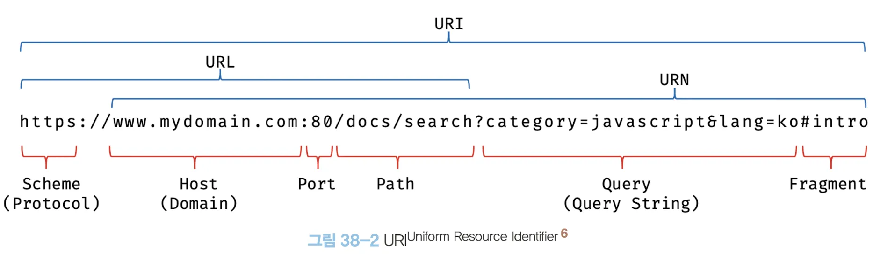
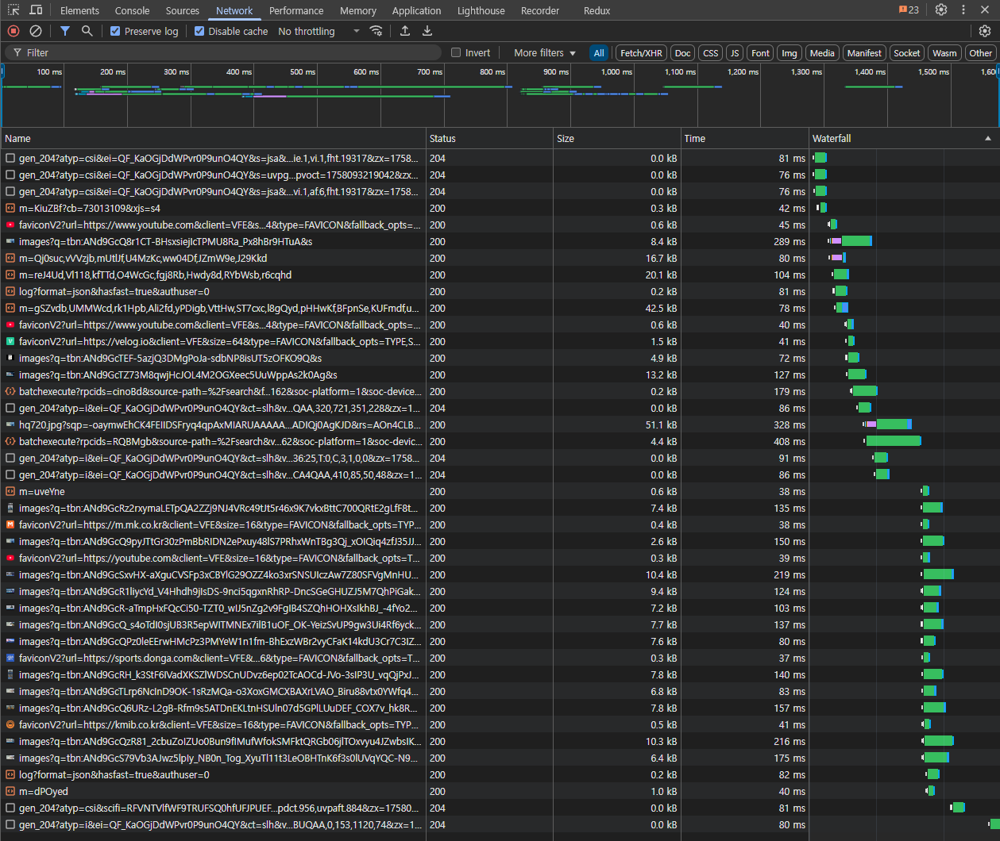
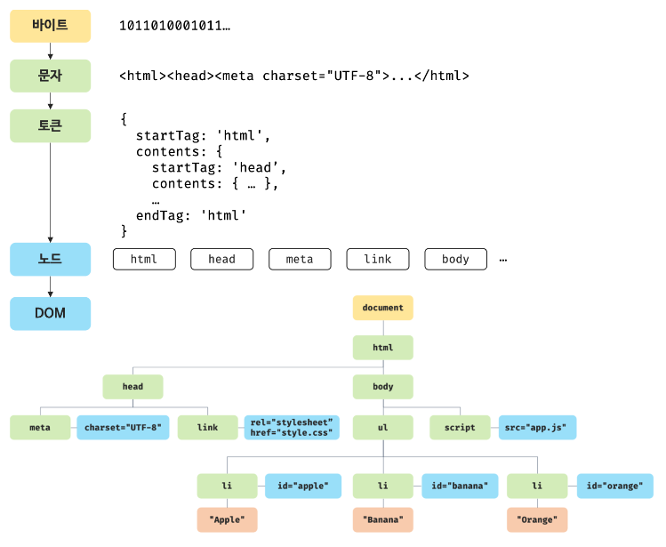
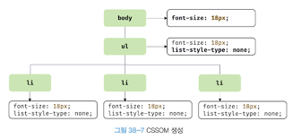

### ⭐️38 브라우저 렌더링 과정

<aside>
🗽

→ 자바스크립트가 가장 많이 사용되는 분야는 웹 브라우저 환경에서 동작하는 웹페이지/애플리케이션의 클라이언트 사이드다.

- 대부분의 프로그래밍 언어는 운영체제나 가상 머신 위에서 실행되지만 웹 애플리케이션의 클라잉언트 사이드 자바스크립트는 브라우저에서 HTML, CSS와 함께 실행된다.
- 브라우저가 HTML, CSS, 자바스크립트로 작성된 텍스트 문서를 어떻게 파싱하여 브라우저에 렌더링 하는지 살펴보자

→ 브라우저의 렌더링 과정은 다음과 같다.

1. 브라우저는 HTML, CSS, 자바스크립트, 이미지, 폰트, 파일 등 렌더링에 필요한 리소스를 요청하고 서버로부터 응답을 받는다.
2. 브라우저의 렌더링 엔진은 서버로부터 응답된 HTML과 CSS를 파싱하여 DOM과 CSSOM을 생성하고 이들을 결합하여 렌더 트리를 생성한다.
3. 브라우저의 자바스크립트 엔진은 서버로부터 응답된 자바스크립트를 파싱하여 AST를 생성하고 바이트코드로 변환하여 실행한다, 이때 자바스크립트는 DOM API를 통해 DOM이나 CSSOM을 변경할 수 있다. 변경된 DOM과 CSSOM은 다시 렌더 트리로 결합된다.
4. 렌더 트리를 기반으로 HTML 요소의 레이아웃을 계산하고 브라우저 화면에 HTML 요소를 페인팅한다.
</aside>

### ⭐️38.1 요청과 응답

<aside>
🗽

→ 브라우저의 핵심 기능은 필요한 리소스를 서버에 요청하고 서버로부터 응답 받아 브라우저에 시각적으로 렌더링 하는 것이다.

- 렌더링에 필요한 리소스는 모두 서버에 존재하므로 필요한 리소스를 서버에 요청하고 서버가 응답한 리소스를 파싱하여 렌더링하는 것이다.
- 서버에 요청을 전송하기 위해 브라우저는 주소창을 제공한다.
- 브라우저의 주소창에 URL을 입력하고 엔터 키를 누르면 URL의 호스트 이름이 DNS를 통해 IP 주소로 변환되고 이 IP 주소를 갖는 서버에게 요청을 전송한다.



→ https://poiemaweb.com을 입력하고 엔터 키를 누르면 루트 요청(/, 스킴과 호스트만으로 구성된 URL에 의한 요청)이 poiemaweb.com 서버로 전송된다.

- 루트 요청에는 명확히 리소스를 요청하는 내용이 없지만 일반적으로 서버는 루트 요청에 대해 암묵적으로 index.html을 응답하도록 기본 설정되어 있다.
- https://poemaweb.com은 https:/poiemaweb.com/index.html과 같은 요청이다.
- 즉, 서버는 루트 요청에 대해 루트 폴더에 존재하는 index.html을 클라이언트로 응답한다.
- index.html이 아닌 정적 파일을 요청하려면 브라우저의 주소창에 요청할 정적 파일의 경로와 파일 이름을 URL의 호스트 뒤에 PATH에 기술하여 서버에 요청한다.
- 정적 파일이 아닌 동적 데이터를 요청시에는 ajax와 REST API를 사용하여 요청할 수 있다.

→ 요청과 응답은 개발자 도구의 Network 패널에서 확인할 수 있다.



- index.html + CSS, 자바스크립트, 이미지 폰트 파일들도 응답된 것을 확인할 수 있다.
- 브라우저의 렌더링 엔진이 HTML을 파싱하는 도중에 외부 리소스를 로드하는 태그, 즉 CSS 파일을 로드하는 link 태그, 이미지 파일을 로드하는 img 태그, 자바스크립트를 로드하는 script 태그 등을 만나면 HTML의 파싱을 일시 중단하고 해당 리소스 파일을 서버로 요청하기 때문이다.
</aside>

### ⭐️38.2 HTTP 1.1 과 HTTP 2.0

<aside>
🗽

→ HTTP는 웹에서 브라우저와 서버가 통신하기 위한 프로토콜 이다.

- HTTP는 1991년 최초로 문서화 되었고, 1996년 HTTP/1.0, 1999년 HTTP/1.1, 2015년 HTTP/2가 발표되었다.

→ HTTP/1.1 과 HTTP/2 의 차이점

1. 1.1은 기본적으로 커넥션 당 하나의 요청과 응답만 처리한다. 즉 여러 개의 요청을 한 번에 전송할 수 없고 응답 또한 마찬가지다. 따라서 1.1은 리소스의 동시 전송이 불가능한 구조이므로 요청할 리소스의 개수에 비례하여 응답 시간도 증가하는 단점이 있다.
2. 2는 커넥션당 여러 개의 요청과 응답, 즉 다중 요청/응답이 가능하다. 2.0은 여러 리소스의 동시 전송이 가능하므로 1.1에 비해 페이지 로드 속도가 약 50% 정도 빠르다고 알고 있다.
</aside>

### ⭐️38.3 HTML 파싱과 DOM 생성

<aside>
🗽

→ 브라우저의 요청에 의해 서버가 응답한 HTML 문서는 문자열로 이루어진 순수한 텍스트다.

- 순수한 텍스트인 HTML 문서를 브라우저에 시각적인 픽셀로 렌더링하려면 HTML 문서를 브라우저가 이해할 수 있는 자료구조로 변환하여 메모리에 저장해야 한다.

```jsx
<!DOCTYPE html>
<html>
	<head>
		<meta charset = "UTF-8">
		<link rel ="stylesheet" href="style.css">
	</head>
	<body>
		<ul>
			<li id="apple">Apple</li>
			<li id="banana">Banana</li>
			<li id="orange">Orange</li>
		</ul>
		<script src="app.js"></script>
	</body>
</html>
```

→ 브라우저의 렌더링 엔진은 다음 그림과 같은 과정을 통해 응답받은 HTML 문서를 파싱하여 브라우저가 이해할 수 있는 자료구조인 DOM을 생성한다.



1. 서버에 존재하던 HTML 파일이 브라우저의 요청에 의해 응답된다. 이때 서버는 브라우저가 요청한 HTML 파일을 읽어 들여 메모리에 저장한 다음 메모리에 저장된 바이트를 인터넷을 경유하여 응답한다.
2. 브라우저는 서버가 응답한 HTML 문서를 바이트 형태로 응답받는다. 그리고 응답된 바이트 형태의 HTML 문서는 meta 태그의 charset 어트리뷰트에 의해 지정된 인코딩 방식을 기준으로 문자열로 변환된다. 참고로 meta 태그의 charset 어트리뷰트에 선언된 인코딩 방식은 content-type: text/html; charset=utf-8과 같이 응답 헤더에 담겨 응답된다. 브라우저는 이를 확인하고 문자열로 변환한다.
3. 문자열로 변환된 HTML 문서를 읽어 들여 문법적 의미를 갖는 코드의 최소 단위인 토큰들로 분해한다.
4. 각 토큰들을 객체로 변환하여 노드들을 생성한다. 토큰의 내용에 따라 문서 노드, 요소 노드, 어트리뷰트 노드, 텍스트 노드가 생성된다. 노드는 이후 DOM을 구성하는 기본 요소가 된다.
5. HTML 문서는 HTML 요소들의 집합으로 이루어지며 HTML 요소는 중첩 관계를 갖는다. 즉 HTML 요소의 콘텐츠 영역에는 텍스트뿐만 아니라 다른 HTML 요소도 포함될 수 있다. 이때 HTML 요소 간에는 중첩 관계에 의해 부자 관계가 형성 된다. 이러한 HTML 요소 간의 부자 관계를 반영하여 모든 노드들을 트리 자료구조로 구성한다. 이 노드들로 구성된 트리 자료구조를 DOM이라 부른다.
</aside>

### ⭐️38.4 CSS 파싱과 CSSOM 생성

<aside>
🗽

→ 렌더링 엔진은 HTML을 처음부터 한 줄씩 순차적으로 파싱하여 DOM을 생성해 나간다.

- 렌더링 엔진은 DOM을 생성해 나가다가 CSS를 로드하는 link 태그나 style 태그를 만나면 DOM 생성을 일시 중단한다.
- 그리고 link 태그의 href 어트리뷰트에 지정된 CSS 파일을 서버에 요청하여 로드한 CSS 파일이나 style 태그 내의 CSS를 HTML과 동일한 파싱 광정을 거치며 해석하여 CSSOM을 생성한다.
- 이후 CSS 파싱을 완료하면 HTML 파싱이 중단된 지점부터 다시 HTML을 파싱하기 시작하여 DOM 생성을 재개한다.

```jsx
body{
	font-size: 18px;
}

ul {
	list-style-type: none;
}
```

→ 서버로부터 CSS 파일이 응답되면 렌더링 엔진은 HTML과 동일한 해성 과정을 거쳐 CSS를 파싱하여 CSSOM을 생성한다.

- CSSOM은 CSS의 상속을 반영하여 생성된다.
- 위 예제에서 body 요소에 적용한 font-size 프로퍼티와 ul 요소에 적용한 list-style-type 프로퍼티는 모든 li 요소에 상속된다.
- 이러한 상속 관계가 반영되어 다음과 같은 CSSOM이 생성된다.



</aside>

### ⭐️38.5 렌더 트리 생성

<aside>
🗽

→ 렌더링 엔진은 서버로부터 응답된 HTML과 CSS를 파싱하여 각각 DOM과 CSSOM을 생성한다.

- DOM과 CSSOM은 렌더링을 위해 렌더 트리로 결합된다.
- 렌더 트리는 렌더링을 위한 트리 구조의 자료구조다.
- 렌더 트리는 브라우저 화면에 렌더링 되는 노드만으로 구성된다.
- 완성된 렌더 트리는 각 HTML 요소의 레이아웃을 계산하는 데 사용되며 브라우저 화면에 픽셀을 렌더링 하는 페인팅 처리에 입력된다.

→ 브라우저의 반복 실행 렌더링 과정

1. 자바스크립트에 의한 노드 추가 또는 삭제
2. 브라우저 창의 리사이징에 의한 뷰포트 크기 변경
3. HTML 요소의 레이아웃에 변경을 발생시키는 width/heigth, margin, 등의 스타일 변경
</aside>

### ⭐️38.6 자바스크립트 파싱과 실행

<aside>
🗽

→ HTML 문서를 파싱한 결과물로서 생성된 DOM은 HTML 문서의 구조와 정보뿐만 아니라 HTML 요소와 스타일 등을 변경할 수 있는 프로그래밍 인터페이스로서 DOM API를 제공한다.

- 자바스크립트 코드에서 DOM API를 사용하면 이미 생성된 DOM을 동적으로 조작할 수 있다.

→ 렌더링 엔진은 HTML을 한 줄씩 순차적으로 파싱하여 DOM을 생성해 나가다가 자바스크립트 파일을 로드하는 script 태그나 자바스크립트 코드를 콘텐츠로 담은 script 태그를 만나면 DOM 생성을 일시 중단한다.

→ 스크립트 태그를 만나면 렌더링 엔진은 자바스크립트 엔진에게 제어권을 넘기고 파싱이 끝나면 다시 렌더링 엔진에게 제어권이 돌아온다 이후 중단된 파싱 지점으로 부터 다시 DOM 생성을 재개한다.

→ 자바스크립트 파싱과 실행은 자바스크립트 엔진이 처리하며, CPU가 이해할 수 있는 저수준 언어로 변환하고 실행하는 역할을 한다.

→ 토크나이징

- 단순한 문자열인 자바스크립트 소스코드를 어휘 분석하여 문법적 의미를 갖는 코드의 최소 단위인 토큰들로 분해한다. 이 과정을 렉싱이라고 부르기도 하지만 토크나이징과 미묘한 차이가 있다.

→ 파상

- 토큰들의 집합을 구문 분석하여 AST를 생성한다. AST는 토큰에 문법적 의미와 구조를 반영한 트리 구조의 자료구조다. AST는 인터프리터나 컴파일러만이 사용하는 것은 아니다.
- AST를 사용하면 TypeScript, Babel, Prettier 같은 트랜스파일러를 구현할 수도 있다.
- AST Explorer 웹사이트에 방문하면 다양한 오픈소스 자바스크립트 파서를 사용하여 AST를 생성해 볼 수 있다.

→ 바이트코드 생성과 실행

- 파싱의 결과물로서 생성된 AST는 인터프리터가 실행할 수 있는 중간 코드인 바이트코드로 변환되고 인터프리터에 의해 실행된다.
- 참고로 V8 엔진의 경우 사용되는 코드는 터보팬이라 불리는 컴파일러에 의해 최적화된 머신 코드로 컴파일되어 성능을 최적화한다.
- 만약 코드의 사용 빈도가 적어지면 다시 디옵티마이징하기도 한다.
</aside>

### ⭐️38.7 리플로우와 리페인트

<aside>
🗽

[38-12.jfif](./images/38-12.jfif)

- 변경된 DOM과 CSSOM은 다시 렌더 트리로 결합되고 변경된 렌더 트리를 기반으로 레이아웃과 페인트 과정을 거쳐 브라우저의 화면에 다시 렌더링한다.
- 이를 리플로우, 리페인트라 한다.

→ 리플로우 ?

- 레이아웃 계산을 다시 하는 것을 말하며, 노드 추가/삭제, 요소의 크기/위치 변경, 윈도우 리사이징 등 레이아웃에 영향을 주는 변경이 발생한 경우에 한하여 실행된다.

→ 리페인트 ?

- 재결합된 렌더 트리를 기반으로 다시 페인트를 하는 것을 말한다.
</aside>

### ⭐️38.8 자바스크립트 파싱에 의한 HTML 파싱 중단

<aside>
🗽

→ 렌더링 엔진과 자바스크립트 엔진은 병렬적으로 파싱을 실행하지 않고 직렬적으로 파싱을 수행한다.

- 브라우저는 동기적으로 위에서 아래 방향으로 순차적으로 HTML, CSS, 자바스크립트를 파싱하고 실행한다.
- 이것은 script 태그의 위치에 따라 HTML 파싱이 블로킹되어 DOM 생성이 지연될 수 있다는 것을 의미한다. 따라서 script 태그의 위치는 중요한 의미를 갖는다.

```jsx
<!DOCTYPE html>
<html>
	<head>
		<meta charset="UTF-8">
		<link rel="stylesheet" href="style.css">
		<script>
			// DOM API document.getElementById는 DOM에서 id가 apple인 HTML 요소를 취득
			// 아래 DOM API가 실행되는 시점에는 아직 id가 apple 인 HTML요소가 파싱이 안됨
			
			const $apple = document.getElementById('apple');
			$apple.style.color = 'red';
		</script>
	</head>
	<body>
		<ul>
			<li id="apple">Apple</li>
			<li id="banana">Banana</li>
			<li id="orange">Orange</li>
		</ul>
	</body>
</html>
```

→ 위 문제를 해결하기 위해서는 스크립트 태그의 위치를 옮겨주는 것이 좋다.

- body 요소의 가장 아래에 자바스크립트를 위치시키는 것은 좋은 아이디어다.
- 이유 ?
    - DOM이 완성되지 않는 상태에서 자바스크립트가 DOM을 조작하면 에러가 발생할 수 있다.
    - 자바스크립트 로딩/파싱/실행으로 인해 HTML 요소들의 렌더링에 지장받는 일이 발생하지 않아 페이지 로딩 시간이 단축된다.

```jsx
<!DOCTYPE html>
<html>
	<head>
		<meta charset="UTF-8">
		<link rel="stylesheet" href="style.css">
	</head>
	<body>
		<ul>
			<li id="apple">Apple</li>
			<li id="banana">Banana</li>
			<li id="orange">Orange</li>
		</ul>
		<script>
			const $apple = document.getElementById('apple');
			$apple.style.color = 'red';
		</script>
	</body>
</html>
```

</aside>

### ⭐️38.9 script 태그의 async/defer 어트리뷰트

<aside>
🗽

→ 자바스크립트 파싱에 의한 DOM 생성이 중단되는 문제를 근본적으로 해결하기 위해 HTML5부터 script 태그에 async와 defer 어트리뷰트가 추가되었다.

→ async와 defer 어트리뷰트는 다음과 같이 src 어트리뷰트를 통해 외부 자바스크립트 파일을 로드하는 경우에만 사용할 수 있다.

- 즉 src 어트리뷰트가 없는 인라인 자바스크립트에는 사용할 수 없다.

```jsx
<script async src="extern.js"></script>
<script defer src="extern.js"></script>
```

- async와 defer 어트리뷰트를 사용하면 HTML 파싱과 외부 자바스크립트 파일의 로드가 비동기적으로 동시에 진행된다.
- 자바스크립트 실행 시점에 차이가 있다.

→ async 어트리뷰트

- HTML 파싱과 외부 자바스크립트 파일의 로드가 비동기적으로 동시에 진행된다.
- 단, 자바스크립트 파싱과 실행은 자바스크립트 파일의 로드가 완료된 직후 진행되며, 이때 HTML 파싱이 중단된다.
- 여러 개의 script 태그에 async 어트리뷰트를 지정하면 script 태그의 순서와는 상관없이 로드가 완료된 자바스크립트 부터 실행되므로 순서가 보장되지 않는다.
- 순서보장이 필요한 script 태그에는 async 어트리뷰트를 지정하지 않아야 한다.

→ defer 어트리뷰트

- async 어트리뷰트와 마찬가지로 HTML 파싱과 외부 자바스크립트 파일의 로드가 비동기적으로 동시에 진행된다.
- 자바스크립트의 파싱과 실행은 HTML 파싱이 완료된 직후, 즉 DOM 생성이 완료된 직후 진행된다.
- 따라서 DOM 생성이 완료된 이후 실행되어야 할 자바스크립트에 유용하다.
</aside>