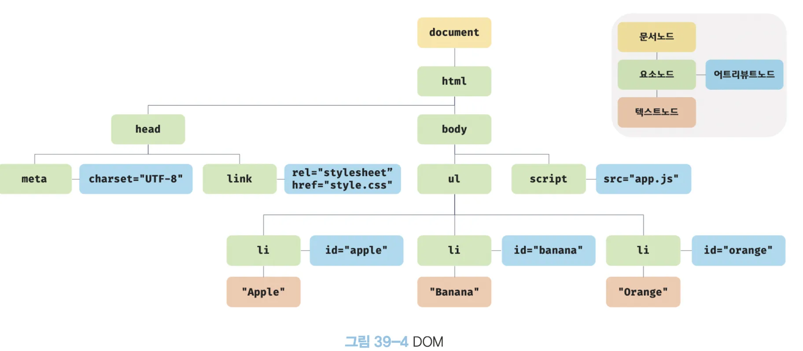
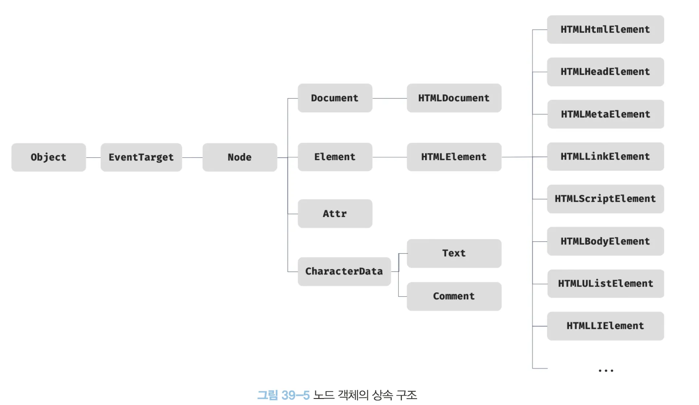

### ⭐️39 DOM

<aside>
💴

→ 브라우저의 렌더링 엔진은 HTML 문서를 파싱하여 브라우저가 이해할 수 있는 자료구조인 DOM을 생성한다.

- DOM은 HTML 문서의 계층적 구조와 정보를 표현하며 이를 제어할 수 있는 API, 즉 프로퍼티와 메서드를 제공하는 트리 자료구조다.
</aside>

### ⭐️39.1 노드

### **📌 39.1.1 HTML 요소와 노드 객체**

<aside>
💴

→ <div class = “greeting”> Hello</div>

- <div  → 시작 태그
- class → 어트리뷰트 이름
- greeting → 어트리뷰트 값
- Hello → 콘텐츠
- </div> → 종료 태그

→ HTML 문서는 HTML 요소들의 집합으로 이뤄지며, HTML 요소는 중첩 관계를 갖는다.

- HTML 요소의 콘첸츠 영역 (시작 태그와 종료 태그 사이)에는 텍스트 뿐만 아니라 다른 HTML 요소도 포함할 수 있다.
- HTML 요소 간에는 중첩 관계에 의해 계층적인 부자 관계가 형성된다.
- HTML 요소 간의 부자 관계를 반영하여 HTML 문서의 구성 요소인 HTML 요소를 객체화한 모든 노드 객체들을 트리 자료로 구성한다.

→ 트리 자료 구조

- 트리 자료구조는 노드들의 계층 구조로 이뤄진다.
- 부모 노드와 자식 노드로 구성되어 노드 간의 계층적 구조를 표현하는 비선형 자료구조를 말한다.
- 트리 자료구조는 하나의 최상위 노드에서 시작한다.
- 최상위 노드는 부모 노드가 없으며, 루트 노드라 한다.
- 루트 노드는 0개 이상의 자식 노드를 갖는다. 자식 노드가 없는 노드를 리프 노드라 한다.

노드 객체들로 구성된 트리 자료구조를 DOM이라 한다. 

노드 객체의 트리로 구조화되어 있기 때문에 DOM을 DOM 트리라고 부르기도 한다.

</aside>

### **📌 39.1.2 노드 객체의 타입**

<aside>
💴

→ HTML 문서를 렌더링 엔진이 파싱한다고 생각해보자.

```jsx
<!DOCTYPE html>
<html>
	<head>
		<meta charset="UTF-8">
		<link rel="stylesheet" href="style.css">
	</head>
	<body>
		<ul>
			<li id="apple"> Apple </li>
			<li id="banana">Banana </li>
			<li id="orange">Orange </li>
		</ul>
		<script src="app.js"></script>
	</body>
</html>
```



→ 노드 객체는 종류가 있고 상속 구조를 갖는다. 노드 객체는 총 12개의 종류로 그 중 중요한 노드 타입은 4가지다.

→ 문서 노드

- 문서 노드는 DOM 트리의 최상위에 존재하는 루트 노드로서 document 객체를 가리킨다.
- document 객체는 브라우저가 렌더링한 HTML 문서 전체를 가리키는 객체로 window.document로 참조할 수 있다.
- HTML 문서당 document 객체는 유일하다.
- document 객체는 DOM 트리의 노드들에 접근하기 위한 진입점 역할을 담당한다.

→ 요소 노드

- 요소 노드는 HTML 요소를 가리키는 객체다.
- 요소 노드는 HTML 요소 간의 중첩에 의해 부자 관계를 가지며, 이 부자 관계를 통해 정보를 구조화한다.
- 요소 노드는 문서의 구조를 표현한다고 할 수 있다.

→ 어트리뷰트 노드

- 어트리뷰트 노드는 HTML 요소의 어트리뷰트를 가리키는 객체다.
- 어트리뷰트 노드는 지정된 HTML 요소의 요소 노드와 연결되어 있다.
- 어트리뷰트 노드는 부모 노드와는 연결되어 있지 않고 요소 노드에만 연결되어 있다.
- 어트리뷰트 노드는 요소 노드의 형제 노드는 아니며, 어트리뷰트 참조나 변경 시 요소 노드에 접근해야 한다.

→ 텍스트 노드

- 텍스트 노드는 HTML 요소의 텍스트를 가리키는 객체다.
- 텍스트 노드는 문서의 정보를 표현한다고 할 수 있다.
- 텍스트 노드는 요소 노드의 자식 요소이며, 자식 노드를 가질 수 없는 리프 노드다.
- 텍스트 노드는 DOM 트리의 최종단이며, 접근 시 부모 노드인 요소 노드에 접근해야한다.

</aside>

### **📌 39.1.3 노드 객체의 상속 구조**

<aside>
💴

→ DOM은 HTML 문서의 계층적 구조와 정보를 표현하며, 이를 제어할 수 있는 API, 즉 프로퍼티와 메서드를 제공하는 트리 자료구조라고 했다.

- DOM을 구성하는 노드 객체는 자신의 구조와 정보를 제어할 수 있는 DOM API를 사용할 수 있다.
- 이를 통해 노드 객체는 자신의 부모, 형제, 자식을 탐색할 수 있으며, 자신의 어트리뷰트와 텍스트를 조작할 수도 있다.

→ DOM을 구성하는 노드 객체

- 브라우저 환경에서 추가적으로 제공하는 호스트 객체다.
- 노드 객체도 자바스크립트 객체이므로 프로토타입에 의한 상속 구조를 갖는다.



→ 모든 노드 객체는 Object, EventTarget, Node 인터페이스를 상속 받는다.

- 문서 노드는 Document, HTMLDocument 인터페이스 상속
- 어트리뷰트 노드는 Attr 인터페이스 상속
- 텍스트 노드는 CharacterData 인터페이스 상속
- 요소 노드는 Element 인터페이스 상속

→ 프로토타입 체인 관점으로 살펴보기 예시 input

- **input 객체** 자체는 `HTMLInputElement` 인스턴스.
- 그 위로 **`HTMLElement → Element → Node → EventTarget → Object`** 까지 프로토타입 체인이 연결.

`input`은 단순히 `value` 같은 입력 전용 속성뿐만 아니라,

- `HTMLElement`에서 제공하는 `style`, `innerHTML`
- `Element`에서 제공하는 `getAttribute`, `querySelector`
- `Node`에서 제공하는 `appendChild`, `removeChild`
- `EventTarget`에서 제공하는 `addEventListener`, `dispatchEvent`
- `Object`에서 제공하는 `toString`, `hasOwnProperty`

| input 요소 노드 객체의 특성 | 프로토타입을 제공하는 객체z |
| --- | --- |
| 객체 | Object |
| 이벤트를 발생시키는 객체 | EventTarget |
| 트리 자료구조의 노드 객체 | Node |
| 브라우저가 렌더링 하는 웹 문서의 요소 | Element |
| 웹 문서 요소 중 HTML 요소를 표현하는 객체 | HTMLElement |
| HTML 요소 중에서 input 요소를 표현하는 객체 | HTMLInputElement |

→ 노드 객체가 가지는 공통 기능과 노트 타입에 따른 고유한 기능

- 공통 기능 (Node 인터페이스)
    - 이벤트와 관련된 기능 EventTarget 인터페이스가 제공한다.
    - 트리 자료구조의 노드로서 트리 탐색 기능
    - 노드 정보 제공 기능
- 공통 기능 (HTMLElement 인터페이스)
    - input , div 노드 객체가 갖는 style 프로퍼티
- 고유한 기능 (HTML 요소)
    - input의 value 프로퍼티
    

→ DOM은 HTML 무선의 계층적 구조와 정보를 표현하는 것은 물론 노드 객체의 종류, 노드 타입에 따라 필요한 기능을 프로퍼티와 메서드의 집합인 DOM API로 제공한다.
이 DOM APU를 통해 HTML의 구존나 내용 또는 스타일 등을 동적으로 조작할 수 있다.

</aside>

### ⭐️39.2 요소 노드 취득

<aside>
💴

→ HTML의 구조나 내용 또는 스타일 등을 동적으로 조작하기 위해서는 요소 노드를 취득해야 한다.

- 예로 h1 요소의 텍스트를 변경하고 싶은 경우, DOM 트리 내에 존재하는 h1 요소 노드를 취득할 필요가 있다. 취득한 요소 노드의 자식 노드인 텍스트 노드를 변경하면 해당 h1 요소의 텍스트가 변경된다.
- 이처럼 요소 노드의 취득은 HTML 요소를 조작하는 시작점이다.
</aside>

### **📌 39.2.1 id를 이용한 요소 노드 취득**

<aside>
💴

→ id를 취득하는 방법

- Document.prototype.getElementById 메서드에서 인수로 전달한 id 어트리뷰트 값을 가지는 요소 노드를 탐색하여 반환한다.
- - getElementById 메서드는 Document.prototype의 프로퍼티다. 따라서 반드시 document를 통해 호출한다.

```html
<!DOCTYPE html>
<html>
	<body>
		<ul>
			<li id="apple"> Apple </li>
			<li id="banana">Banana </li>
			<li id="orange">Orange </li>
		</ul>
		<script>
		// 두 번째 li 요소가 파싱되어 생성된 요소 노드가 반환된다.
		const $elem = document.getElementById('banana');
		$elem.style.color = 'red';
		</script>
	</body>
</html>
```

→ id 값은 HTML 문서 내에서 유일한 값이어야 하며, class 어트리 뷰트와는 달리 공백 문자로 구분하여 여러 개의 값을 가질 수 없다.

- 중복된 id로 생성하더라도 에러는 발생하지 않는다. getElementById 메서드는 전달된 id 값을 갖는 첫 번째 요소 노드만 반환한다.

```html
<!DOCTYPE html>
<html>
	<body>
		<ul>
			<li id="banana"> Apple </li>
			<li id="banana">Banana </li>
			<li id="banana">Orange </li>
		</ul>
		<script>
		// 첫 번째 li 요소가 파싱되어 생성된 요소 노드가 반환된다.
		const $elem = document.getElementById('banana');
		$elem.style.color = 'red';
		</script>
	</body>
</html>
```

- id 값을 갖는 HTML 요소가 존재하지 않는 경우 getElementById 메서드는 null을 반환한다.

```html
<!DOCTYPE html>
<html>
	<body>
		<ul>
			<li id="apple"> Apple </li>
			<li id="banana">Banana </li>
			<li id="orange">Orange </li>
		</ul>
		<script>
		// 존재하지 않은 id는 null 반환
		const $elem = document.getElementById('grape');
		// -> TypeError 노드를 찾을 수 없음
		$elem.style.color = 'red';
		</script>
	</body>
</html>
```

</aside>

### **📌 39.2.2 태그 이름을 이용한 요소 노드 취득**

<aside>
💴

→ Document.prototype.getElementsByTagName 메서드는 인수로 전달한 태그 이름을 갖는 모든 요소 노드들을 탐색하여 반환한다.

- 여러 개의 요소 노드 객체를 갖는 DOM 컬렉션 객체인 HTMLCollection 객체를 반환한다.

```html
<!DOCTYPE html>
<html>
	<body>
		<ul>
			<li id="apple"> Apple </li>
			<li id="banana">Banana </li>
			<li id="orange">Orange </li>
		</ul>
		<script>
		// 태그 이름이 li인 요소 노드를 모두 탐색하여 반환한다.
		const $elems = document.getElementsByTagName('li');
		// 취득한 몯든 요소 노드의 style.color 프로퍼티 값을 변경한다.
		[...$elems].forEach(elem => { elem.style.color = 'red'; });
		</script>
	</body>
</html>
```

- getElementsByTagName 메서드가 반환하는 DOM 컬렉션 객체인 HTMLCollection 객체는 유사 배열 객체이면서 이터러블이다.

→ HTML 문서의 모든 요소 노드를 취득하려면 getElementsByTagName 메서드의 인수로 ‘*’를 전달한다.

```jsx
// 모든 요소 노드를 탐색하여 반환한다.
const $all = document.getElementsByTagName('*');
```

-> getElementsByTagName  메서드는 DOM의 루트 노드인 문서 노드, 즉 document를 통해 호출하며 DOM 전체에서 요소 노드를 탐색하여 반환된다.

```html
<!DOCTYPE html>
<html>
	<body>
		<ul id="fruits">
			<li>Apple </li>
			<li>Banana </li>
			<li>Orange </li>
		</ul>
		<ul>
			<li>HTML</li>
		</ul>
		<script>
		// DOM 전체에서 태그 이름이 li인 요소 노드를 모두 탐색하여 반환한다.
		const $lisFromDocument = document.getElementsByTagName('li');
		console.log($lisFromDocument); // HTMLCollection(4)[li, li, li, li]
		
		// ul#fruits 요소의 자손 노드 중에서 태그 이름이 li인 요소 노드를 탐색 반환
		const $fruits = document.getElementById('fruits');
		const $lisFromFruits = $fruits.getElementsByTagName('li');
		console.log($lisFromFruits); // HTMLCollection(3) [li, li, li]
		</script>
	</body>
</html>
```

- 인수로 전달된 태그 이름을 갖는 요소가 존재하지 않는 경우 getElementsByTagName 메서드는 빈 HTMLCollection 객체를 반환한다.
</aside>

### **📌 39.2.3 Class 를 이용한 요소 노드 취득**

<aside>
💴

→ Document.prototype/Element.prototype.getElementsByClassName

- 인수로 전달한 class 어트리뷰트 값을 갖는모든 요소 노드들을 탐색하여 반환한다.
- getElementsByClassName 메서드는 여러 개의 요소 노드 객체를 갖는 DOM 컬렉션 객체인 HTMLCollection 객체를 반환한다.

```html
<!DOCTYPE html>
<html>
	<body>
		<ul>
			<li class="fruit apple">Apple </li>
			<li class="fruit banana">Banana </li>
			<li class="fruit orange">Orange </li>
		</ul>
		<script>
		// class 값이 'fruit'인 요소 노드를 모두 탐색하여 반환.
		const $elems = document.getElementsByClassName('fruit');
		
		// 스타일 변경
		[...$elems].forEach(elem => { elem.style.color = 'red';}); 
		
		// class 값이 'fruit apple' 인 요소 노드를 탐색 반환
		const $apples = document.getElementsByClassName('fruit aplle');
		
		// 스타일 변경
		[...$apples].forEach(elem => { elem.style.color = 'blue';}); 
		</script>
	</body>
</html>
```

→ id 와 class를 같이 써보자

```html
<!DOCTYPE html>
<html>
	<body>
		<ul id="fruits">
			<li class="apple">Apple </li>
			<li class="banana">Banana </li>
			<li class="orange">Orange </li>
		</ul>
		<div class="banana">Banana</div>
		<script>
		// DOM 전체에서 class 값이 'banana'인 요소 노드를 모두 탐색하여 반환
		const $bananasFromDocument = document.getElementsByClassName('banana');
		console.log($bananasFromDocument);
		// HTMLCollections(2) [li.banana, div.banana]
		
		// id fruits의 자손 노드에서 class가 banana인 요소 노드 탐색 반환
		const $fruits = document.getElementsById('fruits');
		const $bananasFromFruits = $fruits.getElementsByClassName('banana');
		console.log($bananasFromFruits); // HTMLCollection [li.banana]
		</script>
	</body>
</html>
```

→ class 값을 갖는 요소가 없을 경우 getElementsByClassName 메서드는 빈 HTMLCollection 객체를 반환한다.

</aside>

### **📌 39.2.4 CSS 선택자를 이용한 요소 노드 취득**

<aside>
💴

→ CSS 선택자는 스타일을 적용하고자 하는 HTML 요소를 특정할 때 사용하는 문법입니다.

```html
// 전체 선택자 : 모든 요소를 선택
* { ... }

// 태그 선택자 : 모든 P 태그 요소를 선택
p { ... }

// id 선택자: id 값이 'foo'인 요소를 선택
#foo { ... }

// class 선택자 : class 값이 'foo'인 요소를 선택
.foo { ... }

// 어트리뷰트 선택자 : input 요소 중에 type 어트리뷰트 값이 'text'인 요소 선택
input[type=text] { ... }

// 후손 선택자 : div 요소의 후손 요소 중 p 요소를 모두 선택
div p { ... }

// 자식 선택자 : div 자식 요소 중 p 요소를 모두 선택
div > p { ... }

// 인접 형제 선택자 : p 요소 형제 요소 중에 p 요소 바로 뒤에 위치하는 ul 요소 선택
p + ul { ... }

// 일반 현제 선택자 : p 요소 형제 요소 중에 p 요소 뒤에 위치하는 ul 모두 선택
p ~ ul { ... }

// 가상 클래스 선택자 : hover 상태인 a 요소를 모두 선택
a:hover { ... }

// 가상 요소 선택자: p 요소 앞에 위치하는 공간을 선택
p::before { ... }
```

→ Document.prototype.querySelector 메서드는 인수로 전달한 CSS 선택자를 만족시키는 하나의 요소 노드를 탐색하여 반환한다.

- 인수로 전달한 CSS 선택자를 만족시키는 요소 노드가 여러 개인 경우 첫 번째 요소 노드만 반환한다.
- 인수로 전달된 CSS 선택자를 만족시키는 요소 노드가 존재하지 않는 경우 null을 반환한다.
- 인수로 전달한 CSS 선택자가 문법에 맞지 않는 경우 DOMException 에러가 발생한다.

```html
<!DOCTYPE html>
<html>
	<body>
		<ul>
			<li id="apple"> Apple </li>
			<li id="banana">Banana </li>
			<li id="orange">Orange </li>
		</ul>
		<script>
		// class 어트리 뷰트 값이 'banana'인 첫 번째 요소 노드 탐색 반환
		const $elems = document.querySelector('.banana');
		// 취득한 몯든 요소 노드의 style.color 프로퍼티 값을 변경한다.
		$elem.style.color = 'red';
		</script>
	</body>
</html>
```

→ querySelectorAll 메서드는 인수로 전달한 CSS 선택자를 만족 시키는 모든 요소 노드를 탐색하여 반환한다.

- querySelectorAll 메서드는 여러 개의 요소 노드 객체를 갖는 DOM 컬렉션 객체인 NodeList 객체를 반환한다.
- NodeList 객체는 유사 배열 객체이면서 이터러블이다.
    - 인수로 전달된 CSS 선택자를 만족시키는 요소가 존재하지 않는 경우 빈 NodeList를 반환한다.
    - 인수로 전달한CSS 선택자가 문법에 맞지 않는 경우 DOMException 에러가 발생한다.

```html
<!DOCTYPE html>
<html>
	<body>
		<ul>
			<li id="apple"> Apple </li>
			<li id="banana">Banana </li>
			<li id="orange">Orange </li>
		</ul>
		<script>
		// ul 요소의 자식 요소인 li 요소를 모두 탐색하여 반환한다.
		const $elems = document.querySelectorAll('ul > li');
		// 취득한 요소 노드들은 NodeList 객체에 담겨 반환한다.
		console.log($elems); // NodeList(3) [li.apple, li.banana, li.orange]
		
		// 취득한 모든 요소 노드의 style.color 프로퍼티 값을 변경한다.
		$elems.forEach(elem => { elem.style.color = 'red'; });
		</script>
	</body>
</html>
```

→ querySelectorAll(*) 로 하면 모든 요소 노드를 취득할 수 있다.

</aside>

### **📌 39.2.5 특정 요소 노드를 취득할 수 있는지 확인**

<aside>
💴

→ Element.prototype.matches 메서드는 인수로 전달한 CSS 선택자를 통해 특정 요소 노드를 취득할 수 있는지 확인 한다.

```html
<!DOCTYPE html>
<html>
	<body>
		<ul id="fruits">
			<li class="apple"> Apple </li>
			<li class="banana">Banana </li>
			<li class="orange">Orange </li>
		</ul>
		<script>
		  const $apple = document.querySelector('.apple');
		  
		  // $apple 노드는 '#fruits > li.apple'로 취득할 수 있다.
		  console.log($apple.matches('#fruits > li.apple')); // true
		  
		  // $apple 노드는 '#fruits > li.banana'로 취득할 수 없다.
		  console.log($apple.matches('#fruits > li.banana')); // false
		</script>
	</body>
</html>
```

</aside>

## **📌** 39.2.6 HTMLCollection과 NodeList

<aside>
✂️

### **HTMLCollection 과 NodeList**

→ 공통점

1. **유사 배열 객체**
    - 인덱스로 접근 가능 (`items[0]`)
    - `length` 속성 보유
2. **이터러블 (iterable)**
    - `for...of` 문으로 순회 가능
    - 스프레드 문법(`[...]`)으로 배열 변환 가능

→ 중요한 특징

1. 살아있는 객체 (Live Object)
    - **DOM 변경이 자동 반영되는 특징**
    - 예시: `getElementsByTagName`, `getElementsByClassName` → 새로운 요소 추가 시 자동으로 length 업데이트

→ `HTMLCollection`은 언제나 live 객체로 동작한다.

→ `NodeList`는 대부분의 경우 노드 객체의 상태 변화를 실시간으로 반영하지 않고 정적 상태 non-live 객체로 동작하지만, 경우에 따라 live 객체로 동작할 때가 있다.

### → HTMLCollection

- HTMLCollection 객체는 노드 객체의 상태 변화를 실시간으로 반영하는 살아 있는 DOM 컬렉션 객체다.

```html
<!DOCTYPE html>
<head>
	<style>
		.red { color: red; }
		.blue { color: blue; }
	</style>
</head>
<html>
	<body>
		<ul id="fruits">
			<li class="red">Apple</li>
			<li class="red">Banana</li>
			<li class="red">Orange</li>
		</ul>
		<script>
			// class 값이 red인 요소 노드 모두 탐색 후 HTMLCollection 객체에 담아 반환 
			const $elems = document.getElementsByClassName('red');
			// 이 시점에 HTMLCollection 객체에는 3개의 요소 노드가 담겨있다.
			console.log($elems); // HTMLCollection(3) [li.red, li.red, li.red]
			
			// HTMLCollection 객체의 모든 요소의 class 값을 'blue'로 변경
			for(let i = 0; i< $elems.length; i++) {
				$elems[i].className = 'blue';
			}
			
			// 이 시점에서 HTMLCollection 객체에는 3개에서 1개로 변경
			console.log($elems); // HTMLCollection(1) [li.red]
		</script>
```


→ 두번째 li 요소만 class 값이 변경되지 않는다. 

why ? 

1. `for` 루프 첫 번째 반복:
    - `$elems[0]` (Apple)을 `class="blue"`로 변경
    - 이제 Apple은 `.red`가 아니니까 컬렉션에서 자동 제외됨
    - `$elems`에는 Banana, Orange만 남음
2. `for` 루프 두 번째 반복:
    - 인덱스는 `i = 1` → 이 시점에 `$elems[1]`은 Orange (Banana가 0번으로 당겨졌음)
    - 그래서 Banana는 건너뛰고 Orange가 바뀜

> HTMLCollection이 live라서 루프 도중에 컬렉션이 실시간으로 변해서 Banana가 건너뛰어진 것
> 

→ 해결 방법은? 

1. for 문을 역방향으로 순회하는 방법으로 회피할 수 있다.

```jsx
// for 문을 역방향으로 순회
for (let i = $elems.length - 1; i >=0; i--) {
	$elems[i].className = 'blue';
}
```

1. while 문을 사용하여 HTMLCollection 객체에 노드 객체가 남아 있지 않을 때까지 무한 반복하는 방법으로 회피하기.

```jsx
// while 문으로 HTMLCollection에 요소가 남아 있지 않을 때까지 무한 반복
let i = 0;
while ($elems.length > i) {
	$elems[i].className = 'blue';
}
```

1. 유사 배열이자 이터러블인 HTMLCollection을 스프레드 문법으로 배열로 변환하여 순회

```jsx
// HTMLCollection을 배열로 변환하여 순회
[...$elems].forEach(elem => elem.className = 'blue');
```

### → NodeList

- HTMLCollection 객체의 부작용을 해결하기 위해 querySelectorAll 메서드를 사용하는 방법도 있다.
- querySelectorAll 메서드는 DOM 컬렉션 객체인 NodeList 객체를 반환한다.
- 이때 NodeList 객체는 실시간으로 노드 객체의 상태 변경을 반영하지 않는 non-live 객체다.

```jsx
// querySelectorAlldms DOM 컬렉션 객체인 NodeList를 반환한다.
const $elems = document.querySelectorAll('.red');

// NodeList 객체는 NodeList.prototype.forEach 메서드를 상속받아 사용한다.
$elems.forEach(elem => elem.className = 'blue');
```

→ NodeList 객체는 대부분의 경우 노드 객체의 상태 변경을 실시간으로 반영하지 않고 과거의 정적 상태를 유지하는 non-live 객체로 동작한다.

- 하지만 childNodes 프로퍼티가 반환하는 NodeList 객체는 HTMLCollection 객체와 같이 실시간으로 노드 객체의 상태 변경을 반영하는 live 객체로 동작하므로 주의하기!

```html
<!DOCTYPE html>
<html>
	<body>
		<ul id="fruits">
			<li>Apple</li>
			<li>Banana</li>
			<li>Orange</li>
		</ul>
	</body>
	<script>
	const $fruits = document.getElementById('fruits');
	
	// childNodes 프로퍼티는 NodeList 객체(live)를 반환한다.
	const { childNodes }  $fruits;
	console.log(childNodes instanceof NodeList); // true
	
	// $fruits 요소의 자식 노드는 공백 텍스트 노드를 포함해 5개다.
	console.log(childNodes); // NodeList(5) [text, li, text, li, text]
	
	for(let i = 0; i < childNodes.length; i++) {
		// removeChild 메서드는 $fruits 요소의 자식 노드를 DOM에서 삭제한다.
		// removeChild 메서드가 호출될 때마다 NodeList 객체인 childNode가 실시간 변경
		// 따라서 첫 번째, 세 번째, 다섯 번째 요소만 삭제된다.
		$fruits.removeChild(childNodes[i]);
	}
	
	// 예상과 다르게 $fruits 요소의 모든 자식 노드가 삭제되지 않는다.
	console.log(childNodes); // NodeList(2) [li, li]
	</script>
</html>
```

- 노드 객체의 상태 변경과 상관없이 안전하게 DOM 컬렉션을 사용하려면 HTMLCollection이나 NodeList 객체를 배열로 변환하여 사용하는 것을 권장한다.

배열로 변환하는 방법 ? 

1. 스프레드 문법 이용하기
2. Array.from 메서드 이용하기

```html
<!DOCTYPE html>
<html>
	<body>
		<ul id="fruits">
			<li>Apple</li>
			<li>Banana</li>
			<li>Orange</li>
		</ul>
	</body>
	<script>
	const $fruits = document.getElementById('fruits');
	
	// childNodes 프로퍼티는 NodeList 객체(live)를 반환한다.
	const { childNodes }  $fruits;
	console.log(childNodes instanceof NodeList); // true
	
	// 스프레드 문법을 사용하여 NodeList 객체를 배열로 변환한다.
	[...childNodes].forEach(childNode => {
		$fruits.removeChild(childNode);
	});
	
	// $fruits 요소의 모든 자식 노드가 삭제된다
	console.log(childNodes); // NodeList[]
	</script>
</html>
```

</aside>

## ⭐️39.3 노드 탐색

<aside>
✂️

→ 요소 노드를 취득한 다음은 ?

1. DOM 트리를 옮겨 다니며 부모, 형제, 자식 노드를 탐색한다.

```html
<ul id="fruits">
	<li class="apple">Apple</li>
	<li class="banana">Banana</li>
	<li class="orange">Orange</li>
</ul>
```

1. 노드를 탐색한다 → HTML 문서 구조는 트리(Tree) 형태!

ul (id="fruits")
├─ li.apple → Apple
├─ li.banana → Banana
└─ li.orange → Orange

1. 프로퍼티들을 이용하여 부모, 자식, 형제 노드를 탐색하기
- 부모 탐색
    - `element.parentNode` → 부모 노드
    - `element.parentElement` → 부모가 요소 노드일 때만 반환
- 자식 탐색
    - `element.childNodes` → 모든 자식 노드 (텍스트 포함)
    - `element.children` → 자식 요소만 (HTMLCollection)
    - `element.firstChild` / `element.lastChild`
    - `element.firstElementChild` / `element.lastElementChild`
- 형제 탐색
    - `element.previousSibling` / `element.nextSibling` → 텍스트 포함
    - `element.previousElementSibling` / `element.nextElementSibling` → 요소만

→ 이때 노드 탐색 프로퍼티는 모두 접근자 프로퍼티다 

- setter 없이 getter만 존재하여 참조만 가능한 읽기 전용 접근자 프로퍼티
- 따라서 프로퍼티에 값을 할당하면 아무런 에러 없이 무시된다.

</aside>

## **📌** 39.3.1 공백 텍스트 노드

<aside>
✂️

→ HTML 요소 사이의 스페이스, 탭, 줄바꿈(개행) 등의 공백 문자는 텍스트 노드를 생성한다.

이를 공백 텍스트 노드라 한다.

```html
<!DOCTYPE html>
<html>
	<body>
		<ul id="fruits">
			<li class="apple">Apple</li>
			<li class="banana">Banana</li>
			<li class="orange">Orange</li>
		</ul>
	</body>
</html>
```


- 이러한 공백 문자로 생긴 공백 텍스트 노드는 노드 탐색 시에 주의해야 한다.
- 인위적으로 제거 시 공백 텍스트 노드는 생성하지 않지만 가독성이 좋지 않다.

```html
<ul id="fruits"><li class="apple">Apple</li><li class="banana">Banana</li><li class="orange">Orange</li></ul>
```

</aside>

## **📌** 39.3.2 자식 노드 탐색

<aside>
✂️

→ 자식 노드 탐색을 위한 노드 탐색 프로퍼티 확인하기

| 프로퍼티 | 소속 (프로토타입) | 반환 값 | 특징 / 설명 |
| --- | --- | --- | --- |
| **Node.prototype.childNodes** | Node | NodeList | 자식 노드를 모두 탐색하여 DOM 컬렉션 객체인 NodeList에 담아 반환한다. 이때 반환된 NodeList에는 요소 노드뿐만 아니라 텍스트 노드(공백, 줄바꿈)나 요소 노드도 포함될 수 있다. (live 객체) |
| **Element.prototype.children** | Element | HTMLCollection | 자식 노드 중 요소 노드만 탐색하여 HTMLCollection 객체에 담아 반환한다. 텍스트나 요소 노드는 포함되지 않는다. (live 객체) |
| **Node.prototype.firstChild** | Node | Node | 첫 번째 자식 노드를 반환한다. 텍스트 노드나 요소 노드일 수도 있다. |
| **Node.prototype.lastChild** | Node | Node | 마지막 자식 노드를 반환한다. 텍스트 노드나 요소 노드일 수도 있다. |
| **Element.prototype.firstElementChild** | Element | Element | 첫 번째 자식 **요소 노드**만 반환한다. |
| **Element.prototype.lastElementChild** | Element | Element | 마지막 자식 **요소 노드**만 반환한다.  |

```html
<!DOCTYPE html>
<html>
  <body>
    <ul id="fruits">
      <li class="apple">Apple</li>
      <li class="banana">Banana</li>
      <li class="orange">Orange</li>
    </ul>

    <script>
      // ul 요소 노드를 가져옴
      const $fruits = document.getElementById('fruits');

      // -------------------------------
      // 1. Node.prototype.childNodes
      // -------------------------------
      // 자식 노드를 모두 탐색하여 NodeList로 반환
      // NodeList에는 텍스트 노드(공백, 줄바꿈)도 포함됨
      console.log($fruits.childNodes);
      // NodeList(7) [text, li.apple, text, li.banana, text, li.orange, text]

      // -------------------------------
      // 2. Element.prototype.children
      // -------------------------------
      // 자식 노드 중 "요소 노드"만 탐색하여 HTMLCollection으로 반환
      // 텍스트 노드나 주석 노드는 제외됨
      console.log($fruits.children);
      // HTMLCollection(3) [li.apple, li.banana, li.orange]

      // -------------------------------
      // 3. Node.prototype.firstChild
      // -------------------------------
      // 첫 번째 자식 노드를 반환 (텍스트 노드 포함 가능)
      console.log($fruits.firstChild);
      // #text (줄바꿈/공백 때문에 첫 번째 자식은 텍스트 노드)

      // -------------------------------
      // 4. Element.prototype.firstElementChild
      // -------------------------------
      // 첫 번째 자식 "요소 노드"만 반환
      console.log($fruits.firstElementChild);
      // <li class="apple">Apple</li>

      // -------------------------------
      // 5. Node.prototype.lastChild
      // -------------------------------
      // 마지막 자식 노드를 반환 (텍스트 노드 포함 가능)
      console.log($fruits.lastChild);
      // #text (마지막 </li> 뒤에 줄바꿈 때문에 텍스트 노드)

      // -------------------------------
      // 6. Element.prototype.lastElementChild
      // -------------------------------
      // 마지막 자식 "요소 노드"만 반환
      console.log($fruits.lastElementChild);
      // <li class="orange">Orange</li>
    </script>
  </body>
</html>
```

</aside>

## **📌** 39.3.3 자식 노드 존재 확인

<aside>
✂️

→ 자식 노드가 존재하는지 확인하는 방법?

- Node.prototype.hasChildNodes 메서드를 사용한다.
- 불리언타입으로 자식 노드가 존재하면 true, 존재하지 않으면 false를 반환한다.

```html
<!DOCTYPE html>
<html>
	<body>
		<ul id="fruits">
		</ul>
	</body>
	<script>
	// 노드 탐색의 기점이 되는 #fruits 요소 노드를 취득한다.
	const $fruits = document.getElementById('fruits');
	
	// #fruits 요소에 자식 노드가 존재하는지 확인
	console.log($fruits.hasChildNodes()); // true? -> 공백 텍스트 노드를 자식노드로
	</script>
</html>
```

- 텍스트 노드가 아닌 요소 노드만 확인하기 위해서는 children.length 또는 childElementCount 프로퍼티를 사용한다.

```html
<!DOCTYPE html>
<html>
	<body>
		<ul id="fruits">
		</ul>
	</body>
	<script>
	// 노드 탐색의 기점이 되는 #fruits 요소 노드를 취득한다.
	const $fruits = document.getElementById('fruits');
	
	// #fruits 요소에 자식 노드가 존재하는지 확인
	console.log($fruits.hasChildNodes()); // true
	// 텍스트 노드가 아닌 요소 노드 존재하는지 확인
	console.log(!!$fruits.children.length); // false 
	// 텍스트 노드가 아닌 요소 노드가 존재하는지 확인 
	console.log(!!$fruits.childElementCount); // false
	</script>
</html>
```

</aside>

## **📌** 39.3.4 요소 노드의 텍스트 노드 탐색

<aside>
✂️

→ 요소 노드의 텍스트 노드에 접근하는 방법?

- firstChild 프로퍼티로 접근하기
- firstChild는 첫 번째 자식 노드를 반환한다. 반환한 노드는 텍스트 노드이거나 요소 노드다.

```html
<!DOCTYPE html>
<html>
<body>
	<div id="foo">Hello</div>
	<script>
		// 요소 노드의 텍스트 노드는 firstChild 프로퍼티로 접근할 수 있다.
		console.log(document.getElementById('foo').firstChild); // #text
	</script>
</body>
</html>
```

</aside>

## **📌** 39.3.5 부모 노드 탐색

<aside>
✂️

→ 부모 노드를 찾는 방법?

- Node.prototype.parentNode 프로퍼티로 접근하기.
- 텍스트 노드는 DOM 트리의 최종단 노드인 리프 노드이므로 부모 노드가 텍스트 노드인 경우는 없다.

```html
<!DOCTYPE html>
<html>
	<body>
		<ul id="fruits">
			<li class="apple">Apple</li>
			<li class="banana">Banana</li>
			<li class="orange">Orange</li>
		</ul>
	</body>
	<script>
	// 노드 탐색의 기점이 되는 .banana 요소 노드를 취득한다.
	const $banana = document.querySelector('.banana');
	
	// .banana 요소 노드의 부모 노드를 탐색한다.
	console.log($banana.parentNode); // ul#fruits
	</script>
</html>
```

</aside>

## **📌** 39.3.6 형제 노드 탐색

<aside>
✂️

→ 형제 노드를 찾는 방법?

| 프로퍼티 | 소속 (프로토타입) | 반환 값 | 특징 / 설명 |
| --- | --- | --- | --- |
| **Node.prototype.previousSibling** | Node | Node | 부모 노드의 자식 중 현재 노드 **앞에 있는 형제 노드**를 반환한다. 요소 노드뿐만 아니라 텍스트 노드도 반환될 수 있다. |
| **Node.prototype.nextSibling** | Node | Node | 부모 노드의 자식 중 현재 노드 **뒤에 있는 형제 노드**를 반환한다. 요소 노드뿐만 아니라 텍스트 노드도 반환될 수 있다. |
| **Element.prototype.previousElementSibling** | Element | Element | 부모 노드의 자식 중 현재 노드 **앞에 있는 형제 요소 노드**만 반환한다. 텍스트/주석 노드는 무시된다. |
| **Element.prototype.nextElementSibling** | Element | Element | 부모 노드의 자식 중 현재 노드 **뒤에 있는 형제 요소 노드**만 반환한다. 텍스트/주석 노드는 무시된다. |

```html
<!DOCTYPE html>
<html>
  <body>
    <ul id="fruits">
	    공백텍스트
      <li class="apple">Apple</li>
      
      <li class="banana">Banana</li>
      
      <li class="orange">Orange</li>
      공백텍스트
    </ul>

    <script>
      const $fruits = document.getElementById('fruits');

      // 1) Node.prototype.firstChild (텍스트 노드 가능)
      const { firstChild } = $fruits;
      console.log(firstChild);
      // #text ("\n      ") ← 줄바꿈 공백이 텍스트 노드로 들어옴

      // 2) Node.prototype.nextSibling (텍스트 노드 가능)
      const { nextSibling } = firstChild;
      console.log(nextSibling);
      // li.apple 

      // 3) Node.prototype.previousSibling (텍스트 노드 가능)
      const { previousSibling } = nextSibling;
      console.log(previousSibling);
      // #text ("\n  ") ← li.apple 이전 줄바꿈 텍스트

      // 4) Element.prototype.firstElementChild (요소만)
      const { firstElementChild } = $fruits;
      console.log(firstElementChild);
      // li.apple 

      // 5) Element.prototype.nextElementSibling (요소만)
      const { nextElementSibling } = firstElementChild;
      console.log(nextElementSibling);
      // li.banana

      // 6) Element.prototype.previousElementSibling (요소만)
      const { previousElementSibling } = firstElementChild;
      console.log(previousElementSibling);
      // li.apple 
    </script>
  </body>
</html>
```

</aside>

## ⭐️39.4 노드 정보 취득

<aside>
✂️

→ 노드 객체에 대한 정보를 취득해보자.

| 프로퍼티 | 설명 |
| --- | --- |
| Node.prototype.nodeType | 노드 객체의 종류, 노드 타입을 나타내는 상수를 반환한다.
1. Node.ELEMENT_NODE: 요소 노드 타입을 나타내는 상수 1 반환
2. Node.TEXT_NODE: 텍스트 노드 타입을 나타내는 상수 3 반환
3. Node.DOCUMENT_NODE: 문서 노드 타입을 나타내는 상수 9 반환 |
| Node.prototype.nodeName | 노드의 이름을 문자열로 반환한다.
1. 요소 노드: 대문자 문자열로 태그 이름을 반환
2. 텍스트 노드: 문자열 “#text”를 반환
3. 문서 노드: 문자열 “#document”를 반환 |

```html
<!DOCTYPE html>
<html>
<body>
	<div id="foo">Hello</div>
	<script>
		// 문서 노드의 노드 정보를 취득한다.
		console.log(document.nodeType); // 9
		console.log(document.nodeName); // #document
		
		// 요소 노드의 노드 정보를 취득한다.
		const $foo = document.getElementById('foo');
		console.log($foo.nodeType); // 1
		console.log($foo.nodeName); // DIV
		
		// 텍스트 노드의 노드 정보를 취득한다.
		const $textNode = $foo.firstChild;
		console.log($textNode.nodeType); // 3
		console.log($textNode.nodeName); // #text
	</script>
</body>
</html>
```

</aside>

## ⭐️39.5 요소 노드의 텍스트 조작

## **📌** 39.5.1 nodeValue

<aside>
✂️

→ nodeValue?

- Node.prototype.nodeValue 프로퍼티는 setter와 getter 모두 존재하는 접근자 프로퍼티다.
- nodeValue 프로퍼티는 참조와 할당 모두 가능하다.
- 노드 객체의 nodeValue를 참조하면, 노드 객체의 값 텍스트 노드의 텍스트를 반환한다.
- 문서 노드나 요소 노드의 nodeValue를 참조하면 null이 나온다.

```html
<!DOCTYPE html>
<html>
<body>
	<div id="foo">Hello</div>
	<script>
		// 문서 노드의 nodeValue 프로퍼티를 참조한다.
		console.log(document.nodeValue); // null
		
		// 요소 노드의 nodeValue 프로퍼티를 참조한다.
		const $foo = document.getElementById('foo');
		console.log($foo.nodeValue); // null
		
		// 텍스트 노드의 nodeValue 프로퍼티를 참조한다.
		const $textNode = $foo.firstChild
		console.log($textNode.nodeValue); // Hello
	</script>
</body>
</html>
```

→ 따라서 텍스트 노드가 아닌 이상 null이기 때문에 의미가 없다.

→ 그렇다면 텍스트 노드의 값을 변경해보자.

```html
<!DOCTYPE html>
<html>
<body>
	<div id="foo">Hello</div>
	<script>
		// 1. #foo 요소 노드의 자식 노드인 텍스트 노드를 취득한다.
		const $textNode = document.getElementById('foo').firstChild;
		
		// 2. nodeValue 프로퍼티를 사용하여 텍스트 노드의 값을 변경한다.
		$textNode.nodeValue = 'World';
		console.log($textNode.nodeValue); // World
	</script>
</body>
</html>
```

</aside>

## **📌** 39.5.2 textContent

<aside>
✂️

→ textContent란 ?

- textContent 프로퍼티는 setter와 getter 모두 존재하는 접근자 프로퍼티로서 요소 노드의 텍스트와 모든 자손 노드의 텍스트를 모두 취득하거나 변경한다.
- textContent 참조 시 요소 노드의 콘텐츠 영역 내의 텍스트를 모두 반환한다.

```html
<!DOCTYPE html>
<html>
<body>
	<div id="foo">Hello <span>world!</span></div>
	<script>
		// #foo 요소 노드의 텍스트를 모두 취득한다. 이때 HTML 마크업은 무시된다.
		console.log(document.getElementById('foo').textContent); // Hello world!
	</script>
</body>
</html>
```

→ textContent vs nodeValue

```html
<!DOCTYPE html>
<html>
<body>
  <div id="foo">Hello <span>world!</span></div>
  <script>
    const $foo = document.getElementById('foo');

    // -------------------------------
    // 1. textContent (요소 전체 텍스트)
    // -------------------------------
    // 요소 노드 내부의 모든 텍스트 노드를 합쳐서 반환
    console.log($foo.textContent); 
    // "Hello world!"

    // -------------------------------
    // 2. nodeValue (요소 노드 자체)
    // -------------------------------
    // 요소 노드에서 nodeValue는 항상 null
    console.log($foo.nodeValue); 
    // null

    // -------------------------------
    // 3. nodeValue (자식 텍스트 노드)
    // -------------------------------
    // <div>의 첫 번째 자식은 텍스트 노드 "Hello "
    const textNode = $foo.firstChild;
    console.log(textNode.nodeValue); 
    // "Hello "

    // -------------------------------
    // 4. nodeValue (중첩된 텍스트 노드)
    // -------------------------------
    // <span> 요소 안의 텍스트 노드 "world!"
    const spanTextNode = $foo.lastChild.firstChild;
    console.log(spanTextNode.nodeValue); 
    // "world!"
  </script>
</body>
</html>

```

→ 만약 위에 span world 가 없다면 ?

- textContent 와 firstChild.nodeValue는 같은 결과 값이 나온다.
- 텍스트 노드 뽑을때는 그냥 편리한 textContent 쓰자!

→ textContent 값 교체와 innerHTML 

```html
<div id="foo">Hello <span>world!</span></div>

<script>
  const $foo = document.getElementById('foo');

  // #foo 요소 노드의 모든 자식 노드가 제거되고 할당된 문자열이 텍스트로 추가.
  // textContent는 HTML 마크업이 파싱되지 않는다.
  $foo.textContent = 'Hi <span>there</span>';
  console.log($foo.textContent); // Hi <span>there</span>
  
  // innerHTML
  $foo.innerHTML = 'Hi <span>there</span>';
  console.log($foo.innerHTML); // Hi there
</script>
```

→ 하지만 innerHTML 프로퍼티는 다음과 같은 이유로 쓰지 않는다던데..

</aside>

## ⭐️39.6 DOM 조작

<aside>
✂️

→ DOM 조작은 새로운 노드를 생성하여 DOM에 추가하거나 기존 노드를 삭제 또는 교체하는 것을 말한다.

- DOM 조작에 의해 DOM에 새로운 노드가 추가되거나 삭제되면 리플로우와 리페인트가 발생하는 원인이 되므로 성능에 영향을 준다.
</aside>

## **📌 39.6.1 innerHTML**

<aside>
✂️

→ Element.prototype.innerHTML 프로퍼티는 setter와 getter 모두 존재하는 접근자 프로퍼티로서 HTML 마크업을 취득하거나 변경한다.

```html
<!DOCTYPE html>
<html>
<body>
	<div id="foo">Hello <span>world!</span></div>
	<script>
		// #foo 요소 콘텐츠 영역 내의 HTML 마크업을 문자열로 취득한다.
		console.log(document.getElementById('foo').innerHTML);
		// Hello <span> world! </span>
	</script>
</body>
</html>
```

- textContent 프로퍼티를 참조하면 HTML 마크업을 무시하고 텍스트만 반환하지만 innerHTML 프로퍼티는 HTML 마크업이 포함된 문자열을 그대로 반환한다.
- innerHTML 프로퍼티에 문자열을 할당하면 요소 노드의 모든 자식 노드가 제거되고 할당한 문자열에 포함되어 있는 HTML 마크업이 파싱되어 요소 노드의 자식 노드로 DOM에 반영된다.

→ innerHTML로 DOM 조작

```html
<!DOCTYPE html>
<html>
<body>
	<ul id="fruits">
		<li class="apple">Apple</li>
	</ul>
</body>
	<script>
		const $fruits = document.getElementById('fruits');
		
		// 노드 추가
		$fruits.innerHTML += '<li class="banana">Banana</li>;
		
		// 노드 교체
		$fruits.innerHTML = '<li class="orange">Orange</li>;
		
		// 노드 삭제
		$fruits.innerHTML = '';
	</script>
</html>
```

→ innerHTML 보안 취약점.

- innerHTML 프로퍼티에 할당한 HTML 마크업 문자열은 렌더링 엔진에 의해 파싱되어 요소 노드의 자식으로 DOM에 반영된다.
- 이때 사용자로부터 입력 받은 데이터를 그대로 innerHTML 프로퍼티에 할당하는 것은 크로스 사이트 스크립팅 공격에 취약하므로 위험하다.
- HTML 마크업 내에 자바스크립트 악성 코드가 포함되어 있다면 파싱 과정에서 그대로 실행될 가능성이 있기 때문이다.

```html
<!DOCTYPE html>
<html>
<body>
	<div id="foo">Hello</div>
	<script>
		// innerHTML 프로퍼티로 스크립트 태그를 삽입하여 자바스크립트가 실행 한다.
		// HTML5는 innerHTML 프로퍼티로 삽입된 script 요소 내 js 코드를 실행 x
		document.getElementById('foo').innerHTML
			= '<script>alert(document.cookie)</script>';
	</script>
</body>
</html>
```

→ 크로스 사이트 스크립팅 공격

```html
<!DOCTYPE html>
<html>
<body>
	<div id="foo">Hello</div>
	<script>
		// 에러 이벤트를 강제로 발생시켜서 자바스크립트 코드가 실행되도록 한다.
		document.getElementById('foo').innerHTML
			= '';
	</script>
</body>
</html>
```

→ innerHTML 의 또다른 문제

```html
<!DOCTYPE html>
<html>
<body>
	<ul id="fruits">
		<li class="apple">Apple</li>
	</ul>
	<script>
	  const $fruits = document.getElementById('fruits');
	  
	  // 노드 추가
	  $fruits.innerHTML += '<li class="banana">Banana</li>';
	</script>
</body>
</html>
```

- 원래라면 기존 Apple 리스트를 가진 상태로 바나나만 추가하면 되는데
- innerHTML은 그렇게 동작하지 않고 전부 제거 후에 다시 Apple 과 Banana 리스트를 추가한다.
- 따라서 효율적이지 못하다.

→ + 추가적인 문제

```html
	<ul id="fruits">
		<li class="apple">Apple</li>
		<li class="orange">Orange</li>
	</ul>
```

- 요소 사이에 원하는 요소를 삽입하고 싶을때 innerHTML은 위치를 지정할 수 없다.
</aside>

## **📌 39.6.2 insertAdjacentHTML 메서드**

<aside>
✂️

→ **insertAdjacentHTML 메서드는 기존 요소를 제거하지 않으면서 위치를 지정해 새로운 요소를 삽입한다.**

- **insertAdjacentHTML 메서드는 두 번째 인수로 전달한 HTML 마크업 문자열을 파싱하고 그 결과로 생성된 노드를 첫 번째 인수로 전달한 위치에 삽입하여 DOM에 반영한다.**
- 첫 번째 인수로 전달할 수 있는 문자열은 beforebegim, afterbegin, beforeend, afterend


```html
<!DOCTYPE html>
<html>
	<body>
		<!-- beforebegin -->
		<div id="foo">
			<!-- afterbegin -->
			text
			<!-- beforeend -->
		</div>
		<!-- afterend -->
	</body>
	<script>
	  const $foo = document.getElementById('foo');
	  
	  $foo.insertAdjacentHTML('beforebegin', '<p>beforebegin</p>');
	  $foo.insertAdjacentHTML('afterbegin', '<p>afterbegin</p>');
	  $foo.insertAdjacentHTML('beforeend', '<p>beforeend</p>');
	  $foo.insertAdjacentHTML('afterend', '<p>afterend</p>');
	</script>
</body>
</html>
```

- insertAdjacentHTML  **메서드는 기존 요소에 영향 주지 않고 새롭게 삽입될 요소만을 파싱하여 자식 요소로 추가한다.**
- insertAdjacentHTML 메서드는 HTML ㅁ마크럽 문자열을 파싱하므로 크로스 사이트 스크립팅 공격에 취약하다는 점은 동일하다.
</aside>

## **📌 39.6.3 노드 생성과 추가**

<aside>
✂️

→ innerHTML 프로퍼티와 insertAdjacentHTML 메서드는 HTML 마크업 문자열을 파싱하여 노드를 생성하고 DOM에 반영한다.

- DOM은 노드를 직접 생성/삽입/삭제/치환하는 메서드도 제공한다.

```html
<!DOCTYPE html>
<html>
	<body>
		<ui id="fruits">
			<li>Apple</li>
		</ul>
	</body>
	<script>
	  const $fruits = document.getElementById('fruits');
	  
	  // 1. 요소 노드 생성
	  const $li = document.createElement('li');
	  
	  // 2. 텍스트 노드 생성
	  const textNode = document.createTextNode('Banana');
	  
	  // 3. 텍스트 노드를 $li 요소 노드의 자식 노드로 추가
	  $li.appendChild(textNode);
	  
	  // 4. $li 요소 노드를 #fruits 요소 노드의 마지막 자식 노드로 추가
	  $fruits.appendChild($li);
	</script>
</body>
</html>
```

- 새로운 요소 노드를 생성하고 텍스트 노드를 생성하여 요소 노드의 자식 노드로 추가한 다음, 요소 노드를 DOM에 추가한다.

→ 요소 노드 생성

- `Document.prototype.createElement(tagName)` 메서드는 요소 노드를 생성하여 반환한다.
- createElement 메서드의 매개변수 tagName에는 태그 이름을 나타내는 문자열을 인수로 전달한다.

```html
// 1. 요소 노드 생성
const $li = document.createElement('li');
// 생성된 요소 노드는 아무런 자식 노드가 없다.
console.log($li.childNode); // NodeList []
```

→ 텍스트 노드 생성

- `Document.prototype.createTextNode(text)` 메서드는 텍스트 노드를 생성하여 반환한다.
- createTextNode 메서드의 매개변수 text에는 텍스트 노드의 값으로 사용한 문자열을 인수로 전달한다.

```html
// 2. 텍스트 노드 생성
const textNode = document.createTextNode('Banana');
```

→ 텍스트 노드를 요소 노드의 자식 노드로 추가.

- `Node.prototype.appendChild(childNode)` 메서드는 매개 변수 childNode에게 인수로 전달한 노드를 appendChild 메서드를 호출한 노드의 마지막 자식 노드로 추가한다.
- appendChild 메서드의 인수로 createTextNode 메서드로 생성한 텍스트 노드를 전달하면 appendChild 메서드를 호출한 노드의 마지막 자식 노드로 텍스트 노드가 추가된다.

```html
// 3. 텍스트 노드를 $li 요소 노드의 자식 노드로 추가
$li.appendChild(textNode);
// 텍스트 노드를 생성하여 요소 노드의 자식 노드로 추가
$li.appendChild(document.createTextNode('Banana'));
```

- 단 요소 노드에 자식 노드가 있는 경우 요소 노드의 textContent 프로퍼티에 문자열을 할당하면 요소 노드의 모든 자식 노드가 제거되고 할당한 무낮열이 텍스트로 추가되므로 주의해야 한다.

→ 요소 노드를 DOM에 추가

- `Node.prototype.appendChild` 메서드를 사용하여 텍스트 노드와 부자 관계로 연결한 요소 노드를 #fruits 요소 노드의 마지막 자식 요소로 추가한다.

```html
// 4. $li 요소 노드를 #fruits 요소 노드의 마지막 자식 노드로 추가
$fruits.appendChild($li);
```

→ 이렇게 하나의 과정으로 요소 노드가 DOM에 추가되면? 
리플로우와 리페인트가 실행된다.

</aside>

## **📌 39.6.4 복수의 노드 생성과 추가**

<aside>
✂️

→ 여러 개의 요소 노드를 생성하여 DOM에 추가해보기

```html
<!DOCTYPE html>
<html>
	<body>
		<ui id="fruits"></ul>
	</body>
	<script>
	  const $fruits = document.getElementById('fruits');
		['Apple', 'Banana', 'Orange'].forEach(text => {
			// 1. 요소 노드 생성
			const $li = document.createElement('li');
			
			// 2. 텍스트 노드 생성
			const textNode = document.createTextNode(text);
			
			// 3. 텍스트 노드를 $li 요소 노드의 자식 노드로 추가
			$li.appendChild(textNode);
			
			// 4. $li 요소 노드를 #fruits 요소 노드의 마지막 자식 노드로 추가
			$fruits.appendChild($li);
		});	  
	</script>
</body>
</html>
```

- 이때 3개의 요소 노드를 생성하여 DOM에 3번 추가하므로 DOM이 3번 변경된다.
- 리플로우와 리페인트가 3번 실행된다.

→ 여러번 리플로우 되는 문제를 해결하기 위한 컨테이너 요소 사용해보기.

```html
<!DOCTYPE html>
<html>
	<body>
		<ui id="fruits"></ul>
	</body>
	<script>
	  const $fruits = document.getElementById('fruits');
		
		// 컨테이너 요소 노드 생성
		const $container = document.createElement('div');
		
		['Apple', 'Banana', 'Orange'].forEach(text => {
			// 1. 요소 노드 생성
			const $li = document.createElement('li');
			
			// 2. 텍스트 노드 생성
			const textNode = document.createTextNode(text);
			
			// 3. 텍스트 노드를 $li 요소 노드의 자식 노드로 추가
			$li.appendChild(textNode);
			
			// 4. $li 요소 노드를 컨테이너 요소의 마지막 자식 노드로 추가
			$container.appendChild($li);
		});
		
		// 5. 컨테이너 요소 노드를 #fruits 요소 노드의 마지막 자식 노드로 추가
		$fruits.appendChild($container);
	</script>
</body>
</html>
```

- 위 방식은 DOM을 한번만 변경하므로 성능에 유리하기는 하지만, 불필요한 컨테이너가 DOM에 추가되는 부작용이 있다.

→ 위 문제를 해결하기 위한 `DocumentFragment` 노드를 사용하자

- `DocumentFragment` 노드는 문서, 요소, 어트리뷰트, 텍스트 노드와 같은 노드 객체의 일종으로, 부모 노드가 없어서 기존 DOM과는 별도로 존재한다는 특징이 있다.
- `DocumentFragment` 노드는 DOM과는 별도이기 때문에 노드에 자식 노드를 추가하여도 기존 DOM에는 어떠한 변경도 발생하지 않는다.
- `DocumentFragment` 노드를 DOM에 추가하면 자신은 제거되고 자신의 자식 노드만 DOM에 추가된다.

```html
<!DOCTYPE html>
<html>
	<body>
		<ui id="fruits"></ul>
	</body>
	<script>
	  const $fruits = document.getElementById('fruits');
		
		// DocumentFragment 요소 노드 생성
		const $fragment = document.createDocumentFragment();
		
		['Apple', 'Banana', 'Orange'].forEach(text => {
			// 1. 요소 노드 생성
			const $li = document.createElement('li');
			
			// 2. 텍스트 노드 생성
			const textNode = document.createTextNode(text);
			
			// 3. 텍스트 노드를 $li 요소 노드의 자식 노드로 추가
			$li.appendChild(textNode);
			
			// 4. $li 요소 노드를 플래그먼트 노드의 마지막 자식 노드로 추가
			$fragment.appendChild($li);
		});
		
		// 5. fragment 노드를 #fruits 요소 노드의 마지막 자식 노드로 추가
		$fruits.appendChild($fragment);
	</script>
</body>
</html>
```

- DOM 변경이 발생하는 것은 한 번뿐이며 리플로우와 리페인트도 한 번만 실행된다.
- 따라서 여러 개의 요소 노드를 DOM에 추가하는 경우 `DocumentFragment` 노드를 사용하자.
</aside>

## **📌 39.6.5 노드 삽입**

<aside>
✂️

→ 마지막 노드로 추가

- appendChild 메서드를 통해서 자신을 호출한 노드의 마지막 자식 노드로 DOM에 추가한다.
- 노드를 추가할 위치를 지정할 수 없고 언제나 마지막 자식 노드로 추가한다.

```html
<!DOCTYPE html>
<html>
	<body>
		<ui id="fruits">
			<li>Apple</li>
			<li>Banana</li>
		</ul>
	</body>
	<script>
	 // 요소 노드 생성
	 const $li = document.createElement('li');
	 
	 // 테스트 노드를 $li 요소 노드의 마지막 자식 노드로 추가
	 $li.appendChild(document.createTextNode('Orange'));
	 
	 // $li 요소 노드를 #fruits 요소 노드의 마지막 자식 노드로 추가
	 document.getElementById('fruits').appendChild($li);
	</script>
</body>
</html>
```

→ 지정한 위치에 노드 삽입

- `Node.prototype.insertBefore(newNode, childNode)` 메서드는 첫 번째 인수로 전달받은 노드를 두 번째 인수로 전달받은 노드 앞에 삽입한다.

```html
<!DOCTYPE html>
<html>
	<body>
		<ui id="fruits">
			<li>Apple</li>
			<li>Banana</li>
		</ul>
	</body>
	<script>
	  const $fruits = document.getElementById('fruits');
	  
	  // 요소 노드 생성
	  const $li = document.createElement('li');
	  
	  // 텍스트 노드를 $li 요소 노드의 마지막 자식 노드로 추가
	  $fruits.insertBefore($li, $fruits.lastElementChild);
	  // Apple - Orange - Banana
	  
	  // 만약 두번째 인수가 호출한 노드의 마지막 자식 노드가 아니면? 
	  // DOMException 에러가 발생한다.
	  
	  // 만약 두번째 인수가 null 이면 첫 번째 인수로 전달받은 노드를 
	  // insertBefore 메서드를 호출한 노드의 마지막 자식 노드로 추가된다.
	</script>
</body>
</html>
```

</aside>

## **📌 39.6.6 노드 이동**

<aside>
✂️

→ DOM에 이미 존재하는 노드를 appendChild 또는 insertBefore 메서드를 사용하여 DOM에 다시 추가하면 현재 위치에서 노드를 제거하고 새로운 위치에 노드를 추가한다.

```html
<!DOCTYPE html>
<html>
	<body>
		<ui id="fruits">
			<li>Apple</li>
			<li>Banana</li>
			<li>Orange</li>
		</ul>
	</body>
	<script>
	 const $fruits = document.getElementById('fruits');
	 
	 // 이미 존재하는 요소 노드를 취득
	 const [$apple, $banana, ] = $fruits.children;
	 
	 // 이미 조재하는 $apple 요소 노드를 #fruits 요소 노드의 마지막 노드로 이동
	 $fruits.appendChild($apple); // Banan - Orange - Apple
	 
	 // 이미 존재하는 $Banana 욧 노드를 #fruits 요소의 마지막 자식 노드 앞으로 이동
	 $fruits.insertBefore($banana, $fruits.lastElementChild);
	</script>
</body>
</html>
```

</aside>

## **📌 39.6.7 노드 복사**

<aside>
✂️

→ Node.prototype.cloneNode([deep: true | false ]) 메서드는 노드의 사본을 생성하여 반환한다.

- 매개변수 deep 에 true를 인수로 전달하면 노드를 깊은 복사하여 모든 자손 노드가 포함된 사본을 생성하고, false를 인수로 전달하거나 생략하면 노드를 얕은 복사하여 노드 자신만의 사본을 생성한다.

```html
<!DOCTYPE html>
<html>
	<body>
		<ui id="fruits">
			<li>Apple</li>
		</ul>
	</body>
	<script>
	 const $fruits = document.getElementById('fruits');
	 const $apple = $fruits.firstElementChild;
	 
	 // $apple 요소를 얕은 복사하여 사본을 생성. 텍스트 노드가 없는 사본 생성
		 const $shallowClone = $apple.cloneNode();
		 // 사본 요소 노드에 텍스트 추가
		 $shallowClone.textContent = 'Banana';
		 // 사본 요소 노드를 #fruits 요소 노드의 마지막 노드로 추가
		 $fruits.appendChild($shallowClone);
		 
		 // #fruits 요소를 깊은 복사하여 모든 자손 노드가 포함된 사본을 생성
		 const $deepClone = $fruits.cloneNode(true);
		 // 사본 요소 노드를 #fruits 요소 노드의 마지막 노드로 추가
		 $fruits.appendChild($deepClone);
	</script>
</body>
</html>
```

</aside>

## **📌 39.6.8 노드 교체**

<aside>
✂️

→ `Node.prototype.replaceChild(newChild, oldChild)` 메서드는 자신을 호출한 노드의 자식 노드를 다른 노드로 교체한다.

- 첫 번째 매개변수 newChild에는 교체할 새로운 노드를 인수로 전달
- 두 번째 매개변수 oldChild에는 이미 존재하는 교체될 노드를 인수로 전달

```html
<!DOCTYPE html>
<html>
	<body>
		<ui id="fruits">
			<li>Apple</li>
		</ul>
	</body>
	<script>
	 const $fruits = document.getElementById('fruits');
	 
	 // 기존 노드와 교체할 요소 노드를 생성
	 const $newChild = document.createElement('li');
	 $newChild.textContent = 'Banana';
	 
	 // #fruits 요소 노드의 첫 번째 자식 요소 노드를 $newChild 요소 노드로 교체
	 $fruits.replaceChild($newChild, $fruits.firstElementChild);
	</script>
</body>
</html>
```

</aside>

## **📌 39.6.9 노드 삭제**

<aside>
✂️

→ Node.prototype.removeChild(child) 메서드는 child 매개변수에 인수로 전달한 노드를 DOM에서 삭제한다.

- 인수로 전달한 노드는 removeChild 메서드를 호출한 노드의 자식 노드여야 한다.

```html
<!DOCTYPE html>
<html>
	<body>
		<ui id="fruits">
			<li>Apple</li>
			<li>Banana</li>
		</ul>
	</body>
	<script>
	 const $fruits = document.getElementById('fruits');
	 
	 // #fruits 요소 노드의 마지막 요소를 DOM에서 삭제
	 $fruits.removeChild($fruits.lastElementChild);
	</script>
</body>
</html>
```

</aside>

## ⭐️39.7 어트리뷰트

## **📌 39.7.1 어트리뷰트 노드와 attributes 프로퍼티**

<aside>
✂️

→ HTML 문서의 구성 요소인 HTML 요소는 여러 개의 어트리뷰트(속성)을 가질 수 있다.

- HTML 어트리뷰트는 HTML 요소의 시작 태그에 어트리뷰트 이름 = “어트리뷰트 값” 형식으로 정의한다.

→ 어트리뷰트 종류

1. 글로벌 어트리뷰트
2. 이벤트 핸들러 어트리뷰트
3. HTML 요소의 어트리뷰트
- 모든 어트리뷰트 노드의 참조는 유사 배열 객체이자 이터러블인 NameNodeMap 객체에 담겨서 요소 노드의 attributes 프로퍼티에 저장된다.

→ 모든 요소 노드의 어트리뷰트 노드는 요소 노드의 `Element.prototype.attributes` 프로퍼티로 취득할 수 있다.

```html
<!DOCTYPE html>
<html>
<body>
	<input id="user" type="text" value="ungmo2">
	<script>
		// 요소 노드의 attribute 프로퍼티는 요소 노드의 모든
		// 어트리뷰트 노드의 참조가 담긴 NameNodeMap 객체를 반환
		const { attributes } = document.getElementById('user');
		console.log(attributes);
		// NameNodeMap {0: id, 1: type, 2: value, id: id, 
		// type: type, value: value, length: 3 }
		
		// 어트리뷰트 값 취득
		console.log(attributes.id.value); // user
		console.log(attributes.type.value); // text
		console.log(attributes.value.value); // ungmo2
	</script>
</body>
</html>
```

</aside>

## **📌 39.7.2 HTML 어트리뷰트 조작**

<aside>
✂️

→ 요소 노드의 attributes 프로퍼티는 getter만 존재하는 읽기 전용 접근자 프로퍼티이므로 HTML 어트리뷰트 값을 취득할 수 있지만 변경할 수는 없다.

- attributes.id.value와 같이 attributes 프로퍼티를 통해야만 HTML 어트리뷰트 값을 취득하거나 변경할 수 있어서 편리하다.

```html
<!DOCTYPE html>
<html>
<body>
	<input id="user" type="text" value="ungmo2">
	<script>
		const $input = document.getElementById('user');
		
		// value 어트리뷰트 값을 취득
		const inpuValue = $input.getAttribute('value');
		console.log(inputValue); // ungmo2
		
		// value 어트리뷰트 값을 변경
		$input.setAttribute('value', 'foo');
		console.log($input.getAttribute('value')); // foo
	</script>
</body>
</html>
```

→ value 어트리뷰트 삭제하기

```html
<!DOCTYPE html>
<html>
<body>
	<input id="user" type="text" value="ungmo2">
	<script>
		const $input = document.getElementById('user');
		
		// value 어트리뷰트 존재 확인
		if($input.hasAttribute('value')) {
			// value 어트리 뷰트 삭제
			$input.removeAttribute('value');
		}
		
		// value 어트리뷰트 삭제 확인
		console.log($input.hasAttribute('value')); // false
	</script>
</body>
</html>
```

</aside>

## **📌 39.7.3 HTML 어트리뷰트 vs DOM 프로퍼티**

<aside>
✂️

→ 요소 노드 객체에는 HTML 어트리뷰트에 대응하는 프로퍼티가 존재한다.

- 이 DOM 프로퍼티는 HTML 어트리뷰트 값을 초기값으로 가지고 있다.
- DOM프로퍼티는 setter와 getter 모두 존재하는 접근자 프로퍼티다. 따라서 DOM 프로퍼티는 참조와 변경이 가능하다.

```html
<!DOCTYPE html>
<html>
<body>
	<input id="user" type="text" value="ungmo2">
	<script>
		const $input = document.getElementById('user');
		
		// 요소 노드의 value 프로퍼티 값을 변경
		$input.value = 'foo';
		
		// 요소 노드의 value 프로퍼티 값을 참조
		console.log($input.value); // foo
	</script>
</body>
</html>
```

→ HTML 어트리뷰트가 DOM에서 중복 관리되어 있는 것처럼 보인다.

1. 요소 노드의 attributes 프로퍼티에서 관리하는 어트리뷰트 노드
2. HTML 어트리뷰트에 대응하는 요소 노드의 프로퍼티

→ 중복 되어 있는가?

- 그렇지 않다. HTML 어트리뷰트의 역할은 HTML 요소의 초기 상태를 지정한다.
- HTML 어트리뷰트 값은 HTML 요소의 초기 상태를 의미하며 이는 변하지 않는다.

```html
<!DOCTYPE html>
<html>
<body>
	<input id="user" type="text" value="ungmo2">
	<script>
		const $input = document.getElementById('user');
		
		// attributes 프로퍼티에 저장된 value 어트리뷰트 값
		console.log($input.getAttribute('value')); // ungmo2
		
		// 요소 노드의 value 프로퍼티 저장된 value 어트리뷰트 값
		console.log($input.value); // ungmo2
	</script>
</body>
</html>
```

→ 첫 렌더링 이후 input 요소에 값 추가.

- 요소 노드는 2개의 상태, 초기 상태과 최산 상태를 관리해야 한다.
- 요소 노드의 초기 상태는 어트리뷰트 노드가 관리하며, 요소 노드의 최신 상태는 DOM 프로퍼티가 관리한다.

→ 어트리뷰트 노드

- HTML 어트리뷰트로 지정한 HTML 요소의 초기 상태는 어트리뷰트 노드에서 관리한다.
- 어트리뷰트 값은 사용자의 입력에 의해 상태가 변경되어도 변하지 않고 지정한 HTML 요소의 초기 상태를 그대로 유지한다.
- 어트리뷰트 노드가 초기 상태 값을 취득하거나 변경하려면 getAttribute/setAttribute 메서드를 사용한다.

```jsx
// attributes 프로퍼티에 저장된 value 어트리뷰트 값을 취득한다. 결과는 언제나 동일
document.getElementById('user').getAttribute('value'); // ungmo2

```

→ DOM 프로퍼티

- 사용자가 입력한 최신 상태는 HTML 어트리뷰트에 대응하는 요소 노드의 DOM 프로퍼티가 관리한다.
- DOM 프로퍼티는 사용자의 입력에 의한 상태 변화에 반응하여 언제나 최신 상태를 유지한다.

```html
<!DOCTYPE html>
<html>
<body>
	<input id="user" type="text" value="ungmo2">
	<script>
		const $input = document.getElementById('user');
		
		// 사용자가 input 요소의 입력 필드에 값을 입력할 때마다 input 요소 노드의
		// value 프로퍼티값, 즉 최신 상태 값을 취득한다.
		// value 프로퍼티 값은 사용자의 입력에 의해 동적으로 변경된다.
		$input.oninput = () => {
			console.log('value 프로퍼티 값', $input.value);
		}
		
		// getAttribute 메서드로 취득한 HTML 어트리뷰트 값, 초기 상태는 변하지않음
		console.log('value 어트리뷰트 값', $input.getAttribute('value'));
	</script>
</body>
</html>
```

- DOM 프로퍼티에 값 할당 및 최신 상태 값 변경
- 초기 상태는 변하지 않음.

```html
<!DOCTYPE html>
<html>
<body>
	<input id="user" type="text" value="ungmo2">
	<script>
		const $input = document.getElementById('user');
		
		// DOM 프로퍼티에 값을 할당하여 HTML 요소의 최신 상태를 변경한다.
		$input.value = 'foo';
		console.log($input.value); // foo
		
		// getAttribute 메서드로 취득한 HTML 어트리뷰트 값, 초기 상태는 변하지않음
		console.log($input.getAttribute('value')); // ungmo2
	</script>
</body>
</html>
```

→ HTML 어트리뷰트와 DOM 프로퍼티의 대응 관계

- 대부분의 HTML 어트리뷰트는 HTML 어트리뷰트 이름과 동일한 DOM 프로퍼티와 1:1로 대응한다.
- id 어트리뷰트 와 id 프로퍼티는 1:1 대응하며, 동일한 값으로 연동한다.
- input 요소의 value 어트리뷰트는 value 프로퍼티와 1:1 대응한다. 하지만 value 어트리뷰튼느 초기 상태를, value 프로퍼티는 최신 상태를 갖는다.
- class 어트리뷰트는 calssName, classList 프로퍼티와 대응한다.
- for 어트리뷰트는 htmlFor 프로퍼티와 1:1 대응한다.
- td요소의 colspan 어트리뷰트는 대응하는 프로퍼티가 존재하지 않는다.
- textContent 프로퍼티는 대응하는 어트리뷰트가 존재하지 않는다
- 어트리뷰트 이름은 대소문자를 구별하지 않지만 대응하는 프로퍼티 키는 카멜 케이스를 따른다.(maxlength → maxLength).

→ DOM 프로퍼티 값의 타입

- checkbox 요소의 checked 어트리뷰트 값은 문자열이지만 checked 프로퍼티 값은 불리언 타입이다.

```html
<!DOCTYPE html>
<html>
<body>
	<input type="checkbox" checked >
	<script>
		const $checkbox = document.querySelector('input[type=checkbox]');
		
		// getAttribute 메서드로 취득한 어트리뷰트 값은 언제나 문자열이다.
		console.log($checkbox.getAttribute('checked')); // ''
		
		// DOM 프로퍼티로 취득한 최신 상태 값은 문자열이 아닐 수도 있다.
		console.log($checkbox.checked); // true
	</script>
</body>
</html>
```

</aside>

## **📌 39.7.4 data 어트리뷰트와 dataset 프로퍼티**

<aside>
✂️

→ data 어트리뷰트

```html
<!DOCTYPE html>
<html>
<body>
	<ul class="users">
		<li id="1" data-user-id="7621" data-role="admin">Lee</li>
		<li id="2" data-user-id="9524" data-role="subscriber">Kim</li>
	</ul>
	<script>
		const user = [...document.querySelector('.users').children];
		
		// user-id가 '7621'인 요소 노드를 취득한다.
		const user = users.find(user => user.dataset.userId === '7621');
		// user-id가 '7621'인 요소 노드에서 data-role 값을 취득한다.
		console.log(user.dataset.role); // "admin"
		
		// user-id가 '7621'인 요소 노드의 data-role 값을 변경한다.
		user.dataset.role = 'subscriber';
		// dataset 프로퍼티는 DOMStringMap 객체를 반환한다.
		console.log(user.dataset); // DOMStringMap {userId: "7621", role: "subscriber"}
	</script>
</body>
</html>
```

→ dataset 프로퍼티에 추가한 카멜케이스의 프로퍼티 키는 data 어트리뷰트의 data- 접두사 다음에 케밥케이스로 자동 변경되어 추가된다.

```html
<!DOCTYPE html>
<html>
<body>
	<ul class="users">
		<li id="1" data-user-id="7621">Lee</li>
		<li id="2" data-user-id="9524">Kim</li>
	</ul>
	<script>
		const user = [...document.querySelector('.users').children];
		
		// user-id가 '7621'인 요소 노드를 취득한다.
		const user = users.find(user => user.dataset.userId === '7621');
		user.dataset.role = 'admin';
		console.log(user.dataset); 
		// DOMStringMap {userId: "7621", role: "admin"}
		// <li id="1" data-user-id="7621" data-role="admin">Lee</li>
	</script>
</body>
</html>
```

</aside>

## ⭐️39.8 스타일

## **📌 39.8.1 인라인 스타일 조작**

<aside>
✂️

→ [HTMLElement.prototype.style](http://HTMLElement.prototype.style) 프로퍼티는 setter와 getter 모두 존재하는 접근자 프로퍼티로서 요소 노드의 인라인 스타일을 취득하거나 추가 또는 변경한다.

```html
<!DOCTYPE html>
<html>
<body>
	<div style="color: red">Hello World</div>
	<script>
		const $div = document.querySelector('div');
		
		// 인라인 스타일 취득
		console.log($div.style); // CSSStyleDeclaration {0: "color", ...}
		
		// 인라인 스타일 변경
		$div.style.color = 'blue';
		
		// 인라인 스타일 추가
		$div.style.width = '100px';
		$div.style.height= '100px';
		$div.style.backgroundColor= 'yellow';
	</script>
</body>
</html>
```

- 케밥 케이스의 CSS 프로퍼티를 그대로 사용하려면 객체의 마침표 표기법 대신 대괄호 표기법을 사용한다.

`$div.style.backgroundColor = ‘yellow’;`

→ `$div.style[’background-color’] = ‘yellow’;`

- 단위 지정이 필요한 CSS 프로퍼티 값은 반드시 단위를 지정해야 한다.

`$div.style.width = ‘100px’;`

</aside>

## **📌 39.8.2 클래스 조작**

<aside>
✂️

→ . 으로 시작하는 클래스 선택자를 사용하여 CSS class를 미리 정의한 다음, HTML 요소의 class 어트리뷰트 값을 변경하여 HTML 요소의 스타일을 변경할 수도 있다.

→ ClassName

- Element.prototype.className 프로퍼티는 setter와 getter 모두 존재하는 접근자 프로퍼티로서 HTML 요소의 class 어트리뷰트 값을 취득하거나 변경한다.
- 요소 노드의 className 프로퍼티를 참조하면 class 어트리뷰트 값을 문자열로 반환하고, 요소 노드의 className 프로퍼티에 문자열을 할당하면 class 어트리뷰트 값을 할당한 문자열로 변경한다.

```html
<!DOCTYPE html>
<html>
<head>
	<style>
	.box {
		width: 100px; height: 100px;
		background-color: antiquewhite;
	}
	.red { color: red; }
	.blue { color: blue; }
	</style>
</head>
<body>
	<div style="box red">Hello World</div>
	<script>
		const $box = document.querySelector('.box');
		
		// .box 요소의 class 어트리뷰트 값을 취득
		console.log($box.className); // 'box red'
		
		// .box 요소의 class 어트리뷰트 값 중에서 'red'만 'blue'로 변경
		$box.className = $box.className.replace('red', 'blue');
	</script>
</body>
</html>
```

→ classList

- Element.prototype.classList 프로퍼티는 class 어트리뷰트의 정보를 담은 DOMTokenList 객체를 반환한다.

```html
<!DOCTYPE html>
<html>
<head>
	<style>
	.box {
		width: 100px; height: 100px;
		background-color: antiquewhite;
	}
	.red { color: red; }
	.blue { color: blue; }
	</style>
</head>
<body>
	<div style="box red">Hello World</div>
	<script>
		const $box = document.querySelector('.box');
		
		// .box 요소의 class 어트리뷰트 정보를 담은 DOMTokenList 객체를 취득
		// classList가 반환하는 DOMTokenList 객체는 HTMLCollection과 NodeList
		// 와 같이 실시간으로 반영하는 살아있는 객체다.
		console.log($box.classList);
		// DOMTokenList(2) [length: 2, value: "box blue", 0: "box", 1: "blue"]
		
		// .box 요소의 class 어트리뷰트 값 중에서 'red'만 'blue'로 변경
		$box.classList.replace('red', 'blue');
	</script>
</body>
</html>
```

- add(…className)
    - add메서드는 인수로 전달한 1개 이상의 문자열을 class 어트리뷰트 값으로 추가한다.
    - `$box.classList.add(’foo’); // → class=”box red foo”`
    - `$box.classList.add(’bar’, ‘baz’); // → class=”box red foo bar baz”`
- remove(…className)
    - remove 메서드는 인수로 전달한 1개 이상의 문자열과 일치하는 클래스를 class 어트리뷰트에서 삭제한다.
    - `$box.classList.remove(’foo’); // → class=”box red bar baz”`
    - `$box.classList.remove(’bar’, ‘baz’); // → class =”box red”`
    - `$box.classList.remove(’x’); // → class = “box red”`
- item(index)
    - item 메서드는 인수로 전달한 index에 해당하는 클래스를 class 어트리뷰트에서 반환한다.
    - `$box.classList.item(0); // → “box”`
    - `$box.classList.item(1); // → “red”`
- contains(className)
    - contains 메서드는 인수로 전달한 문자열과 일치하는 클래스가 class 어트리뷰트에 포함되어 있는지 확인한다.
    - `$box.classList.contains(’box’); // → true`
    - `$box.classList.contatins(’blue’); // → false`
- replace(oldClassName, newClassName)
    - replace 메서드는 class 어트리뷰트에서 첫 번째 인수로 전달한 문자열을 두 번째 인수로 전달한 문자열로 변경한다.
    - `$box.classList.replace(’red’, ‘blue’); // → class=”box blue”`
- toggle(className[, force])
    - toggle 메서드는 class 어트리뷰트에 인수로 전달한 문자열과 일치하는 클래스가 존재하면 제거하고, 존재하지 않으면 추가한다.
    - `$box.classList.toggle(’foo’); // → class = “box blue foo”`
    - `$box.classList.toggle(’foo’); // → class = “box blue”`
    - 두번째 인수로 불리언 타입에 따라 추가 및 제거 가능
    - `$box.classList.toggle(’foo’, true); // → class = “box blue foo”`
    - `$box.classList.toggle(’foo’, false); // → class=”box blue”`
</aside>

## **📌 39.8.3 요소에 적용되어 있는 CSS 스타일 참조**

<aside>
✂️

→ style 프로퍼티는 인라인 스타일만 반환한다.

- HTML 요소에 적용되어 있는 모든 CSS 스타일을 참조해야 할 경우 getComputedStyle 메서드를 사용한다.
- window.getComputedStyle(element[, presudo]) 메서드는 첫 번째 인수로 전달한 요소 노드에 적용 되어 있는 모든 스타일을 조합되어 최종적으로 적용된 스타일을 말한다.

```html
<!DOCTYPE html>
<html>
<head>
	<style>
	.body{
		color:red;
	}
	.box {
		width: 100px; 
		height: 50px;
		background-color: cornsilk;
		border: 1px solid black;
	}
	</style>
</head>
<body>
	<div style="box">Box</div>
	<script>
		const $box = document.querySelector('.box');
		
		// .box 요소에 적용된 모든 CSS 스타일을 담고 있는 CSSStyleDeclaration 취득
		const computedStyle = window.getComputedStyle($box);
		console.log(computedStyle); // CSSStyleDeclaration 
		
		// 임베딩 스타일
		console.log(computedStyle.width); // 100px
		console.log(computedStyle.heigth); // 50px
		console.log(computedStyle.backgroundColor); // rgb(255, 248, 220)
		console.log(computedStyle.border); // 1px solid rgb(0, 0, 0)
		
		// 상속 스타일(body -> .box)
		console.log(computedStyle.color) // rgb(255, 0, 0)
		
		// 기본 스타일
		console.log(computedStyle.display); // block
	</script>
</body>
</html>
```

</aside>